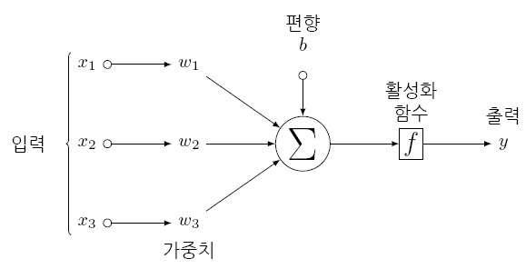

```{r setup, include=FALSE}
# source("tools/chunk-options.R")
knitr::opts_chunk$set(echo = FALSE, warning=FALSE, message=FALSE,
                    comment="", digits = 3, tidy = FALSE, prompt = FALSE, fig.align = 'center')

library(tidyverse)
```


# 아키텍쳐 [^nn-architecture] {#neural-network-architecture}


[^nn-architecture]: [Illustrating (Convolutional) Neural Networks in LaTeX with TikZ](https://davidstutz.de/illustrating-convolutional-neural-networks-in-latex-with-tikz/)

{width=100%}


```{r}
source("script/neural_network.R")


# Predictor variable as a set of uniform rv's over the interval [-2, 2]
x <- runif(60, min=-2, max=2)

# Response variable
y_resp <- function(x) {

  Y = (cos(2*x + 1))

  return(Y)

}

y <- y_resp(x)

# Running SGD function to obtain our optimized mode and parameters
model <- SGD(x, y, w1, w2, sigmoid, derivativeActivation,
             learnRate = 0.01, epochs = 200)

model

```


