```{r setup, include=FALSE}
# source("tools/chunk-options.R")
knitr::opts_chunk$set(echo = TRUE, warning=FALSE, message=FALSE,
                    comment="", digits = 3, tidy = FALSE, 
                    prompt = FALSE, fig.align = 'center')

library(tidyverse)
```

# 신경망 개념 [^1] {.tabset}

[^1]: [Illustrating (Convolutional) Neural Networks in LaTeX with TikZ](https://davidstutz.de/illustrating-convolutional-neural-networks-in-latex-with-tikz/)

## 신경세포(뉴론)

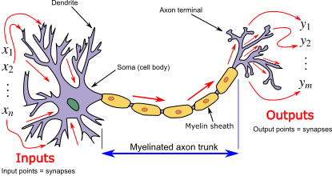{width="100%"}

------------------------------------------------------------------------

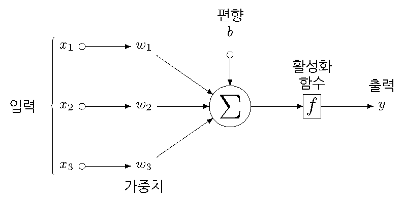

------------------------------------------------------------------------

$$
\frac{1}
       {1 + e^{- \beta_0 - \beta_1X_i - \cdots - \beta_nX_n)} } = \text{출력}
$$

## 수학적 표현 {#neural-network-math-notation}

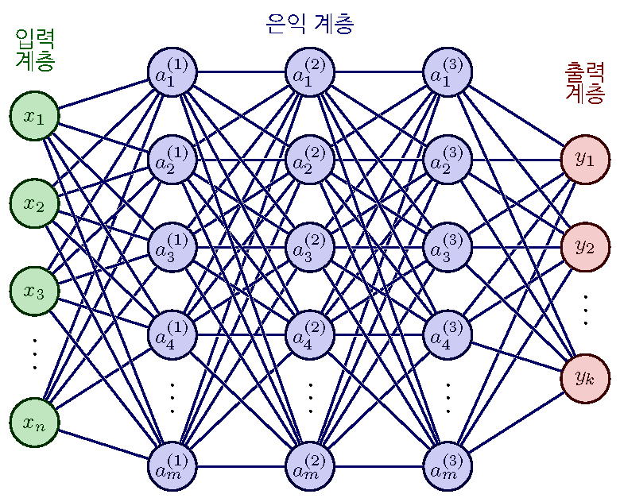

------------------------------------------------------------------------

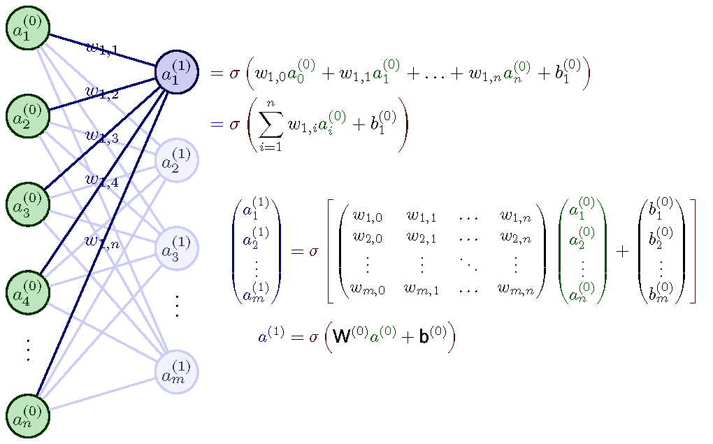{width="100%"}

## 구성요소 

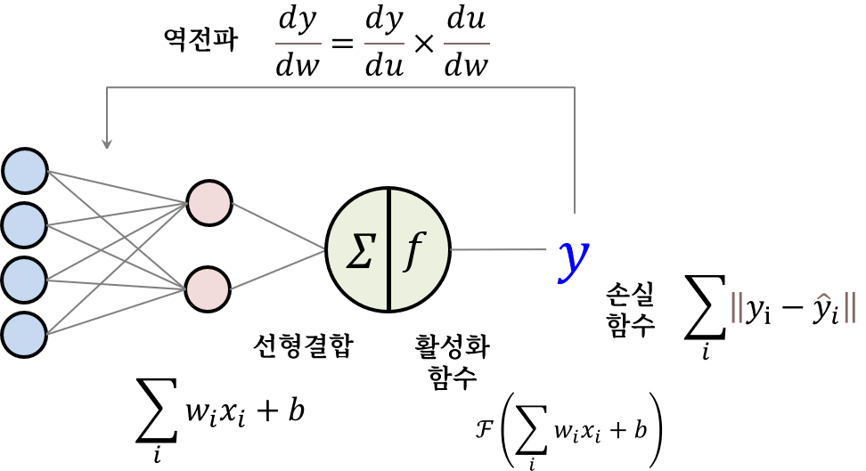


### 활성화 함수(Activation Function)

<div class = "row">
  <div class = "col-md-6">
**회귀모형**

$$
z = \left ( \sum_i w_i \times x_i + b \right )
$$


  </div>
  <div class = "col-md-6">
**시각화**

```{r}
library(tidyverse)

## 선형회귀 모형
reg_func <- function(x) {x}
  
ggplot(data.frame(x=c(-4, 4)), mapping=aes(x=x)) + 
  geom_hline(yintercept=0, color='red') +
  geom_vline(xintercept=0, color='red') +
  stat_function(fun=reg_func, colour = "dodgerblue3") +
  ggtitle('회귀함수') +
  scale_x_continuous(name='x') +
  scale_y_continuous(name='f(x)') +
  theme(plot.title = element_text(hjust = 0.5)) +
  theme_light()
```

  </div>
</div>


<div class = "row">
  <div class = "col-md-6">
**Sigmoid (이항 회귀모형)**


$$
\sigma(z) = \left (  \frac{1} {1 + e^{-z}} \right )
$$


  </div>
  <div class = "col-md-6">
**시각화**

```{r}
plot_activation_function <- function(f, title, range){
  ggplot(data.frame(x=range), mapping=aes(x=x)) + 
    geom_hline(yintercept=0, color='red', alpha=1/4) +
    geom_vline(xintercept=0, color='red', alpha=1/4) +
    stat_function(fun=f, colour = "dodgerblue3") +
    ggtitle(title) +
    scale_x_continuous(name='x') +
    scale_y_continuous(name='f(x)') +
    theme(plot.title = element_text(hjust = 0.5)) +
    theme_light()
}  

f <- function(x){1 / (1 + exp(-x))}
plot_activation_function(f, '이항 회귀모형', c(-4,4))

```

  </div>
</div>
 

<div class = "row">
  <div class = "col-md-6">
**Tanh(Hyperbolic Tangent)**

$$
tanh(x) = \frac{e^x - e^{-x}}{e^x + e^{-x}} = \frac{1 - e^{-2x}}{1 + e^{-2x}}
$$


  </div>
  <div class = "col-md-6">
**시각화**

```{r}
tanh_func <- function(x){tanh(x)}
plot_activation_function(tanh_func, 'TanH', c(-4,4))
```

  </div>
</div>


<div class = "row">
  <div class = "col-md-6">
**Softmax (다중분류 회귀모형)**

$$
\sigma(z_i) = \frac{e^{z_{i}}}{\sum_{j=1}^K e^{z_{j}}} \ \ \ for\ i=1,2,\dots,K
$$


  </div>
  <div class = "col-md-6">
**시각화**


  </div>
</div>


<div class = "row">
  <div class = "col-md-6">
**ReLu (Rectified Linear Unit) **

$$
ReLu(z) = max(0, z)
$$


  </div>
  <div class = "col-md-6">
**시각화**

```{r}
rec_lu_func <- function(x){ ifelse(x < 0 , 0, x )}
plot_activation_function(rec_lu_func, 'RecLU', c(-4,4))
```

  </div>
</div>


### 손실 함수

<div class = "row">
  <div class = "col-md-6">
**연속형**

-   Mean Absolute Error(MAE)

$$
\sum_{i=1}^{D}|x_i-y_i|
$$

- Mean Squared Error(MSE)

$$
\sum_{i=1}^{D}(x_i-y_i)^2
$$

- Huber loss

$$
L_{\delta}=
    \left\{\begin{matrix}
        \frac{1}{2}(y - \hat{y})^{2} & if \left | (y - \hat{y})  \right | < \delta\\
        \delta ((y - \hat{y}) - \frac1 2 \delta) & otherwise
    \end{matrix}\right.
$$


  </div>
  <div class = "col-md-6">
**범주형**

- Cross Entropy

$$
-{(y\log(p) + (1 - y)\log(1 - p))}
$$


$$
-\sum_{c=1}^My_{o,c}\log(p_{o,c})
$$

- Negative Loglikelihood
    
$$
NLL(y) = -{\log(p(y))}
$$

$$
\min_{\theta} \sum_y {-\log(p(y;\theta))}
$$

$$
\max_{\theta} \prod_y p(y;\theta)
$$

- Hinge loss

$$
max(0, 1 - y \cdot \hat{y})
$$

- KL/JS divergence
    
$$
KL(\hat{y} || y) = \sum_{c=1}^{M}\hat{y}_c \log{\frac{\hat{y}_c}{y_c}}
$$

$$
JS(\hat{y} || y) = \frac{1}{2}(KL(y||\frac{y+\hat{y}}{2}) + KL(\hat{y}||\frac{y+\hat{y}}{2}))
$$

  </div>
</div>


### 역전파

- 연쇄법칙(Chain Rule)

$$\frac{dy}{dx} = \frac{dy}{du} \cdot \frac{du}{dx}$$
예를 들어 $f(x) = (x^3 + 2x)^4$ 를 미분하면...

$$
f'(x) = 4 \times (x^3 + 2x)^3 \times \frac{d}{dx}(x^3 + 2x)  \\
      = 4 \times (x^3 + 2x)^3 \times (3x^2 + 2)
$$


- 역전파 알고리즘

$w_{i,j}^k$ 가중치에 대한 손실함수  $E$에 대한 편미분값을 다음과 같이 정의할 수 있다.

$$
\frac{\partial E}{ \partial w} = \delta_{j}^{k} o_{i}^{k-1}
$$

각 입력값과 출력값에 대응되는 편미분값을 다음과 같이 정의할 수 있고,

$$
\frac{ \partial E(X,\theta)}{\partial w_{ij}^k} = 
\frac{1}{N} \sum_{d=1}^{N}\frac{\partial}{\partial w_{ij}^k} \left ( \frac{1}{2} (\hat{y}_d - y_d)^2 \right ) =
\frac{1}{N} \sum_{d=1}^{N}\frac{\partial E_d}{\partial w_{ij}^k}
$$
따라서, 가중치를 다음과 같이 계산할 수 있다.

$$\Delta w_{ij}^k = - \alpha \frac{ \partial E(X,\theta)}{\partial w_{ij}^k} $$

## 사례: 로지스틱 회귀 모형

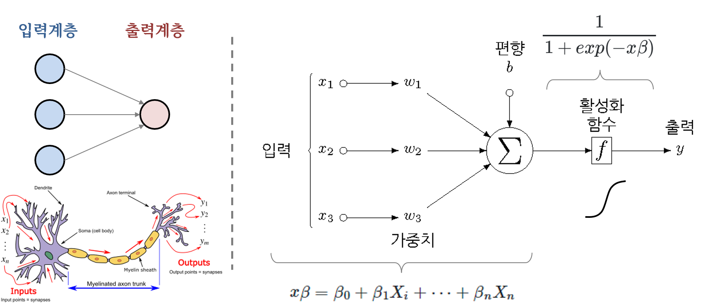

------------------------------------------------------------------------

$$
x \beta = \beta_0 + \beta_1X_i + \cdots + \beta_nX_n \\
$$ $$
\text{활성화 함수} = {\frac{exp(x\beta)}{1 + exp (x\beta)}} = {\frac{1}{1 + exp (-x\beta)}} 
$$

$$
\text{확률} = \frac{exp( \beta_0 + \beta_1X_i + \cdots + \beta_nX_n )}
       {1 + exp ( \beta_0 + \beta_1X_i + \cdots + \beta_nX_n)} = \frac{1}
       {1 + e^{- \beta_0 - \beta_1X_i - \cdots - \beta_nX_n)} }
$$


# 신경망 구현 {.tabset}

## 문제 정의

문제는 사진속에 담긴 고양이와 개 사진을 데이터로 삼아 개(1)와 고양이(0)를 분류하는 분류기를 구현하는 것이다.
데이터는 캐글 [Dogs vs. Cats - Create an algorithm to distinguish dogs from cats](https://www.kaggle.com/c/dogs-vs-cats) 웹사이트에서 구할 수 있다.


## 데이터 살펴보기

```{r}
library(magick)
library(tidyverse)
train_imgs <- fs::dir_ls("data/dogs-vs-cats/train/")

dogs_imgs <- train_imgs[str_detect(train_imgs, "dog\\.")][sample(5)]
cats_imgs <- train_imgs[str_detect(train_imgs, "cat\\.")][sample(5)]

show_imgs <- c(dogs_imgs, cats_imgs)

cats_dogs <- map(show_imgs, image_read) %>% 
  image_join()

cats_dogs[1:5] %>% 
  image_resize("70x70") %>% 
  image_append(stack = FALSE)

cats_dogs[6:10] %>% 
  image_resize("70x70") %>% 
  image_append(stack = FALSE)
```


## 역전파 알고리즘

1.  신경망 아키텍쳐 정의
2.  패러미터 초기화
3.  순방향 전파(forward propagation)를 통해 예측
4.  손실함수를 사용해서 손실을 계산
5.  역전파 알고리즘을 사용해서 손실(오차)을 줄임 (경사하강법 등)
    - 손실함수 오차에 대해 편미분값을 계산한다.
    - 신경망 전체 계층에 대해 연쇄규칙을 적용하여 편미분값을 계산한다.
    - 가중치를 업데이트한다.
6.  손실(오차)가 범위내에 들어갈 때까지 상기 과정을 반복


## 알고리즘 구현 (R)

```{r, eval = FALSE}
library(tidyverse)

# 활성화 함수 정의 (RELU 등) -----------
sigmoid <- function(x){
  1/(1+exp(-x))
}

# 패러미터 초기화 ----------------------
initialize_with_zeros <- function(dim){
  w = matrix(0, nrow = dim, ncol = 1)
  b = 0
  return(list(w, b))
}

# 순방향 전파 후 손실 계산 후 역전파----
propagate <- function(w, b, X, Y){
  m <- ncol(X)
  # 순방향 전파
  A <- sigmoid((t(w) %*% X) + b)
  # 손실(오차) 계산
  cost <- (-1 / m) * sum(Y * log(A) + (1 - Y) * log(1 - A))
  # 역전파
  dw <- (1 / m) * (X %*% t(A - Y))
  db <- (1 / m) * rowSums(A - Y)
  grads <- list(dw, db)
  return(list(grads, cost))
}

# 최적화 (경사하강법 등) ----------------
optimize <- function(w, b, X, Y, num_iter, learning_rate, print_cost = FALSE) {
  costs <- list()
  
  for (i in 1:num_iter) {
    # 경사값과 손실 계산 
    grads <- propagate(w, b, X, Y)[[1]] 
    cost <- propagate(w, b, X, Y)[[2]]
    # 미분값 가져오기
    dw <- matrix(grads[[1]])
    db <- grads[[2]]
    # 패러미터 갱신
    w <- w - learning_rate * dw
    b <- b - learning_rate * db
    # 손실값 기록
    if (i %% 100 == 0) {
      costs[[i]] <- cost
    }
    # 500회마다 손실 출력
    if ((print_cost == TRUE) & (i %% 500 == 0)) {
      cat(sprintf(" %d 회 반복후 손실: %06f\n", i,
      costs[[i]]))
    }
    params <- list(w, b)
    grads <- list(dw, db)
  }
  return(list(params, grads, costs))
}

# 예측 -------------------------
pred <- function(w, b, X) {
  m <- ncol(X)
  Y_prediction <- matrix(0, nrow = 1, ncol = m)
  # 고양이/개 예측 확률 계산
  A <- sigmoid((t(w) %*% X) + b)
  # 예측확률이 50% 넘으면 개, 그렇지 않으면 고양이로 라벨
  for (i in 1:ncol(A)) {
    if (A[1, i] > 0.5) {
    Y_prediction[1, i] = 1
    } else {
      Y_prediction[1, i] = 0
    }
  }
  return(Y_prediction)
}

# 신경망 모형 -------------------------
nn_model <- function(X_train,
                         Y_train,
                         X_test,
                         Y_test,
                         num_iter,
                         learning_rate,
                         print_cost = FALSE){
  # 초기값 0으로 설정
  w <- initialize_with_zeros(nrow(X_train))[[1]]
  b <- initialize_with_zeros(nrow(X_train))[[2]]
  # 경사하강법 손실 최소화
  optFn_output <- optimize(w,
                           b,
                           X_train,
                           Y_train,
                           num_iter,
                           learning_rate,
                           print_cost)
  
  parameters <- optFn_output[[1]]
  grads <- optFn_output[[2]]
  costs <- optFn_output[[3]]
  # 모수 w, b 저장
  w <- as.matrix(parameters[[1]])
  b <- parameters[[2]]
  # 훈련/시험 데이터 예측
  pred_train = pred(w, b, X_train)
  pred_test = pred(w, b, X_test)
  # 훈련/시험 손실 출력 확인
  cat(sprintf("훈련 정확도: %#.2f \n", mean(pred_train == Y_train) * 100))
  cat(sprintf("시험 정확도: %#.2f \n", mean(pred_test == Y_test) * 100))
  res = list( "costs"= costs,
              "pred_train" = pred_train,
              "pred_test"= pred_test,
              "w" = w,
              "b" = b,
              "learning_rate" = learning_rate,
              "num_iter" = num_iter)
  return(res)
}

```

## 입력 데이터

입력 데이터가 이미지이기 때문에 이를 기계가 계산할 수 있는 숫자로 변환한다.

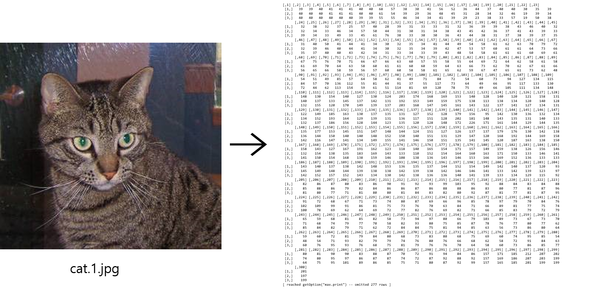

```{r, eval = FALSE}
raw_img <- image_read("data/dogs-vs-cats/train/cat.1.jpg")
# raw_mat <- image_data(raw_img, 'rgba')

raw_tiff <- image_convert(raw_img, "tiff")
raw_array <- as.integer(raw_tiff[[1]])

dim(raw_array)

raw_array[,,1] 

```

```{r, eval = FALSE}

dim(trainx)

library(EBImage)
file_path_train <- "data/dogs-vs-cats/train"
file_path_test <- "data/dogs-vs-cats/test"


library(pbapply)
height = 64
width = 64
channels = 3

extract_feature <- function(dir_path, width, height) {
  
  img_size <- width * height
  images <- list.files(dir_path)
  label <- ifelse(grepl("dog", images) == T, 1, 0)
  print(paste("Processing", length(images), "images"))
  
  feature_list <- pblapply(images, function(imgname) {
    img <- readImage(file.path(dir_path, imgname))
    img_resized <- EBImage::resize(img, w = width, h = height)
    img_matrix <- matrix(reticulate::array_reshape(img_resized, (width *
    height * channels)), nrow = width * height * channels)
    img_vector <- as.vector(t(img_matrix))
    return(img_vector)
    })
  feature_matrix <- do.call(rbind, feature_list)
  return(list(t(feature_matrix), label))
}

# data_train <-extract_feature(file_path_train, width = 64,height = 64)
# data_train %>% 
#   write_rds("data/dogs-vs-cats/data_train.rds")

data_train <- 
  read_rds("data/dogs-vs-cats/data_train.rds")

trainx <-data_train[[1]]
trainy <-data_train[[2]]

# data_test <-extract_feature(file_path_test,width = 64,height = 64)
# data_test %>% 
#   write_rds("data/dogs-vs-cats/data_test.rds")

data_test <- 
  read_rds("data/dogs-vs-cats/data_test.rds")

testx <-data_test[[1]]
testy<- data_test[[2]]

# 데이터 전처리 --------------------
trainx <- scale(trainx)
testx <- scale(testx)


```

## 훈련(모형적합)

```{r, eval = FALSE}

# 모형 적합 ---------------------
model <- nn_model( trainx,
                   trainy,
                   testx,
                   testy,
                   num_iter = 5000,
                   learning_rate = 0.01,
                   print_cost = TRUE)

# Cost after iteration 500: 0.011374
# Cost after iteration 1000: 0.005671
# Cost after iteration 1500: 0.003772
# Cost after iteration 2000: 0.002825
# Cost after iteration 2500: 0.002257
# Cost after iteration 3000: 0.001880
# Cost after iteration 3500: 0.001610
# Cost after iteration 4000: 0.001408
# Cost after iteration 4500: 0.001251
# Cost after iteration 5000: 0.001126
# train accuracy: 100.00
# test accuracy: 62.00
```

## 학습 평가

```{r, eval = FALSE}
x <- c(1:5000)
y <- model$costs
smoothingSpline <- smooth.spline(x, y, spar = 0.35)

plot(NULL, type = "n", xlab = "Iterations", ylab = "Cost",
     xlim = c(1, 5000), ylim = c(0, 1),
     xaxt = "n", yaxt = "n", cex.lab = 0.7)

lines(smoothingSpline, col = ’deepskyblue4’)
axis(side = 1, col = "black", cex.axis = 0.7)
axis(side = 2, col = "black", cex.axis = 0.7)
legend(1550, 0.9, inset = 0.001, c(’Learning rate = 0.01’), cex = 0.6)
```

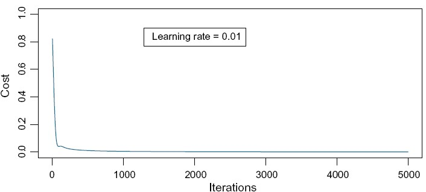

## 정확도 향상

Hyper parameter를 달리하여 이미지 분류 정확도를 높임.

```{r, eval = FALSE}
learning_rates <- c(0.01, 0.002, 0.005)
models <- list()
smoothingSpline <- list()

plot(NULL, type = "n", xlab = "Iterations", ylab = "Cost",
     xlim = c(1, 5000), ylim = c(0, 1), xaxt = "n", yaxt = "n", cex.lab = 0.7)

for(i in 1:length(learning_rates)){
  cat(sprintf("Learning rate: %#.3f \n", learning_rates[i]))
  models[[i]] <- simple_model(trainx,
                             trainy,
                             testx,
                             testy,
                             num_iter = 5000,
                             learning_rate = learning_rates[i],
                             print_cost = F)
  cat(’\n-------------------------------------------------------\n’)
  
  x <- c(1:5000)
  y <- unlist(models[[i]]$costs)
  smoothingSpline = smooth.spline(x, y, spar = 0.35)
  lines(smoothingSpline, col = i + 2, lwd = 2)
}

axis(side = 1, col = "black", cex.axis = 0.7)
axis(side = 2, col = "black", cex.axis = 0.7)
legend("topright", inset = 0.001, 
       c(’Learning rate = 0.01’, ’Learning rate = 0.002’, ’Learning rate = 0.005’),
       lwd = c(2, 2, 2),
       lty = c(1, 1, 1),
       col = c(’green3’, ’blue’, ’cyan’),
       cex = 0.6)

# Learning rate: 0.010
# train accuracy: 100.00
# test accuracy: 62.00
# -------------------------------------------------------
# Learning rate: 0.002
# train accuracy: 100.00
# test accuracy: 60.00
# -------------------------------------------------------
# Learning rate: 0.005
# train accuracy: 100.00
# test accuracy: 62.00
# -------------------------------------------------------

```

## 딥러닝 앱

<br>

- **Shiny 웹앱** : [데이터 사이언스 언어 R - 기계 이미지 인식](https://r2bit.shinyapps.io/shiny_resnet/)

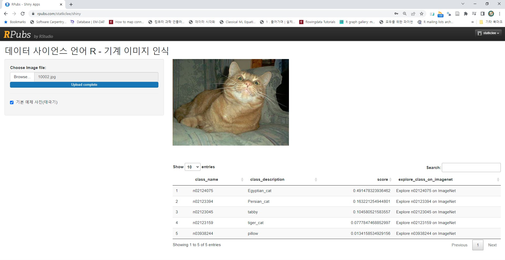

# 딥러닝 확장 개념 {.tabset}

## 미니-배치 정규화

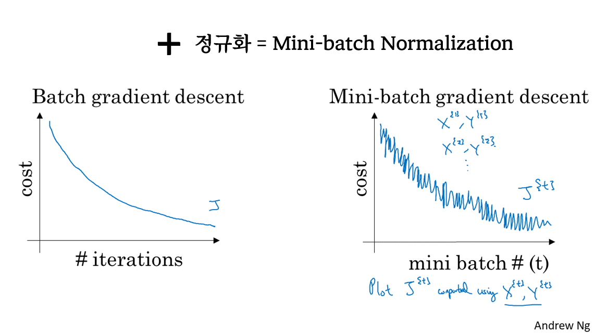

## 드롭아웃

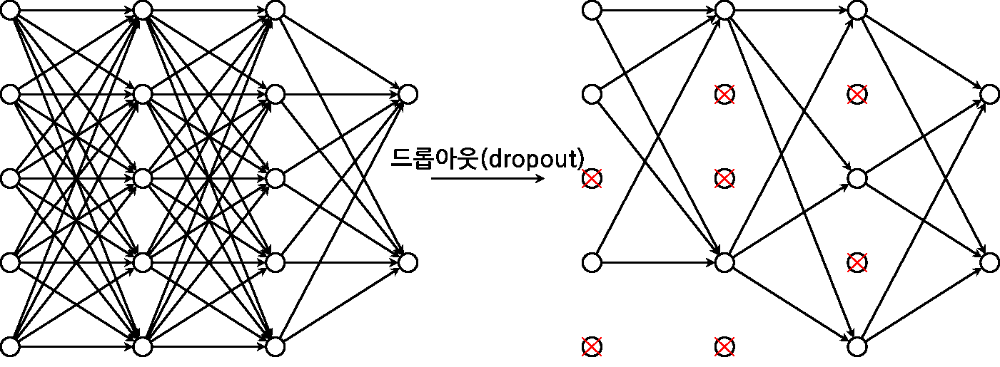

## 오토인코더

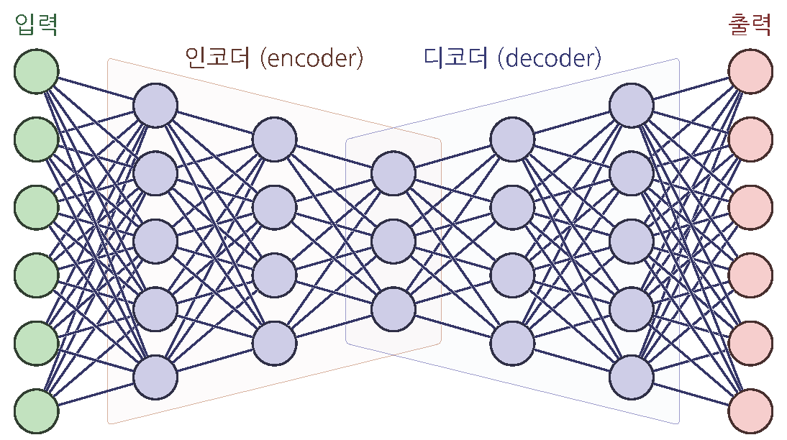

## 이미지 인식 (CNN)

- [Convolutional Neural Networks (CNNs / ConvNets)](https://cs231n.github.io/convolutional-networks/)

이미지 인식에 특화된 신경망 아키텍쳐로 Convolutional Neural Network 는 합성곱(Convolution) 연산을 통해 이미지 정보를 유지하면서도 기존 신경망 아키텍처와 비교하여 연산량을 대폭 줄였다. 

- 입력 이미지 &rarr; padding &rarr; Convolutional Layer &rarr; activation function &rarr; pooling &rarr; ... &rarr; flattening &rarr;  출력


## 자연어 처리 (RNN/LSTM)

> "You shall know a word by the company it keep" <br>
> John Rupert Firth


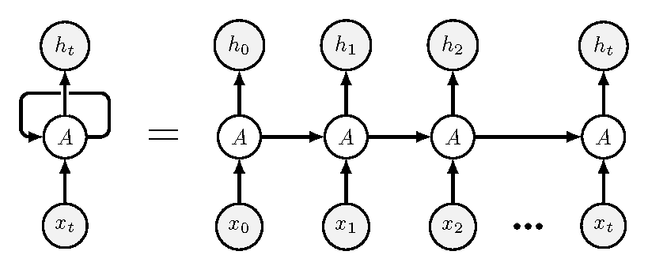

------------------------------------------------------------------------

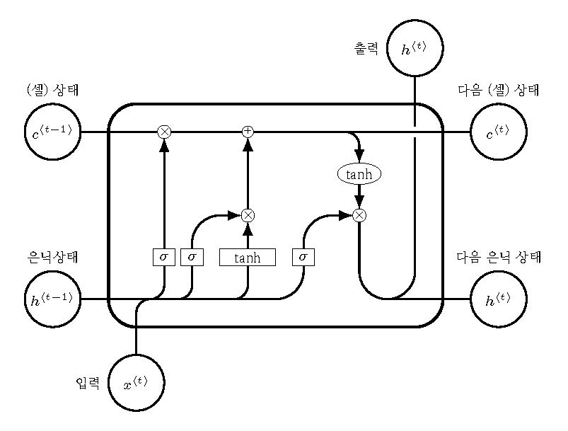


## Attention / Transformer

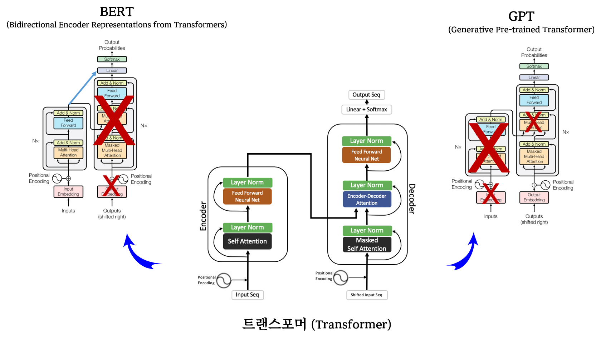


## 전이 학습 

- [Transfer learning from pre-trained models](https://towardsdatascience.com/transfer-learning-from-pre-trained-models-f2393f124751)

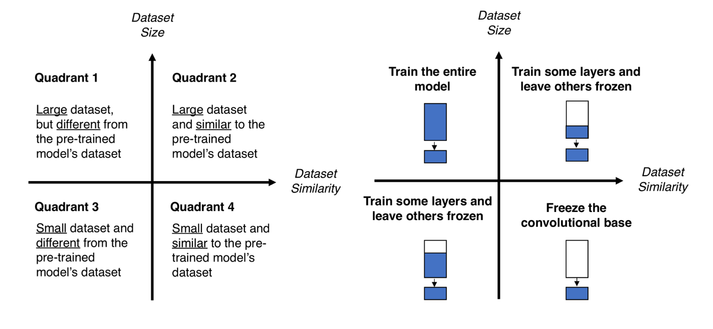


