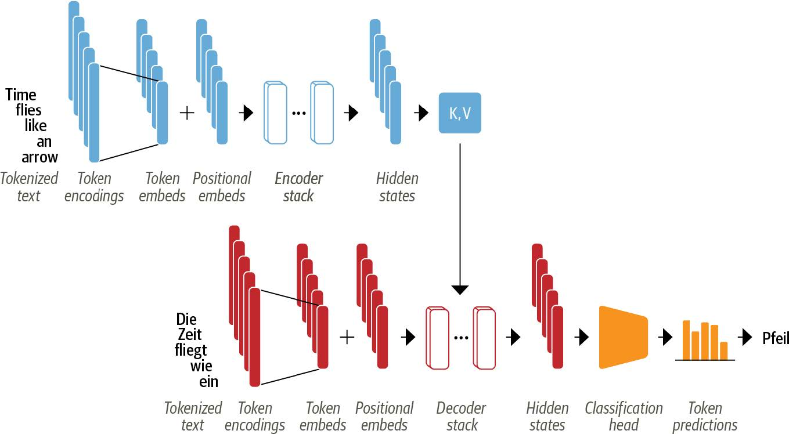
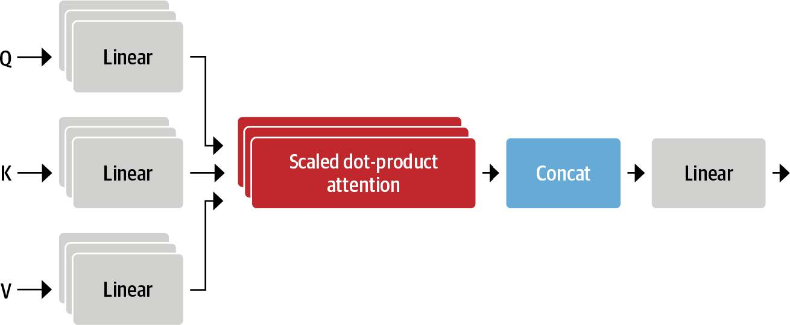
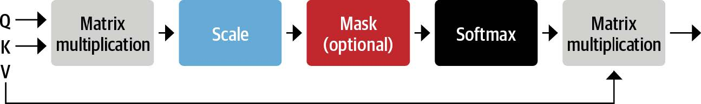
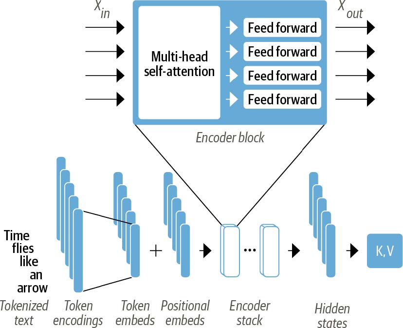
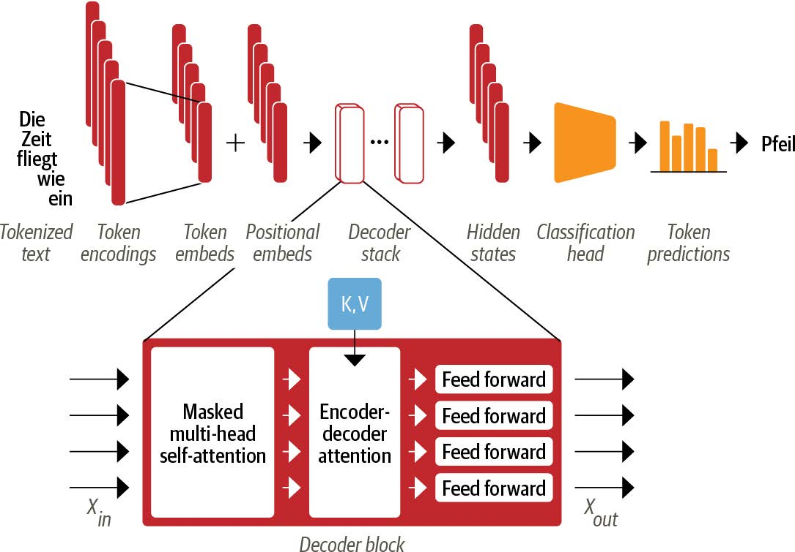
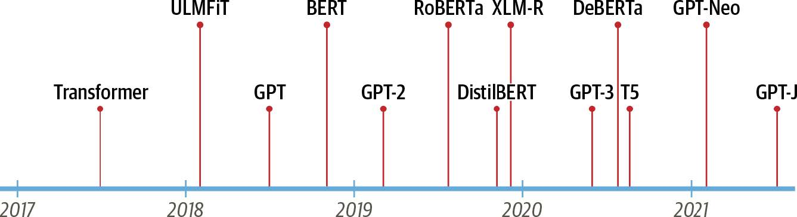
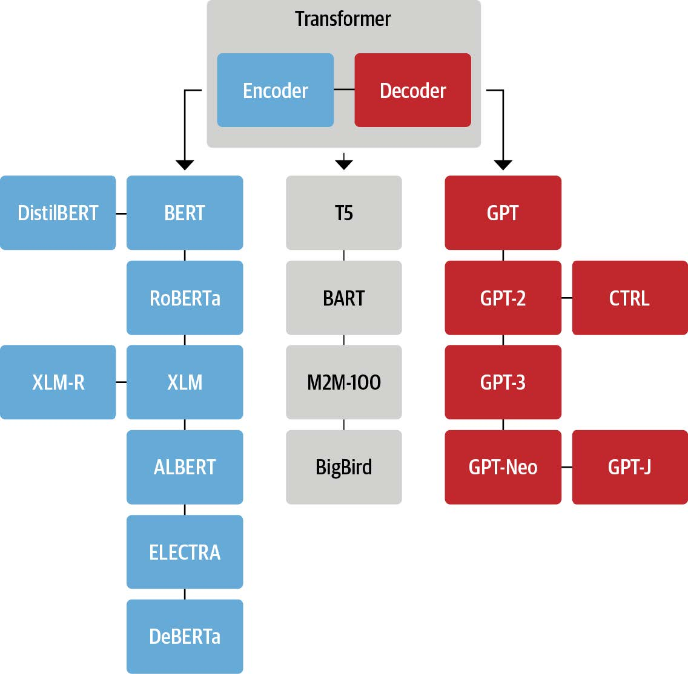
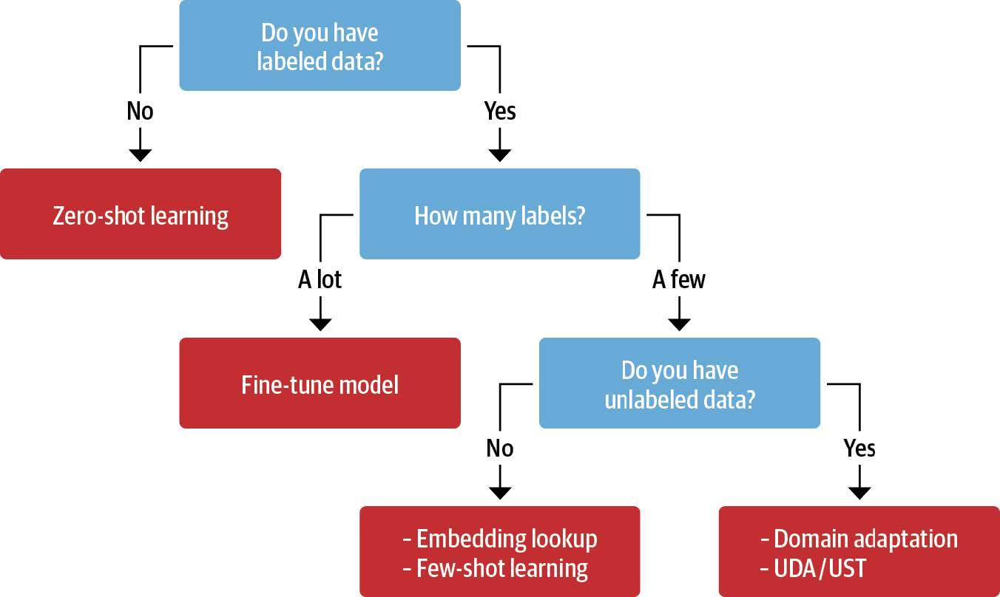

```{r setup, include=FALSE}
# source("tools/chunk-options.R")
knitr::opts_chunk$set(echo = TRUE, warning=FALSE, message=FALSE,
                    comment="", digits = 3, tidy = FALSE, prompt = FALSE, fig.align = 'center')

library(tidyverse)
```

# 딥러닝 2.0

- Transformers
- Transfer Learning
- 딥러닝 하드웨어
- 딥러닝 프레임워크

[유튜브 동영상: FourthBrain and Hugging Face demo on Building NLP Applications with Transformers](https://www.youtube.com/watch?v=1v4Ut7umOUw)
[슬라이드: FourthBrain and Hugging Face demo on Building NLP Applications with Transformers](https://www.slideshare.net/JulienSIMON5/building-nlp-applications-with-transformers)
[Julien Simon, Chief Evangelist, Hugging Face](https://julsimon.medium.com/)


# Transformers

[Lewis Tunstall, Leandro von Werra, Thomas Wolf (2022), "Natural Language Processing with Transformers_ Building Language Applications with Hugging Face", O'Reilly Media](https://www.amazon.com/Natural-Language-Processing-Transformers-Applications/dp/1098103246)



## 구성요소 {.tabset}

### Attention



### Scaled dot-product attention



### 인코더



### 디코더




## 연대기



## 아키텍쳐



## 라벨 데이터



