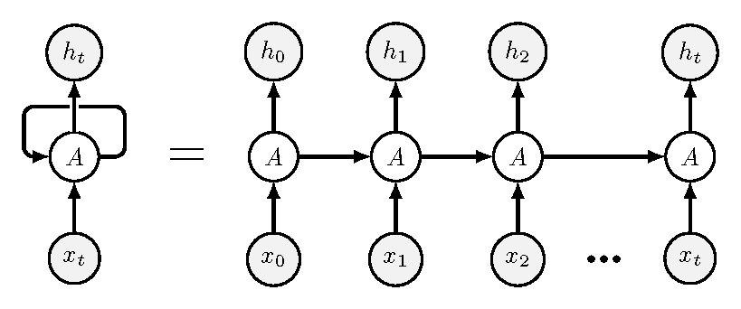

```{r setup, include=FALSE}
# source("tools/chunk-options.R")
knitr::opts_chunk$set(echo = TRUE, warning=FALSE, message=FALSE,
                    comment="", digits = 3, tidy = FALSE, prompt = FALSE, fig.align = 'center')

library(tidyverse)
```

# RNN 아키텍쳐 {.tabset}



# 시계열 예측 

## 항공 탑승자수

```{r}
library(tidyverse)
library(forecast)
library(timetk)
# 1. 데이터 -----
## 1.1. ts 데이터 가져오기
data(AirPassengers)

ap_tbl <- AirPassengers %>% 
  tk_tbl(timetk_idx = FALSE) %>% 
  mutate(date = lubridate::my(as.character(index))) %>% 
  rename(passenger = value) %>% 
  select(date, passenger)

ap_tbl

## 1.2. 시계열 데이터 정상성
forecast::autoplot(AirPassengers)
```

## 통계 모형(ARIMA)

```{r}
ap_fit <-  auto.arima(AirPassengers)

ap_fcst <- forecast(ap_fit, h=24, level = c(95, 80))

forecast::autoplot(ap_fcst)


```

# RNN

- [RNN international airline passengers](https://www.kaggle.com/code/tidyverse/rnn-international-airline-passengers)

```{python, eval = FALSE}
# reticulate::repl_python()
# 파이썬 라이브러리 ----------------
import pandas as pd
import numpy as np

from keras.models import Sequential
from keras.layers import SimpleRNN
from keras.layers import Dense, Dropout, Activation

# 항공승객 데이터 -------------------------
dataset = pd.read_csv('data/AirPassengers.csv', usecols=[1], engine= 'python', skipfooter=2)

dataset = dataset.values
dataset = dataset.astype("float32")
dataset.shape

# 훈련/시험 데이터 분리 -------------------
train_size = int(len(dataset) * 0.60)
test_size = len(dataset) - train_size
train = dataset[0:train_size,:]
test = dataset[train_size:len(dataset),:]
print("train size: {}, test size: {} ".format(len(train), len(test)))

time_stemp = 10
dataX = []
dataY = []
for i in range(len(train)-time_stemp-1):
    a = train[i:(i+time_stemp), 0]
    dataX.append(a)
    dataY.append(train[i + time_stemp, 0])
trainX = np.array(dataX)
trainY = np.array(dataY)  

dataX = []
dataY = []
for i in range(len(test)-time_stemp-1):
    a = test[i:(i+time_stemp), 0]
    dataX.append(a)
    dataY.append(test[i + time_stemp, 0])
testX = np.array(dataX)
testY = np.array(dataY) 

trainX = np.reshape(trainX, (trainX.shape[0], trainX.shape[1], 1))
testX = np.reshape(testX, (testX.shape[0], testX.shape[1], 1))
print('shape of trainX: ', trainX.shape)
print('shape of testX: ', testX.shape)

# RNN 예측모형 ----------------------

# Initialising the RNN
regressor = Sequential()

# Adding the first RNN layer and some Dropout regularisation
regressor.add(SimpleRNN(units = 100,activation='relu', return_sequences = True, input_shape = (trainX.shape[1], 1)))
regressor.add(Dropout(0.2))

# Adding a second RNN layer and some Dropout regularisation
regressor.add(SimpleRNN(units = 80,activation='relu', return_sequences = True))
regressor.add(Dropout(0.2))

# Adding a third RNN layer and some Dropout regularisation
regressor.add(SimpleRNN(units = 50,activation='relu', return_sequences = True))
regressor.add(Dropout(0.2))

# Adding a fourth RNN layer and some Dropout regularisation
regressor.add(SimpleRNN(units = 30,activation='relu', return_sequences = True))
regressor.add(Dropout(0.2))

# Adding a fifth RNN layer and some Dropout regularisation
regressor.add(SimpleRNN(units = 20))
regressor.add(Dropout(0.2))

# Adding the output layer
regressor.add(Dense(units = 1))

# Compiling the RNN 
# NotImplementedError: Cannot convert a symbolic Tenso
regressor.compile(optimizer = 'adam', loss = 'mean_squared_error')

# Fitting the RNN to the Training set
regressor.fit(trainX, trainY, epochs = 250, batch_size = 50)
trainPredict = model.predict(trainX)
testPredict = model.predict(testX)

```


```{r}
rnn_train_raw <- read_csv("data/airpassengers_rnn_train.csv") %>% 
  pull(RNN)
rnn_test_raw <- read_csv("data/airpassengers_rnn_test.csv") %>% 
  pull(RNN)

ap_tbl %>% 
  slice(2:n()) %>% 
  mutate(RNN = c(rep(NA, 12), rnn_train_raw, rep(NA, 12), rnn_test_raw) ) %>% 
  # mutate(RNN = as.numeric(RNN)) %>% 
  pivot_longer(-date, names_to = "구분", values_to = "값") %>% 
  ggplot(aes(x = date, y = 값, color = 구분)) +
    geom_line()
```

