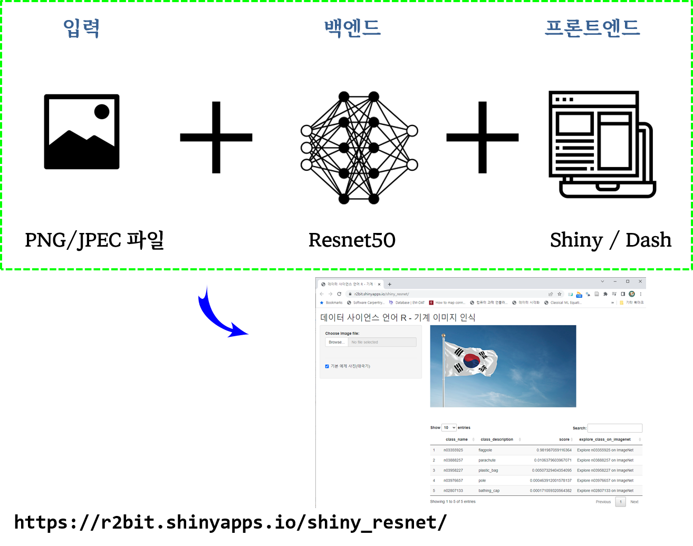
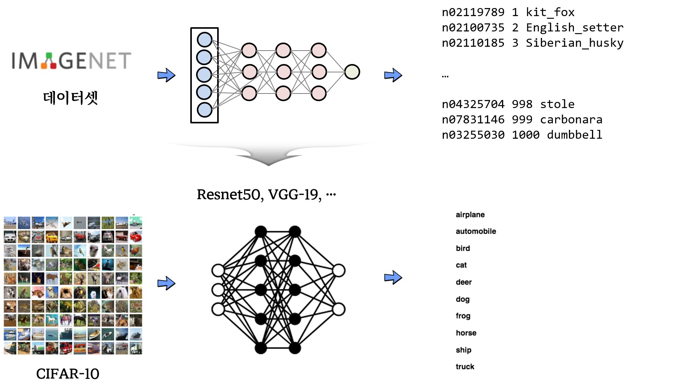

```{r setup, include=FALSE}
# source("tools/chunk-options.R")
knitr::opts_chunk$set(echo = TRUE, warning=FALSE, message=FALSE,
                    comment="", digits = 3, tidy = FALSE, prompt = FALSE, fig.align = 'center')

library(tidyverse)
```

# AI 분류 서비스 {.tabset}

## 아키텍쳐



- https://r2bit.shinyapps.io/shiny_resnet/


## 원본 이미지

```{r, out.width='100%'}
library(magick)

flag_img <- magick::image_read("data/flag.png")

# plot(flag_img)
flag_img %>% 
  image_resize("50%")

```

## `reset` 이미지 인식 


```{r}
library(keras)

# 이미지 데이터를 TF 넣을 수 있는 `array` 형태로 변환
flag_img <- image_load("data/flag.png", target_size = c(224,224))
x <- image_to_array(flag_img)

x <- array_reshape(x, c(1, dim(x)))
x <- imagenet_preprocess_input(x)

resnet50_pretrained <- application_resnet50(weights = "imagenet")

preds <- resnet50_pretrained %>% 
  predict(x) %>% 
  imagenet_decode_predictions(top = 5) %>% 
  .[[1]]


preds
```


# 전이학습 내부 {.tabset}



## CIFAR-10 데이터셋

```{r}
data <- dataset_cifar10()

trainx <- data$train$x
testx <- data$test$x
trainy <- to_categorical(data$train$y, num_classes = 10)
testy <- to_categorical(data$test$y, num_classes = 10)
```


이미지 학습용으로 CIFAR-10은 32 x 32 크기의 60,000개의 이미지로 10개 범주로 나눠져 구성되어 있다. 즉, 10개의 범주로 나눠지고 각 범주는 6,000개로 분류되어 있다.

| Y 라벨 | 이미지 분류 |
|:------------:|:--------------:|
|0 | Airplane |
|1 | Automobile |
|2 | Bird |
|3 | Cat |
|4 | Deer |
|5 | Dog |
|6 | Frog |
|7 | Horse |
|8 | Ship |
|9 | Truck |

```{r}
cifar_7 <- list()
  
for(i in 1:7) {
  cifar_7[[i]] <- magick::image_read(trainx[i,,,] / 255)  
}

cifar_7 %>% 
  image_join() %>% 
  image_append(stack = FALSE) %>% 
  image_resize("400%")

```

## AI 이미지 인식

```{r}
library(keras)

resnet50_pretrained <- application_resnet50(weights = "imagenet")

predict_image <- function(input_img) {

  x <- image_array_resize(input_img, w = 224, h = 224)
  x <- array_reshape(x, c(1, dim(x)))
  x <- imagenet_preprocess_input(x)
  
  preds <- resnet50_pretrained %>% 
    predict(x) %>% 
    imagenet_decode_predictions(top = 1) %>% 
    .[[1]] %>% 
    dplyr::pull(class_description)
  return(preds)
}

image_names <- NULL

for(i in 1:7 ) {
  image_names[i] <- predict_image(trainx[i,,,]) 
}

image_names

cifar_7_names <- cifar_7 %>% 
  image_join() %>% 
  image_resize("600%") %>% 
  image_annotate(text = image_names, size = 30, location = "+50+0", degrees =45)


cifar_7_names %>% 
  image_append(stack = FALSE) 

```

# 자체개발 vs Pretrained 모델  {.tabset}

## 데이터셋

```{r}
data <- dataset_cifar10()

trainx <- data$train$x[1:1000,,,]
testx <- data$test$x[1:1000,,,]
trainy <- to_categorical(data$train$y[1:1000,], num_classes = 10)
testy <- to_categorical(data$test$y[1:1000,], num_classes = 10)

# 훈련 입력 이미지를 resent에 맞춰 224x224 으로 크기 조정
x <- array(rep(0, 1000 * 224 * 224 * 3), dim = c(1000, 224, 224, 3))

for (i in 1:1000) { 
  x[i,,,] <- image_array_resize(trainx[i,,,], 224, 224) 
}

trainx <- imagenet_preprocess_input(x)

# 시험 입력 이미지를 resent에 맞춰 224x224 으로 크기 조정
x <- array(rep(0, 1000 * 224 * 224 * 3), dim = c(1000, 224, 224, 3))

for (i in 1:1000) { 
  x[i,,,] <- image_array_resize(testx[i,,,], 224, 224) 
}

testx <- imagenet_preprocess_input(x)
```

## 자체제작 - CNN 딥러닝 모형

```{r}

# Model architecture
model <- keras_model_sequential()
model %>%
  layer_conv_2d(filters = 32, kernel_size = c(3,3), activation = 'relu',
  input_shape = c(224,224,3)) %>%
  layer_conv_2d(filters = 32, kernel_size = c(3,3), activation = 'relu') %>%
  layer_max_pooling_2d(pool_size = c(2,2)) %>%
  layer_dropout(rate = 0.25) %>%
  layer_flatten() %>%
  layer_dense(units = 256, activation = 'relu') %>%
  layer_dropout(rate = 0.25) %>%
  layer_dense(units = 10, activation = 'softmax')
summary(model)
```

```{r, eval = FALSE}
# 컴파일
model %>% compile(loss = 'categorical_crossentropy',
                  optimizer = 'rmsprop',
                  metrics = 'accuracy')

# 모형 적합
model_cnn <- model %>% fit(trainx,
                           trainy,
                           epochs = 10,
                           batch_size = 10,
                           validation_split = 0.2)

model_cnn
```

```{r, eval = FALSE}
2022-06-27 17:22:51.530824: W tensorflow/core/framework/cpu_allocator_impl.cc:81] Allocation of 396492800 exceeds 10% of free system memory.
2022-06-27 17:22:52.366457: W tensorflow/core/framework/cpu_allocator_impl.cc:81] Allocation of 396492800 exceeds 10% of free system memory.
Epoch 1/10
80/80 [==============================] - 152s 2s/step - loss: 222.3463 - accuracy: 0.1713 - val_loss: 2.2358 - val_accuracy: 0.2150
Epoch 2/10
80/80 [==============================] - 154s 2s/step - loss: 2.3729 - accuracy: 0.4412 - val_loss: 2.5260 - val_accuracy: 0.2750
Epoch 3/10
80/80 [==============================] - 143s 2s/step - loss: 1.1362 - accuracy: 0.7613 - val_loss: 3.1178 - val_accuracy: 0.2500
Epoch 4/10
80/80 [==============================] - 147s 2s/step - loss: 2.1652 - accuracy: 0.8763 - val_loss: 5.2696 - val_accuracy: 0.2500
Epoch 5/10
80/80 [==============================] - 150s 2s/step - loss: 0.9931 - accuracy: 0.9375 - val_loss: 49.1674 - val_accuracy: 0.1500
Epoch 6/10
80/80 [==============================] - 146s 2s/step - loss: 4.1380 - accuracy: 0.9038 - val_loss: 8.8890 - val_accuracy: 0.2250
Epoch 7/10
80/80 [==============================] - 136s 2s/step - loss: 0.8670 - accuracy: 0.9575 - val_loss: 16.6223 - val_accuracy: 0.2900
Epoch 8/10
80/80 [==============================] - 136s 2s/step - loss: 2.2269 - accuracy: 0.9312 - val_loss: 17.0739 - val_accuracy: 0.2000
Epoch 9/10
80/80 [==============================] - 137s 2s/step - loss: 11.1061 - accuracy: 0.9388 - val_loss: 19.4581 - val_accuracy: 0.2450
Epoch 10/10
80/80 [==============================] - 150s 2s/step - loss: 0.7317 - accuracy: 0.9700 - val_loss: 17.7526 - val_accuracy: 0.2200

Final epoch (plot to see history):
        loss: 0.7317
    accuracy: 0.97
    val_loss: 17.75
val_accuracy: 0.22 
```


## Pretrained 모델 - resnet50

```{r}
# RESNET50 
pretrained <- application_resnet50(weights = "imagenet",
                                   include_top = FALSE,
                                   input_shape = c(224, 224, 3))

model <- keras_model_sequential() %>%
  pretrained %>%
  layer_flatten() %>%
  layer_dense(units = 256, activation = "relu") %>%
  layer_dense(units = 10, activation = "softmax")

summary(model)

# Freeze weights of resnet50 network
freeze_weights(pretrained)
# Compile
model %>% compile(loss = 'categorical_crossentropy',
                  optimizer = 'rmsprop',
                  metrics = 'accuracy')
summary(model)
```


```{r, eval = FALSE}
# Fit model
model_resnet50 <- model %>% fit(trainx,
                           trainy,
                           epochs = 10,
                           batch_size = 10,
                           validation_split = 0.2)

model_resnet50
```


```{r, eval = FALSE}
Epoch 1/10
80/80 [==============================] - 81s 1s/step - loss: 20.1118 - accuracy: 0.5863 - val_loss: 6.8605 - val_accuracy: 0.6700
Epoch 2/10
80/80 [==============================] - 83s 1s/step - loss: 2.1866 - accuracy: 0.8763 - val_loss: 6.7808 - val_accuracy: 0.7100
Epoch 3/10
80/80 [==============================] - 84s 1s/step - loss: 0.9900 - accuracy: 0.9275 - val_loss: 8.5960 - val_accuracy: 0.7000
Epoch 4/10
80/80 [==============================] - 83s 1s/step - loss: 0.9558 - accuracy: 0.9375 - val_loss: 6.4063 - val_accuracy: 0.8050
Epoch 5/10
80/80 [==============================] - 80s 1000ms/step - loss: 0.4001 - accuracy: 0.9675 - val_loss: 5.9686 - val_accuracy: 0.7850
Epoch 6/10
80/80 [==============================] - 78s 973ms/step - loss: 0.6653 - accuracy: 0.9688 - val_loss: 10.3922 - val_accuracy: 0.7050
Epoch 7/10
80/80 [==============================] - 79s 983ms/step - loss: 0.4645 - accuracy: 0.9737 - val_loss: 4.9130 - val_accuracy: 0.8200
Epoch 8/10
80/80 [==============================] - 78s 978ms/step - loss: 0.3080 - accuracy: 0.9837 - val_loss: 5.8252 - val_accuracy: 0.8250
Epoch 9/10
80/80 [==============================] - 83s 1s/step - loss: 0.1377 - accuracy: 0.9912 - val_loss: 8.0080 - val_accuracy: 0.7750
Epoch 10/10
80/80 [==============================] - 88s 1s/step - loss: 0.2952 - accuracy: 0.9850 - val_loss: 6.2213 - val_accuracy: 0.8050

Final epoch (plot to see history):
        loss: 0.2952
    accuracy: 0.985
    val_loss: 6.221
val_accuracy: 0.805 
```


## Pretrained 모델 - vgg16

```{r}
# Pretrained model
pretrained <- application_vgg16(weights = 'imagenet',
                                include_top = FALSE,
                                input_shape = c(224, 224, 3))

# Model architecture
model <- keras_model_sequential() %>%
  pretrained %>%
  layer_flatten() %>%
  layer_dense(units = 256, activation = "relu") %>%
  layer_dense(units = 10, activation = "softmax")

summary(model)

freeze_weights(pretrained)

summary(model)

```

```{r, eval = FALSE}

model %>% compile(loss = 'categorical_crossentropy',
                 optimizer = 'adam',
                 metrics = 'accuracy')

model_vgg16 <- model %>% fit(trainx,
                    trainy,
                    epochs = 10,
                    batch_size = 10,
                    validation_split = 0.2)
model_vgg16
```


```{r, eval = FALSE}
Epoch 1/10
80/80 [==============================] - 113s 1s/step - loss: 7.1705 - accuracy: 0.5050 - val_loss: 1.5229 - val_accuracy: 0.6250
Epoch 2/10
80/80 [==============================] - 118s 1s/step - loss: 0.2360 - accuracy: 0.9175 - val_loss: 1.2900 - val_accuracy: 0.6650
Epoch 3/10
80/80 [==============================] - 132s 2s/step - loss: 0.0421 - accuracy: 0.9837 - val_loss: 1.4543 - val_accuracy: 0.6600
Epoch 4/10
80/80 [==============================] - 122s 2s/step - loss: 0.0096 - accuracy: 0.9975 - val_loss: 1.3438 - val_accuracy: 0.6850
Epoch 5/10
80/80 [==============================] - 116s 1s/step - loss: 0.0024 - accuracy: 1.0000 - val_loss: 1.3533 - val_accuracy: 0.7100
Epoch 6/10
80/80 [==============================] - 116s 1s/step - loss: 0.0016 - accuracy: 1.0000 - val_loss: 1.3771 - val_accuracy: 0.6950
Epoch 7/10
80/80 [==============================] - 117s 1s/step - loss: 0.0012 - accuracy: 1.0000 - val_loss: 1.3868 - val_accuracy: 0.6900
Epoch 8/10
80/80 [==============================] - 119s 1s/step - loss: 8.8380e-04 - accuracy: 1.0000 - val_loss: 1.3977 - val_accuracy: 0.6850
Epoch 9/10
80/80 [==============================] - 123s 2s/step - loss: 7.0219e-04 - accuracy: 1.0000 - val_loss: 1.4090 - val_accuracy: 0.6900
Epoch 10/10
80/80 [==============================] - 124s 2s/step - loss: 5.8618e-04 - accuracy: 1.0000 - val_loss: 1.4137 - val_accuracy: 0.6900

Final epoch (plot to see history):
        loss: 0.0005862
    accuracy: 1
    val_loss: 1.414
val_accuracy: 0.69 
```

## 비교

```{r}
library(tidyverse)

# model_cnn %>% write_rds("data/model_cnn.rds")
# model_resnet50 %>% write_rds("data/model_resnet50.rds")
# model_vgg16 %>% write_rds("data/model_vgg16.rds")

model_cnn  <- read_rds("data/model_cnn.rds")
model_resnet50  <- read_rds("data/model_resnet50.rds")
model_vgg16 <- read_rds("data/model_vgg16.rds")


cnn_loss     <- model_cnn$metrics$loss
cnn_accuracy <- model_cnn$metrics$accuracy

resnet50_loss     <- model_resnet50$metrics$loss
resnet50_accuracy <- model_resnet50$metrics$accuracy

vgg16_loss     <- model_vgg16$metrics$loss
vgg16_accuracy <- model_vgg16$metrics$accuracy

tibble(cnn = cnn_accuracy,
       resnet50 = resnet50_accuracy,
       vgg16 = vgg16_accuracy) %>% 
  mutate(에포크 = 1:10) %>% 
  pivot_longer(cols = -에포크,
               names_to = "모형",
               values_to = "정확도")  %>% 
  mutate(모형 = factor(모형, levels = c("vgg16", "resnet50", "cnn"))) %>% 
  ggplot(aes(x = 에포크, y = 정확도, color = 모형)) +
    geom_point() +
    geom_line() +
    scale_y_continuous(labels = scales::percent) +
    theme_light() +
    labs(title = "에포크 단계별 전이학습 모형 정확도 비교")


```


