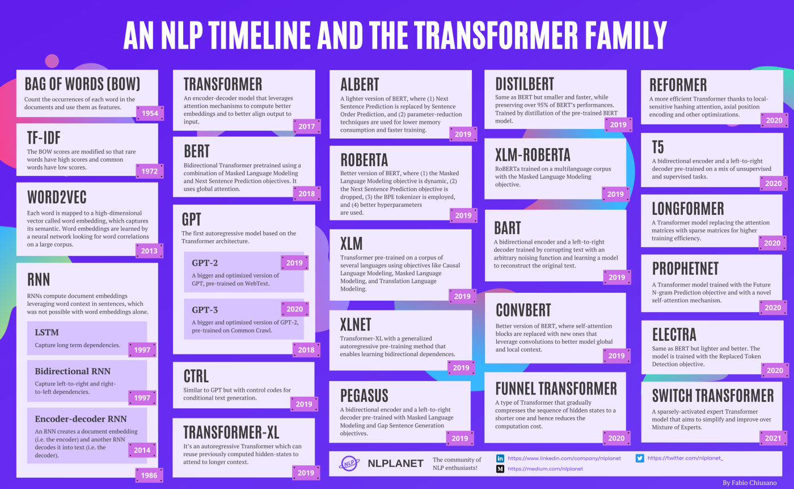

```{r setup, include=FALSE}
# source("tools/chunk-options.R")
knitr::opts_chunk$set(echo = TRUE, warning=FALSE, message=FALSE,
                    comment="", digits = 3, tidy = FALSE, prompt = FALSE, fig.align = 'center')

library(tidyverse)
```

# NLP 패러다임 변화

{width=100%}

# 자료구조 

0과 1밖에 모르는 기계에게 인간의 언어 알려줘야 하는데, 이유는 컴퓨터는 숫자만 인식할 수 있기 때문에 바이너리 코드로 처리해 줘야한다.
텍스트 데이터 즉, 순서가 없는 범주형 데이터를 수치형 데이터로 변환한다.
벡터에서 해당되는 하나의 데이터만 1로 변경해 주고 나머지는 0으로 채워주는 방식으로 원핫 인코딩(One-Hot Encoding), 통계학에서
가변수(Dummy Variable)처리라고 부른다.

**TF(단어 빈도, term frequency)**는 특정한 단어가 문서 내에 얼마나 자주 등장하는지를 나타내는 값으로 
이 값이 높을수록 문서에서 중요하다고 생각할 수 있지만, 단어 자체가 문서군 내에서 자주 사용되는 경우,이것은 그 단어가 흔하게 등장한다는 것을 의미도 된다.

이것을 **DF(문서 빈도, document frequency)**라고 하며, 이 값의 역수를 **IDF(역문서 빈도, inverse document frequency)**라고함
**TF-IDF**는 TF와 IDF를 곱한 값이 된다.

단어문서행렬(Term Document Matrix)을 전치(Transpose)하게 되면 문서단어행렬(DTM)이 된다.
단어문서행렬은 다음과 같은 형태를 갖는다.

|        | $문서_1$ | $문서_1$ | $문서_1$ | $\cdots$ | $문서_n$ |
|--------|----------|----------|----------|----------|----------|
|$단어_1$|     0    |     0    |    0     |     0    |     0    |
|$단어_2$|     1    |     1    |    0     |     0    |     0    |
|$단어_3$|     1    |     0    |    0     |     0    |     0    |
|$\cdots$|     0    |     0    |    2     |     1    |     1    |
|$단어_m$|     0    |     0    |    0     |     1    |     0    |

문서단어행렬은 단서문서행렬을 전치하여 다음과 같은 형태를 갖는다.

|        | $단어_1$ | $단어_1$ | $단어_1$ | $\cdots$ | $단어_n$ |
|--------|----------|----------|----------|----------|----------|
|$문서_1$|     0    |     1    |    1     |     0    |     0    |
|$문서_2$|     0    |     1    |    0     |     0    |     0    |
|$문서_3$|     0    |     0    |    0     |     2    |     0    |
|$\cdots$|     0    |     0    |    0     |     1    |     1    |
|$문서_m$|     0    |     0    |    0     |     1    |     0    |

딥러닝 학습 후 n-차원으로 워드임베딩하면 다음과 같은 형태를 갖는다.

|        | $차원_1$ | $차원_1$ | $차원_1$ | $\cdots$ | $차원_n$ |
|--------|----------|----------|----------|----------|----------|
|$단어_1$|  0.754   |   0.625  |  0.525   | 0.954    |  0.685   |
|$단어_2$|     1    |     1    |  0.219   | 0.791    |  0.652   |
|$단어_3$|  0.125   |   0.968  |  0.215   | 0.571    |  0.845   |
|$\cdots$|  0.857   |   0.323  |  0.125   | 0.847    |  0.696   |
|$단어_m$|  0.214   |   0.841  |  0.985   |     1    |  0.198   |

# NLP 기술 역사




# 워드 임베딩

- [`glove`](https://nlp.stanford.edu/projects/glove/)
    - [`textdata`](https://cran.r-project.org/web/packages/textdata/index.html)
    - [`word2vec`](https://github.com/bnosac/word2vec)
- [`fastText`](https://github.com/facebookresearch/fastText)
    - [`fastText`](https://cran.r-project.org/web/packages/fastText/index.html)

`word2vec`은 Autoencoder 와 유사하나 몇가지 점에서 차이점이 있다. 즉, `word2vec`의 목표는 단어를 컴퓨터가 계산 가능한 형태로 One-hot 인코딩(통계학에서 더미 변수 인코딩)하게 되면 매우 성긴 행렬로 표현되기 때문에 이런 문제를 해결하고자 단어 인근 정보를 유지한 상태의 행렬정보로 새롭게 매핑한 것이다.


## 단어(코사인) 유사도


```{r}
library(tidytext)
library(textdata)
library(tidyverse)
library(widyr)

glove6b <- embedding_glove6b(dimensions = 50)

tidy_glove <- glove6b %>%
  pivot_longer(contains("d"),
               names_to = "dimension") %>%
  rename(item1 = token)

tidy_glove

cosine_sim_fn <- function(word1 = "man", word2 = "woman") {
  
  # 첫번째 단어 벡터
  u <- tidy_glove %>% 
  filter(item1 == word1) %>% 
  pull(value)

  # 두번째 단어 벡터
  v <- tidy_glove %>% 
    filter(item1 == word2) %>% 
    pull(value)
  
  # 코사인 유사도 계산
  num <- sum(u * v)
  norm_u <- InspectChangepoint:::vector.norm(u)
  norm_v <- InspectChangepoint:::vector.norm(v)
  denum <- norm_u * norm_v
  cos_sim <- num/denum
  
  return(cos_sim)
}

cosine_sim_fn("man", "woman")
```


단어 유사도 시각화

```{r}

tidy_glove %>% 
  filter(item1 %in% c("korea", "france", "seoul", "paris", "man", "qeen")) %>% 
  pivot_wider(names_from = item1, values_from = value) %>% 
  select(-dimension) %>% 
  as.matrix() %>% 
  lsa::cosine() %>% 
  heatmap()

```


## 인접 단어


```{r}
nearest_neighbors <- function(df, token) {
  df %>%
    widely(
      ~ {
        y <- .[rep(token, nrow(.)), ]
        res <- rowSums(. * y) / 
          (sqrt(rowSums(. ^ 2)) * sqrt(sum(.[token, ] ^ 2)))
        matrix(res, ncol = 1, dimnames = list(x = names(res)))
      },
      sort = TRUE,
      maximum_size = NULL
    )(item1, dimension, value) %>%
    select(-item2)
}

nearest_neighbors(tidy_glove, "korea")

```


```{r, eval = FALSE}
library(umap)

glove6b_sample <- glove6b %>% 
  sample_n(size = 100) 

glove_umap <-  umap(glove6b_sample %>% select(-token))

umap_df <- glove_umap$layout %>%
  as.data.frame()%>%
  rename(UMAP1="V1",
         UMAP2="V2") %>%
  bind_cols(glove6b_sample) %>% 
  select(token, everything()) %>% 
  as_tibble()

umap_df %>% 
  ggplot(aes(x = UMAP1, 
             y = UMAP2))+
  geom_point()+
  labs(x = "UMAP1",
       y = "UMAP2",
      subtitle = "UMAP plot") +
  ggrepel::geom_text_repel(aes(label = token))

```

##  king - man + woman = queen


```{r}
king_v <- tidy_glove %>% 
  filter(item1 == "king") %>% 
  rename(king = item1,
         king_v = value)

man_v <- tidy_glove %>% 
  filter(item1 == "man") %>% 
  rename(man = item1,
         man_v = value)

woman_v <- tidy_glove %>% 
  filter(item1 == "woman") %>% 
  rename(woman = item1,
         woman_v = value)

queen_v <- tidy_glove %>% 
  filter(item1 == "queen") %>% 
  rename(queen = item1,
         queen_v = value)

question_v <- king_v %>% 
  left_join(man_v) %>% 
  left_join(woman_v) %>% 
  left_join(queen_v) %>% 
  mutate(value = king_v - man_v + woman_v) %>% 
  mutate(item1 = "king-man+woman") %>% 
  select(item1, dimension, value)

infer_glove <- tidy_glove  %>% 
  bind_rows(question_v)

nearest_neighbors(infer_glove, "king-man+woman")
```

# BERT {.tabset}


