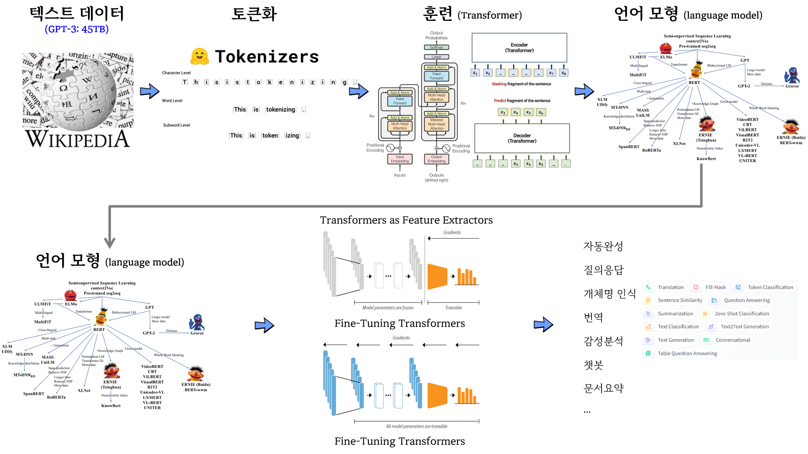

```{r setup, include=FALSE}
# source("tools/chunk-options.R")
knitr::opts_chunk$set(echo = TRUE, warning=FALSE, message=FALSE,
                    comment="", digits = 3, tidy = FALSE, prompt = FALSE, fig.align = 'center')

library(tidyverse)
```


```{r setup-crayon, echo = FALSE, results='asis'}

options(crayon.enabled = TRUE)

old.hooks <- fansi::set_knit_hooks(knitr::knit_hooks)

```



# BERT 질의 응답

## 질의 응답

<div class = "row">
  <div class = "col-md-6">
**대상 문단**

> 'A new study estimates that if the US had universally mandated masks on 1 April, there could have been nearly 40% fewer deaths by the start of June. Containment policies had a large impact on the number of COVID-19 cases and deaths, directly by reducing transmission rates and indirectly by constraining people’s behaviour. They account for roughly half the observed change in the growth rates of cases and deaths.'

  </div>
  <div class = "col-md-6">
**질의 응답**

- 질문: Which country is this article about?
    - 응답: **US**
- 질문: Which disease is discussed in this article?
    - 응답: **COVID-19**

  </div>
</div>


```{python, cache = FALSE, eval = FALSE}
from transformers import pipeline

qNa = pipeline('question-answering', 
                model='bert-large-cased-whole-word-masking-finetuned-squad',
                tokenizer='bert-large-cased-whole-word-masking-finetuned-squad') 

paragraph = 'A new study estimates that if the US had universally mandated masks on 1 April, there could have been nearly 40% fewer deaths by the start of June. Containment policies had a large impact on the number of COVID-19 cases and deaths, directly by reducing transmission rates and indirectly by constraining people’s behaviour. They account for roughly half the observed change in the growth rates of cases and deaths.'

ans = qNa({'question': 'Which country is this article about?',
           'context': f'{paragraph}'})
print(ans)
# {'score': 0.795813262462616, 'start': 34, 'end': 36, 'answer': 'US'}
ans = qNa({'question': 'Which disease is discussed in this article?',
           'context': f'{paragraph}'})
print(ans)
# {'score': 0.9766002893447876, 'start': 205, 'end': 213, 'answer': 'COVID-19'}
```


```{r, R.options = list(width = 30)}
# https://stackoverflow.com/questions/53424164/color-highlighting-text-in-r-for-a-pre-defined-list-of-words


library(reticulate)
library(tidyverse)
library(crayon)

paragraph <- 'A new study estimates that if the US had universally mandated masks on 1 April, there could have been nearly 40% fewer deaths by the start of June. Containment policies had a large impact on the number of COVID-19 cases and deaths, directly by reducing transmission rates and indirectly by constraining people’s behaviour. They account for roughly half the observed change in the growth rates of cases and deaths.'


unique_words <- function(x) {
  purrr::map(.x = x,
             .f = ~ unique(base::strsplit(x = ., split = " ")[[1]],
                           collapse = " "))
}

df <- tibble::enframe(unique_words(x = paragraph)) %>%
  tidyr::unnest() %>%
  dplyr::mutate(.data = .,
                # value2 = dplyr::case_when(value == py$ans$answer ~ crayon::red(value),
                value2 = dplyr::case_when(value == "US" ~ crayon::red(value),
                                          value == "COVID-19" ~ crayon::blue(value),
                                          TRUE ~ value)) %>%
  dplyr::select(., -value) 

print(cat(df$value2))
```


## 빈칸 채워넣기

```{python, eval = FALSE}
fill_mask = pipeline("fill-mask",
                      model="bert-base-cased",
                      tokenizer="bert-base-cased")

mask_output = fill_mask("A new study estimates that if the US had universally mandated masks on 1 April, there could have been nearly 40% fewer [MASK] by the start of June")
           
mask_output

# [{'score': 0.19625626504421234, 'token': 6209, 'token_str': 'deaths', 'sequence': 'A new study estimates that if the US had universally mandated masks on 1 April, there could have been nearly 40 % fewer deaths by the start of June'}, {'score': 0.11479492485523224, 'token': 26107, 'token_str': 'executions', 'sequence': 'A new study estimates that if the US had universally mandated masks on 1 April, there could have been nearly 40 % fewer executions by the start of June'}, {'score': 0.08466506004333496, 'token': 5256, 'token_str': 'victims', 'sequence': 'A new study estimates that if the US had universally mandated masks on 1 April, there could have been nearly 40 % fewer victims by the start of June'}, {'score': 0.04194879159331322, 'token': 17944, 'token_str': 'masks', 'sequence': 'A new study estimates that if the US had universally mandated masks on 1 April, there could have been nearly 40 % fewer masks by the start of June'}, {'score': 0.027420325204730034, 'token': 19189, 'token_str': 'arrests', 'sequence': 'A new study estimates that if the US had universally mandated masks on 1 April, there could have been nearly 40 % fewer arrests by the start of June'}]
                      
```

```{r}
library(tidyverse)
library(reticulate)
library(reactable)
# mask_tbl <- map_df(py$mask_output, bind_rows)
# 
# mask_tbl %>%
#   write_rds("data/fill_mask.rds")

mask_tbl <- 
  read_rds("data/fill_mask.rds")

tokens <- mask_tbl$token_str

mask_color_tbl <- mask_tbl %>% 
  tidytext::unnest_tokens(word, sequence) %>% 
  dplyr::mutate(text = dplyr::case_when(word %in% tokens ~ crayon::red(word),
                                        TRUE ~ word)) %>% 
  group_by(score, token, token_str) %>% 
  summarize(text = str_c(text, collapse = " ")) 

mask_color_tbl %>% 
  reactable::reactable(  defaultColDef = colDef(
    header = function(value) gsub(".", " ", value, fixed = TRUE),
    cell = function(value) format(value, nsmall = 1),
    align = "center",
    minWidth = 70,
    headerStyle = list(background = "#f7f7f8")
  
  ),
  columns = list(
    score = colDef(minWidth  = 50),
    token = colDef(minWidth  = 50),
    token_str = colDef(minWidth  = 50),
    text = colDef(minWidth  = 140)
  ),
  bordered = TRUE,
  highlight = TRUE
  )


print(cat(paste0(mask_color_tbl$text, "\n\n")) )
```


# BERT fine-tuning {.tabset}


- [BERT | Fine Tuning | Disaster Tweets - Natural Language Processing with Disaster Tweets](https://www.kaggle.com/code/manojgadde/beginner-bert-fine-tuning-disaster-tweets/)

## 트윗데이터

```{python, eval = FALSE}
import numpy as np
import pandas as pd
import nltk
from nltk.corpus import stopwords
from nltk.stem.porter import PorterStemmer
from nltk.stem import WordNetLemmatizer
import sklearn
import re
import string
import seaborn as sns

train_data = pd.read_csv('data/twitter/train.csv')

train_data.drop(['id','keyword','location'],axis=1,inplace=True)

train_data.head()

X = train_data.drop('target',axis=1)
y = train_data['target']
```

## 훈련/시험 데이터

```{python, eval = FALSE}

from sklearn.model_selection import train_test_split

X_train, X_test, y_train,y_test=train_test_split(corpus,y,test_size=0.2,random_state=42)  
```

## 토큰화 

```{python, eval = FALSE}
from transformers import DistilBertTokenizerFast
tokenizer = DistilBertTokenizerFast.from_pretrained('distilbert-base-uncased')

def tokenize_text(data):
    encoded = tokenizer(data, padding=True, truncation=True, return_tensors='np')
    return encoded.data
  
train_data=tokenize_text(X_train)
test_data=tokenize_text(X_test)
```


## BERT fine-tuning 학습

```{python, eval = FALSE}
from transformers import TFDistilBertForSequenceClassification

model = TFDistilBertForSequenceClassification.from_pretrained('distilbert-base-uncased', 
                                                               num_labels = 2)


from tensorflow.keras.losses import SparseCategoricalCrossentropy
import tensorflow as tf

optimizer = tf.keras.optimizers.Adam(learning_rate=5e-5)

model.compile(optimizer = optimizer,
              loss      = tf.keras.losses.SparseCategoricalCrossentropy(from_logits=True),
              metrics   = ['accuracy'])


model.fit(
    train_data,
    np.array(y_train),
    validation_data=(
        test_data,
        np.array(y_test),
    ),
    batch_size=32, epochs=1
)
```

## 모형 저장

```{python, eval = FALSE}
model.save_pretrained('data/twitter_bert_80')
```


## 예측 적용

```{python, eval = FALSE}
from transformers import TFDistilBertForSequenceClassification

tf_model = TFDistilBertForSequenceClassification.from_pretrained('data/twitter_bert_80')

preds = tf_model.predict(test_data)

# 48/48 [==============================] - 44s 829ms/step

classes = np.argmax(preds['logits'],axis=1)

from sklearn import metrics
metrics.accuracy_score(classes, y_test)
# 0.8023637557452397
metrics.confusion_matrix(classes,y_test)

# array([[691, 118],
#        [183, 531]], dtype=int64)
```

