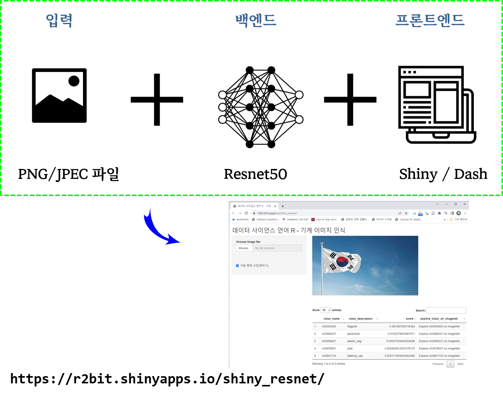
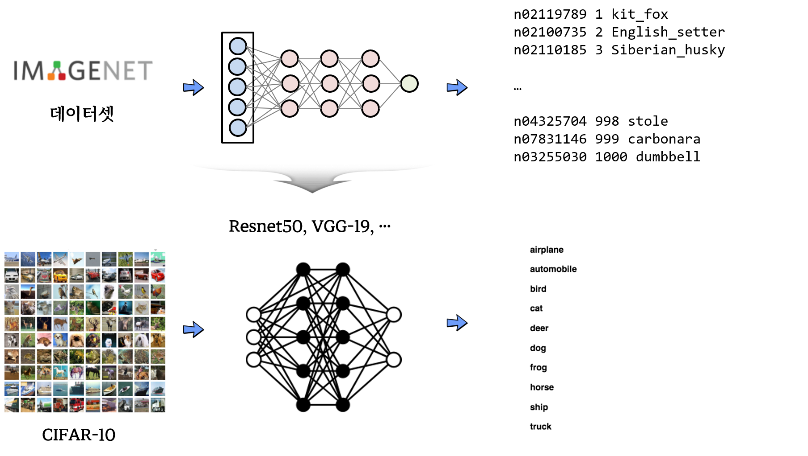

```{r setup, include=FALSE}
# source("tools/chunk-options.R")
knitr::opts_chunk$set(echo = TRUE, warning=FALSE, message=FALSE,
                    comment="", digits = 3, tidy = FALSE, prompt = FALSE, fig.align = 'center')

library(tidyverse)
```

# AI 분류 서비스 {.tabset}

## 아키텍쳐



- https://r2bit.shinyapps.io/shiny_resnet/


## 원본 이미지

```{r, out.width='100%'}
library(magick)

flag_img <- magick::image_read("data/flag.png")

# plot(flag_img)
flag_img %>% 
  image_resize("50%")

```

## `reset` 이미지 인식 

```{r, eval = TRUE}

# R 에서 GPU 사용할 경우 GPU 버전 tensorflow 설치 -------------
# install_keras(conda = "C:/Users/statkclee/anaconda3/Scripts/conda.exe",
#               tensorflow = "gpu")
# 
# if(tensorflow::tf_gpu_configured()) {
#   physical_devices = tf$config$list_physical_devices('GPU')
#   tf$config$experimental$set_memory_growth(physical_devices[[1]],TRUE)
# }

# Disable GPU -------------
library(keras)
Sys.setenv("CUDA_VISIBLE_DEVICES" = -1)   
 
use_backend("tensorflow") 

# 이미지 데이터를 TF 넣을 수 있는 `array` 형태로 변환
flag_img <- image_load("data/flag.png", target_size = c(224,224))
x <- image_to_array(flag_img)

x <- array_reshape(x, c(1, dim(x)))
x <- imagenet_preprocess_input(x)

resnet50_pretrained <- application_resnet50(weights = "imagenet")

preds <- resnet50_pretrained %>% 
  predict(x) %>% 
  imagenet_decode_predictions(top = 5) %>% 
  .[[1]]


preds
```


# 전이학습 내부 {.tabset}



## CIFAR-10 데이터셋

```{r}
data <- dataset_cifar10()

trainx <- data$train$x
testx <- data$test$x
trainy <- to_categorical(data$train$y, num_classes = 10)
testy <- to_categorical(data$test$y, num_classes = 10)
```


이미지 학습용으로 CIFAR-10은 32 x 32 크기의 60,000개의 이미지로 10개 범주로 나눠져 구성되어 있다. 즉, 10개의 범주로 나눠지고 각 범주는 6,000개로 분류되어 있다.

| Y 라벨 | 이미지 분류 |
|:------------:|:--------------:|
|0 | Airplane |
|1 | Automobile |
|2 | Bird |
|3 | Cat |
|4 | Deer |
|5 | Dog |
|6 | Frog |
|7 | Horse |
|8 | Ship |
|9 | Truck |

```{r}
cifar_7 <- list()
  
for(i in 1:7) {
  cifar_7[[i]] <- magick::image_read(trainx[i,,,] / 255)  
}

cifar_7 %>% 
  image_join() %>% 
  image_append(stack = FALSE) %>% 
  image_resize("400%")

```

## AI 이미지 인식

```{r}
library(keras)

resnet50_pretrained <- application_resnet50(weights = "imagenet")

predict_image <- function(input_img) {

  x <- image_array_resize(input_img, w = 224, h = 224)
  x <- array_reshape(x, c(1, dim(x)))
  x <- imagenet_preprocess_input(x)
  
  preds <- resnet50_pretrained %>% 
    predict(x) %>% 
    imagenet_decode_predictions(top = 1) %>% 
    .[[1]] %>% 
    dplyr::pull(class_description)
  return(preds)
}

image_names <- NULL

for(i in 1:7 ) {
  image_names[i] <- predict_image(trainx[i,,,]) 
}

image_names

cifar_7_names <- cifar_7 %>% 
  image_join() %>% 
  image_resize("600%") %>% 
  image_annotate(text = image_names, size = 30, location = "+50+0", degrees =45)


cifar_7_names %>% 
  image_append(stack = FALSE) 

```

# 자체개발 vs Pretrained 모델  {.tabset}

## 데이터셋

```{r}
data <- dataset_cifar10()

trainx <- data$train$x[1:1000,,,]
testx <- data$test$x[1:1000,,,]
trainy <- to_categorical(data$train$y[1:1000,], num_classes = 10)
testy <- to_categorical(data$test$y[1:1000,], num_classes = 10)

# 훈련 입력 이미지를 resent에 맞춰 224x224 으로 크기 조정
x <- array(rep(0, 1000 * 224 * 224 * 3), dim = c(1000, 224, 224, 3))

for (i in 1:1000) { 
  x[i,,,] <- image_array_resize(trainx[i,,,], 224, 224) 
}

trainx <- imagenet_preprocess_input(x)

# 시험 입력 이미지를 resent에 맞춰 224x224 으로 크기 조정
x <- array(rep(0, 1000 * 224 * 224 * 3), dim = c(1000, 224, 224, 3))

for (i in 1:1000) { 
  x[i,,,] <- image_array_resize(testx[i,,,], 224, 224) 
}

testx <- imagenet_preprocess_input(x)
```

## 자체제작 - CNN 딥러닝 모형

```{r}

# Model architecture
model <- keras_model_sequential()
model %>%
  layer_conv_2d(filters = 32, kernel_size = c(3,3), activation = 'relu',
  input_shape = c(224,224,3)) %>%
  layer_conv_2d(filters = 32, kernel_size = c(3,3), activation = 'relu') %>%
  layer_max_pooling_2d(pool_size = c(2,2)) %>%
  layer_dropout(rate = 0.25) %>%
  layer_flatten() %>%
  layer_dense(units = 256, activation = 'relu') %>%
  layer_dropout(rate = 0.25) %>%
  layer_dense(units = 10, activation = 'softmax')
summary(model)
```

```{r, eval = FALSE}
# 컴파일
model %>% compile(loss = 'categorical_crossentropy',
                  optimizer = 'rmsprop',
                  metrics = 'accuracy')

# 모형 적합
model_cnn <- model %>% fit(trainx,
                           trainy,
                           epochs = 10,
                           batch_size = 10,
                           validation_split = 0.2)

model_cnn
```

```{r, eval = FALSE}
2022-06-27 17:22:51.530824: W tensorflow/core/framework/cpu_allocator_impl.cc:81] Allocation of 396492800 exceeds 10% of free system memory.
2022-06-27 17:22:52.366457: W tensorflow/core/framework/cpu_allocator_impl.cc:81] Allocation of 396492800 exceeds 10% of free system memory.
Epoch 1/10
80/80 [==============================] - 152s 2s/step - loss: 222.3463 - accuracy: 0.1713 - val_loss: 2.2358 - val_accuracy: 0.2150
Epoch 2/10
80/80 [==============================] - 154s 2s/step - loss: 2.3729 - accuracy: 0.4412 - val_loss: 2.5260 - val_accuracy: 0.2750
Epoch 3/10
80/80 [==============================] - 143s 2s/step - loss: 1.1362 - accuracy: 0.7613 - val_loss: 3.1178 - val_accuracy: 0.2500
Epoch 4/10
80/80 [==============================] - 147s 2s/step - loss: 2.1652 - accuracy: 0.8763 - val_loss: 5.2696 - val_accuracy: 0.2500
Epoch 5/10
80/80 [==============================] - 150s 2s/step - loss: 0.9931 - accuracy: 0.9375 - val_loss: 49.1674 - val_accuracy: 0.1500
Epoch 6/10
80/80 [==============================] - 146s 2s/step - loss: 4.1380 - accuracy: 0.9038 - val_loss: 8.8890 - val_accuracy: 0.2250
Epoch 7/10
80/80 [==============================] - 136s 2s/step - loss: 0.8670 - accuracy: 0.9575 - val_loss: 16.6223 - val_accuracy: 0.2900
Epoch 8/10
80/80 [==============================] - 136s 2s/step - loss: 2.2269 - accuracy: 0.9312 - val_loss: 17.0739 - val_accuracy: 0.2000
Epoch 9/10
80/80 [==============================] - 137s 2s/step - loss: 11.1061 - accuracy: 0.9388 - val_loss: 19.4581 - val_accuracy: 0.2450
Epoch 10/10
80/80 [==============================] - 150s 2s/step - loss: 0.7317 - accuracy: 0.9700 - val_loss: 17.7526 - val_accuracy: 0.2200

Final epoch (plot to see history):
        loss: 0.7317
    accuracy: 0.97
    val_loss: 17.75
val_accuracy: 0.22 
```


## Pretrained 모델 - resnet50

```{r}
# RESNET50 
pretrained <- application_resnet50(weights = "imagenet",
                                   include_top = FALSE,
                                   input_shape = c(224, 224, 3))

model <- keras_model_sequential() %>%
  pretrained %>%
  layer_flatten() %>%
  layer_dense(units = 256, activation = "relu") %>%
  layer_dense(units = 10, activation = "softmax")

summary(model)

# Freeze weights of resnet50 network
freeze_weights(pretrained)
# Compile
model %>% compile(loss = 'categorical_crossentropy',
                  optimizer = 'rmsprop',
                  metrics = 'accuracy')
summary(model)
```


```{r, eval = FALSE}
# Fit model
model_resnet50 <- model %>% fit(trainx,
                           trainy,
                           epochs = 10,
                           batch_size = 10,
                           validation_split = 0.2)

model_resnet50
```


```{r, eval = FALSE}
Epoch 1/10
80/80 [==============================] - 81s 1s/step - loss: 20.1118 - accuracy: 0.5863 - val_loss: 6.8605 - val_accuracy: 0.6700
Epoch 2/10
80/80 [==============================] - 83s 1s/step - loss: 2.1866 - accuracy: 0.8763 - val_loss: 6.7808 - val_accuracy: 0.7100
Epoch 3/10
80/80 [==============================] - 84s 1s/step - loss: 0.9900 - accuracy: 0.9275 - val_loss: 8.5960 - val_accuracy: 0.7000
Epoch 4/10
80/80 [==============================] - 83s 1s/step - loss: 0.9558 - accuracy: 0.9375 - val_loss: 6.4063 - val_accuracy: 0.8050
Epoch 5/10
80/80 [==============================] - 80s 1000ms/step - loss: 0.4001 - accuracy: 0.9675 - val_loss: 5.9686 - val_accuracy: 0.7850
Epoch 6/10
80/80 [==============================] - 78s 973ms/step - loss: 0.6653 - accuracy: 0.9688 - val_loss: 10.3922 - val_accuracy: 0.7050
Epoch 7/10
80/80 [==============================] - 79s 983ms/step - loss: 0.4645 - accuracy: 0.9737 - val_loss: 4.9130 - val_accuracy: 0.8200
Epoch 8/10
80/80 [==============================] - 78s 978ms/step - loss: 0.3080 - accuracy: 0.9837 - val_loss: 5.8252 - val_accuracy: 0.8250
Epoch 9/10
80/80 [==============================] - 83s 1s/step - loss: 0.1377 - accuracy: 0.9912 - val_loss: 8.0080 - val_accuracy: 0.7750
Epoch 10/10
80/80 [==============================] - 88s 1s/step - loss: 0.2952 - accuracy: 0.9850 - val_loss: 6.2213 - val_accuracy: 0.8050

Final epoch (plot to see history):
        loss: 0.2952
    accuracy: 0.985
    val_loss: 6.221
val_accuracy: 0.805 
```


## Pretrained 모델 - vgg16

```{r}
# Pretrained model
pretrained <- application_vgg16(weights = 'imagenet',
                                include_top = FALSE,
                                input_shape = c(224, 224, 3))

# Model architecture
model <- keras_model_sequential() %>%
  pretrained %>%
  layer_flatten() %>%
  layer_dense(units = 256, activation = "relu") %>%
  layer_dense(units = 10, activation = "softmax")

summary(model)

freeze_weights(pretrained)

summary(model)

```

```{r, eval = FALSE}

model %>% compile(loss = 'categorical_crossentropy',
                 optimizer = 'adam',
                 metrics = 'accuracy')

model_vgg16 <- model %>% fit(trainx,
                    trainy,
                    epochs = 10,
                    batch_size = 10,
                    validation_split = 0.2)
model_vgg16
```


```{r, eval = FALSE}
Epoch 1/10
80/80 [==============================] - 113s 1s/step - loss: 7.1705 - accuracy: 0.5050 - val_loss: 1.5229 - val_accuracy: 0.6250
Epoch 2/10
80/80 [==============================] - 118s 1s/step - loss: 0.2360 - accuracy: 0.9175 - val_loss: 1.2900 - val_accuracy: 0.6650
Epoch 3/10
80/80 [==============================] - 132s 2s/step - loss: 0.0421 - accuracy: 0.9837 - val_loss: 1.4543 - val_accuracy: 0.6600
Epoch 4/10
80/80 [==============================] - 122s 2s/step - loss: 0.0096 - accuracy: 0.9975 - val_loss: 1.3438 - val_accuracy: 0.6850
Epoch 5/10
80/80 [==============================] - 116s 1s/step - loss: 0.0024 - accuracy: 1.0000 - val_loss: 1.3533 - val_accuracy: 0.7100
Epoch 6/10
80/80 [==============================] - 116s 1s/step - loss: 0.0016 - accuracy: 1.0000 - val_loss: 1.3771 - val_accuracy: 0.6950
Epoch 7/10
80/80 [==============================] - 117s 1s/step - loss: 0.0012 - accuracy: 1.0000 - val_loss: 1.3868 - val_accuracy: 0.6900
Epoch 8/10
80/80 [==============================] - 119s 1s/step - loss: 8.8380e-04 - accuracy: 1.0000 - val_loss: 1.3977 - val_accuracy: 0.6850
Epoch 9/10
80/80 [==============================] - 123s 2s/step - loss: 7.0219e-04 - accuracy: 1.0000 - val_loss: 1.4090 - val_accuracy: 0.6900
Epoch 10/10
80/80 [==============================] - 124s 2s/step - loss: 5.8618e-04 - accuracy: 1.0000 - val_loss: 1.4137 - val_accuracy: 0.6900

Final epoch (plot to see history):
        loss: 0.0005862
    accuracy: 1
    val_loss: 1.414
val_accuracy: 0.69 
```

## 비교

```{r}
library(tidyverse)

# model_cnn %>% write_rds("data/model_cnn.rds")
# model_resnet50 %>% write_rds("data/model_resnet50.rds")
# model_vgg16 %>% write_rds("data/model_vgg16.rds")

model_cnn  <- read_rds("data/model_cnn.rds")
model_resnet50  <- read_rds("data/model_resnet50.rds")
model_vgg16 <- read_rds("data/model_vgg16.rds")


cnn_loss     <- model_cnn$metrics$loss
cnn_accuracy <- model_cnn$metrics$accuracy

resnet50_loss     <- model_resnet50$metrics$loss
resnet50_accuracy <- model_resnet50$metrics$accuracy

vgg16_loss     <- model_vgg16$metrics$loss
vgg16_accuracy <- model_vgg16$metrics$accuracy

tibble(cnn = cnn_accuracy,
       resnet50 = resnet50_accuracy,
       vgg16 = vgg16_accuracy) %>% 
  mutate(에포크 = 1:10) %>% 
  pivot_longer(cols = -에포크,
               names_to = "모형",
               values_to = "정확도")  %>% 
  mutate(모형 = factor(모형, levels = c("vgg16", "resnet50", "cnn"))) %>% 
  ggplot(aes(x = 에포크, y = 정확도, color = 모형)) +
    geom_point() +
    geom_line() +
    scale_y_continuous(labels = scales::percent) +
    theme_light() +
    labs(title = "에포크 단계별 전이학습 모형 정확도 비교")
```


# Keras {.tabset}

[Transfer Learning With Keras(Resnet-50)](https://chroniclesofai.com/transfer-learning-with-keras-resnet-50/) 사례를 바탕으로 Pretrained Model 을 사용한 전이학습을 실행해보자.

## Pretrained Model 선정

[Keras Applications - Available models](https://keras.io/api/applications/) 에서 최적 사전 학습 모델을 선택한다. 즉, 정확도는 높으나 크기가 작고 inference cpu + gpu 시간이 빠른 사전학습 모형을 선택한다.

예를 들어, EfficientNetB3 사전학습 모형이 크기도 작고 cpu+gpu inference 시간도 빨라 선정한다.

```{r}
library(tidyverse)
library(rvest)
library(scatterPlotMatrix)

pretrained_models <- read_html(x = "https://keras.io/api/applications/") %>% 
  html_element(css = "table") %>% 
  html_table(fill = TRUE, header = TRUE)

pretrained_models_tbl <- pretrained_models %>% 
  janitor::clean_names() %>% 
  filter(!is.na(depth)) %>% 
  mutate(across(top_1_accuracy:time_ms_per_inference_step_gpu, parse_number))

pretrained_models_tbl %>% 
  rename(cpu_time = time_ms_per_inference_step_cpu,
         gpu_time = time_ms_per_inference_step_gpu) %>% 
  column_to_rownames(var = "model") %>% 
  scatterPlotMatrix()

```


## 환경설정


```{python, eval = FALSE}
import matplotlib.pyplot as plt
import numpy as np
import PIL
from keras.layers.core import Dense,Flatten
from tensorflow.keras.models import Sequential
from tensorflow.keras.optimizers import Adam
import pathlib

# GPU 설정 ----------------------
os.environ["TF_CPP_MIN_LOG_LEVEL"] = "2"
import tensorflow as tf

physical_devices = tf.config.list_physical_devices("GPU")
tf.config.experimental.set_memory_growth(physical_devices[0], True)
```


## 데이터 가져오기

```{python, eval = FALSE}

dataset_url = "https://storage.googleapis.com/download.tensorflow.org/example_images/flower_photos.tgz"

data_dir = tf.keras.utils.get_file('flower_photos', origin=dataset_url, untar=True)

data_dir = pathlib.Path(data_dir)
```

## 훈련/시험 데이터

```{python, eval = FALSE}
img_height,img_width=180,180
batch_size=32

train_ds = tf.keras.preprocessing.image_dataset_from_directory(
  pathlib.Path("data/flower_photos"), #data_dir
  # data_dir,
  validation_split=0.2,
  subset="training",
  label_mode='categorical',
  seed=123,
  image_size=(img_height, img_width),
  batch_size=batch_size)
  
val_ds = tf.keras.preprocessing.image_dataset_from_directory(
  pathlib.Path("data/flower_photos"), #data_dir
  # data_dir,
  label_mode='categorical',
  validation_split=0.2,
  subset="validation",
  seed=123,
  image_size=(img_height, img_width),
  batch_size=batch_size)  
```

## Pretrained Model 아키텍처

```{python, eval = FALSE}
efficient_model = Sequential()

pretrained_model = tf.keras.applications.EfficientNetB3(include_top=False,
                                                        input_shape=(180,180,3),
                                                        pooling='avg',
                                                        classes=5,
                                                        weights='imagenet')


for layer in pretrained_model.layers:
  layer.trainable=False

efficient_model.add(pretrained_model)

efficient_model.summary()

```

```
Model: "sequential"
_________________________________________________________________
 Layer (type)                Output Shape              Param #   
=================================================================
 efficientnetb3 (Functional)  (None, 1536)             10783535  
                                                                 
=================================================================
Total params: 10,783,535
Trainable params: 0
Non-trainable params: 10,783,535
_________________________________________________________________
```


## fine-tuning Model 아키텍쳐

```{python, eval = FALSE}
efficient_model.add(Flatten())
efficient_model.add(Dense(512, activation='relu'))
efficient_model.add(Dense(5, activation='softmax'))

efficient_model.summary()
```

```
Model: "sequential"
_________________________________________________________________
 Layer (type)                Output Shape              Param #   
=================================================================
 efficientnetb3 (Functional)  (None, 1536)             10783535  
                                                                 
 flatten (Flatten)           (None, 1536)              0         
                                                                 
 dense (Dense)               (None, 512)               786944    
                                                                 
 dense_1 (Dense)             (None, 5)                 2565      
                                                                 
=================================================================
Total params: 11,573,044
Trainable params: 789,509
Non-trainable params: 10,783,535
_________________________________________________________________
```

## 훈련

```{python, eval = FALSE}
efficient_model.compile(optimizer = Adam(learning_rate=0.001),
                        loss = 'categorical_crossentropy',
                        metrics = ['accuracy'])

for i in range(7):
    k = 8 * 2 ** i
    print("batch size "+str(k))
    efficient_model.fit(train_ds, 
                        validation_data = val_ds, 
                        batch_size = k,
                        epochs=1)

efficient_model.save_weights("data/model_efficient.h5")
```

```
batch size 512

 1/92 [..............................] - ETA: 37s - loss: 0.0023 - accuracy: 1.0000
 2/92 [..............................] - ETA: 25s - loss: 0.0043 - accuracy: 1.0000
 3/92 [..............................] - ETA: 23s - loss: 0.0043 - accuracy: 1.0000
 4/92 [>.............................] - ETA: 23s - loss: 0.0079 - accuracy: 1.0000
 5/92 [>.............................] - ETA: 23s - loss: 0.0097 - accuracy: 1.0000
 6/92 [>.............................] - ETA: 22s - loss: 0.0125 - accuracy: 1.0000
 7/92 [=>............................] - ETA: 22s - loss: 0.0120 - accuracy: 1.0000
 8/92 [=>............................] - ETA: 22s - loss: 0.0121 - accuracy: 1.0000
 9/92 [=>............................] - ETA: 21s - loss: 0.0124 - accuracy: 1.0000
10/92 [==>...........................] - ETA: 21s - loss: 0.0160 - accuracy: 0.9969
11/92 [==>...........................] - ETA: 21s - loss: 0.0170 - accuracy: 0.9972
12/92 [==>...........................] - ETA: 21s - loss: 0.0172 - accuracy: 0.9974
13/92 [===>..........................] - ETA: 20s - loss: 0.0166 - accuracy: 0.9976
14/92 [===>..........................] - ETA: 20s - loss: 0.0155 - accuracy: 0.9978
15/92 [===>..........................] - ETA: 20s - loss: 0.0149 - accuracy: 0.9979
16/92 [====>.........................] - ETA: 20s - loss: 0.0150 - accuracy: 0.9980
17/92 [====>.........................] - ETA: 19s - loss: 0.0179 - accuracy: 0.9963
18/92 [====>.........................] - ETA: 19s - loss: 0.0193 - accuracy: 0.9948
19/92 [=====>........................] - ETA: 19s - loss: 0.0190 - accuracy: 0.9951
20/92 [=====>........................] - ETA: 19s - loss: 0.0193 - accuracy: 0.9953
21/92 [=====>........................] - ETA: 18s - loss: 0.0188 - accuracy: 0.9955
22/92 [======>.......................] - ETA: 18s - loss: 0.0191 - accuracy: 0.9957
23/92 [======>.......................] - ETA: 18s - loss: 0.0199 - accuracy: 0.9946
24/92 [======>.......................] - ETA: 18s - loss: 0.0230 - accuracy: 0.9935
25/92 [=======>......................] - ETA: 17s - loss: 0.0223 - accuracy: 0.9937
26/92 [=======>......................] - ETA: 17s - loss: 0.0240 - accuracy: 0.9916
27/92 [=======>......................] - ETA: 17s - loss: 0.0235 - accuracy: 0.9919
28/92 [========>.....................] - ETA: 16s - loss: 0.0255 - accuracy: 0.9911
29/92 [========>.....................] - ETA: 16s - loss: 0.0249 - accuracy: 0.9914
30/92 [========>.....................] - ETA: 16s - loss: 0.0257 - accuracy: 0.9906
31/92 [=========>....................] - ETA: 16s - loss: 0.0268 - accuracy: 0.9899
32/92 [=========>....................] - ETA: 15s - loss: 0.0271 - accuracy: 0.9893
33/92 [=========>....................] - ETA: 15s - loss: 0.0265 - accuracy: 0.9896
34/92 [==========>...................] - ETA: 15s - loss: 0.0261 - accuracy: 0.9899
35/92 [==========>...................] - ETA: 15s - loss: 0.0259 - accuracy: 0.9902
36/92 [==========>...................] - ETA: 14s - loss: 0.0262 - accuracy: 0.9905
37/92 [===========>..................] - ETA: 14s - loss: 0.0258 - accuracy: 0.9907
38/92 [===========>..................] - ETA: 14s - loss: 0.0252 - accuracy: 0.9910
39/92 [===========>..................] - ETA: 14s - loss: 0.0247 - accuracy: 0.9912
40/92 [============>.................] - ETA: 13s - loss: 0.0246 - accuracy: 0.9914
41/92 [============>.................] - ETA: 13s - loss: 0.0242 - accuracy: 0.9916
42/92 [============>.................] - ETA: 13s - loss: 0.0239 - accuracy: 0.9918
43/92 [=============>................] - ETA: 12s - loss: 0.0234 - accuracy: 0.9920
44/92 [=============>................] - ETA: 12s - loss: 0.0239 - accuracy: 0.9915
45/92 [=============>................] - ETA: 12s - loss: 0.0257 - accuracy: 0.9910
46/92 [==============>...............] - ETA: 12s - loss: 0.0258 - accuracy: 0.9912
47/92 [==============>...............] - ETA: 11s - loss: 0.0269 - accuracy: 0.9900
48/92 [==============>...............] - ETA: 11s - loss: 0.0295 - accuracy: 0.9896
49/92 [==============>...............] - ETA: 11s - loss: 0.0289 - accuracy: 0.9898
50/92 [===============>..............] - ETA: 11s - loss: 0.0289 - accuracy: 0.9900
51/92 [===============>..............] - ETA: 10s - loss: 0.0287 - accuracy: 0.9902
52/92 [===============>..............] - ETA: 10s - loss: 0.0286 - accuracy: 0.9904
53/92 [================>.............] - ETA: 10s - loss: 0.0282 - accuracy: 0.9906
54/92 [================>.............] - ETA: 10s - loss: 0.0279 - accuracy: 0.9907
55/92 [================>.............] - ETA: 9s - loss: 0.0279 - accuracy: 0.9909 
56/92 [=================>............] - ETA: 9s - loss: 0.0280 - accuracy: 0.9911
57/92 [=================>............] - ETA: 9s - loss: 0.0277 - accuracy: 0.9912
58/92 [=================>............] - ETA: 8s - loss: 0.0314 - accuracy: 0.9903
59/92 [==================>...........] - ETA: 8s - loss: 0.0313 - accuracy: 0.9905
60/92 [==================>...........] - ETA: 8s - loss: 0.0310 - accuracy: 0.9906
61/92 [==================>...........] - ETA: 8s - loss: 0.0306 - accuracy: 0.9908
62/92 [===================>..........] - ETA: 7s - loss: 0.0303 - accuracy: 0.9909
63/92 [===================>..........] - ETA: 7s - loss: 0.0343 - accuracy: 0.9901
64/92 [===================>..........] - ETA: 7s - loss: 0.0339 - accuracy: 0.9902
65/92 [====================>.........] - ETA: 7s - loss: 0.0340 - accuracy: 0.9899
66/92 [====================>.........] - ETA: 6s - loss: 0.0344 - accuracy: 0.9896
67/92 [====================>.........] - ETA: 6s - loss: 0.0342 - accuracy: 0.9897
68/92 [=====================>........] - ETA: 6s - loss: 0.0337 - accuracy: 0.9899
69/92 [=====================>........] - ETA: 6s - loss: 0.0335 - accuracy: 0.9900
70/92 [=====================>........] - ETA: 5s - loss: 0.0331 - accuracy: 0.9902
71/92 [======================>.......] - ETA: 5s - loss: 0.0329 - accuracy: 0.9903
72/92 [======================>.......] - ETA: 5s - loss: 0.0324 - accuracy: 0.9905
73/92 [======================>.......] - ETA: 5s - loss: 0.0324 - accuracy: 0.9906
74/92 [=======================>......] - ETA: 4s - loss: 0.0320 - accuracy: 0.9907
75/92 [=======================>......] - ETA: 4s - loss: 0.0320 - accuracy: 0.9908
76/92 [=======================>......] - ETA: 4s - loss: 0.0322 - accuracy: 0.9905
77/92 [========================>.....] - ETA: 3s - loss: 0.0319 - accuracy: 0.9907
78/92 [========================>.....] - ETA: 3s - loss: 0.0317 - accuracy: 0.9908
79/92 [========================>.....] - ETA: 3s - loss: 0.0314 - accuracy: 0.9909
80/92 [=========================>....] - ETA: 3s - loss: 0.0311 - accuracy: 0.9910
81/92 [=========================>....] - ETA: 2s - loss: 0.0307 - accuracy: 0.9911
82/92 [=========================>....] - ETA: 2s - loss: 0.0304 - accuracy: 0.9912
83/92 [==========================>...] - ETA: 2s - loss: 0.0301 - accuracy: 0.9913
84/92 [==========================>...] - ETA: 2s - loss: 0.0298 - accuracy: 0.9914
85/92 [==========================>...] - ETA: 1s - loss: 0.0295 - accuracy: 0.9915
86/92 [===========================>..] - ETA: 1s - loss: 0.0296 - accuracy: 0.9916
87/92 [===========================>..] - ETA: 1s - loss: 0.0294 - accuracy: 0.9917
88/92 [===========================>..] - ETA: 1s - loss: 0.0294 - accuracy: 0.9918
89/92 [============================>.] - ETA: 0s - loss: 0.0295 - accuracy: 0.9916
90/92 [============================>.] - ETA: 0s - loss: 0.0292 - accuracy: 0.9917
91/92 [============================>.] - ETA: 0s - loss: 0.0290 - accuracy: 0.9918
92/92 [==============================] - ETA: 0s - loss: 0.0288 - accuracy: 0.9918
92/92 [==============================] - 30s 328ms/step - loss: 0.0288 - accuracy: 0.9918 - val_loss: 0.2576 - val_accuracy: 0.9183
```

## 모형 추론

```{python, eval = FALSE}
import cv2

data_dir = pathlib.Path("data/flower_photos")
roses = list(data_dir.glob('roses/*'))
class_names = train_ds.class_names

image = cv2.imread(str(roses[0]))
image_resized = cv2.resize(image, (img_height,img_width))
image = np.expand_dims(image_resized, axis=0)

pred=efficient_model.predict(image)
# 1/1 [==============================] - ETA: 0s
# 1/1 [==============================] - 0s 38ms/step

output_class=class_names[np.argmax(pred)]
print("The predicted class is", output_class)
# The predicted class is roses
```

```{r}
library(magick)

image_read("data/flower_photos/roses/10090824183_d02c613f10_m.jpg")
```

