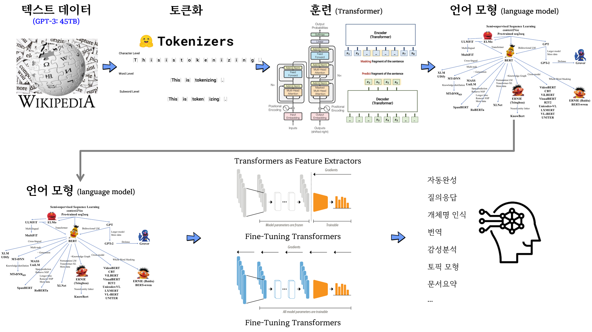

```{r setup, include=FALSE}
# source("tools/chunk-options.R")
knitr::opts_chunk$set(echo = TRUE, warning=FALSE, message=FALSE,
                    comment="", digits = 3, tidy = FALSE, prompt = FALSE, fig.align = 'center')

library(tidyverse)
```



# BERT 활용

## 

[Hugging Face Hub](https://huggingface.co/datasets) 에서 데이터셋을 다운로드 하여 바로 가져온다.

- `pip install datasets`

```{python, eval = FALSE}
# 1. 원본데이터 가져오기
from datasets import load_dataset
emotions = load_dataset("emotion")

## 1.1. 데이터프레임 변환
import pandas as pd

emotions.set_format(type="pandas")
df = emotions["train"][:]
df.head()

def label_int2str(row):
    return emotions["train"].features["label"].int2str(row)

df["label_name"] = df["label"].apply(label_int2str)
df.head()

# 2. 텍스트 --> 토큰
from transformers import AutoTokenizer

model_ckpt = "distilbert-base-uncased"
tokenizer = AutoTokenizer.from_pretrained(model_ckpt)

def tokenize(batch):
    return tokenizer(batch['text'], padding=True, truncation=True)

## 2.1. DF --> 원 텍스트  
emotions.reset_format()

## 2.2. 텍스트 토큰 변환

# print(tokenize(emotions["train"][:2]))

emotions_encoded = emotions.map(tokenize, batched=True, batch_size=None)  
  
print(emotions["train"].column_names)
print(emotions_encoded["train"].column_names)

# 3. 모형개발

from transformers import TFAutoModelForSequenceClassification

num_labels = 6
batch_size = 64

tf_model = (TFAutoModelForSequenceClassification
            .from_pretrained(model_ckpt, num_labels=num_labels))

tokenizer_columns = tokenizer.model_input_names

tf_train_dataset = emotions_encoded["train"].to_tf_dataset(
    columns=tokenizer_columns, label_cols=["label"], shuffle=True,
    batch_size=batch_size)
tf_eval_dataset = emotions_encoded["validation"].to_tf_dataset(
    columns=tokenizer_columns, label_cols=["label"], shuffle=False,
    batch_size=batch_size)
   
# hide_output
from transformers import AutoModel
import torch

model_ckpt = "distilbert-base-uncased"
device = torch.device("cuda" if torch.cuda.is_available() else "cpu")
model = AutoModel.from_pretrained(model_ckpt).to(device)

def extract_hidden_states(batch):
    # Place model inputs on the GPU
    inputs = {k:v.to(device) for k,v in batch.items() 
              if k in tokenizer.model_input_names}
    # Extract last hidden states
    with torch.no_grad():
        last_hidden_state = model(**inputs).last_hidden_state
    # Return vector for [CLS] token
    return {"hidden_state": last_hidden_state[:,0].cpu().numpy()}
  
emotions_encoded.set_format("torch", 
                          columns=["input_ids", "attention_mask", "label"])
                          
emotions_hidden = emotions_encoded.map(extract_hidden_states, batched=True)

import numpy as np

X_train = np.array(emotions_hidden["train"]["hidden_state"])
X_valid = np.array(emotions_hidden["validation"]["hidden_state"])
y_train = np.array(emotions_hidden["train"]["label"])
y_valid = np.array(emotions_hidden["validation"]["label"])
X_train.shape, X_valid.shape

from sklearn.linear_model import LogisticRegression

lr_clf = LogisticRegression(max_iter=3000)
lr_clf.fit(X_train, y_train)

lr_clf.score(X_valid, y_valid)
    
```


# BERT fine-tuning

- [BERT | Fine Tuning | Disaster Tweets - Natural Language Processing with Disaster Tweets](https://www.kaggle.com/code/manojgadde/beginner-bert-fine-tuning-disaster-tweets/)


```{python, eval = FALSE}
import numpy as np # linear algebra
import pandas as pd # data processing, CSV file I/O (e.g. pd.read_csv)

import numpy as np
import matplotlib.pyplot as plt
import nltk
from nltk.corpus import stopwords
from nltk.stem.porter import PorterStemmer
from nltk.stem import WordNetLemmatizer
import sklearn
import re
import string
import pandas as pd
import seaborn as sns

train_data = pd.read_csv('data/twitter/train.csv')

train_data.drop(['id','keyword','location'],axis=1,inplace=True)

train_data.head()

X = train_data.drop('target',axis=1)
y = train_data['target']


from nltk.stem import WordNetLemmatizer

wn = WordNetLemmatizer()
corpus = []

for i in range(0,len(X)):
    review=re.sub('[^a-zA-Z]',' ',X['text'][i])
    review=review.lower()
    review=review.split()
    review=[wn.lemmatize(word) for word in review if word not in stopwords.words('english')]
    review= ' '.join(review)
    corpus.append(review)
    
    
## train_test_split

from sklearn.model_selection import train_test_split

X_train, X_test, y_train,y_test=train_test_split(corpus,y,test_size=0.2,random_state=42)  
    

from transformers import DistilBertTokenizerFast
tokenizer = DistilBertTokenizerFast.from_pretrained('distilbert-base-uncased')


##tokenize function
def tokenize_text(data):
    encoded = tokenizer(data, padding=True, truncation=True, return_tensors='np')
    return encoded.data
  
##tokenize train_data
train_data=tokenize_text(X_train)
#tokenize test_data
test_data=tokenize_text(X_test)

from transformers import TFDistilBertForSequenceClassification

model = TFDistilBertForSequenceClassification.from_pretrained('distilbert-base-uncased', num_labels = 2)


# from tensorflow.keras.losses import SparseCategoricalCrossentropy
# import tensorflow as tf
# 
# optimizer = tf.keras.optimizers.Adam(learning_rate=5e-5)
# 
# model.compile(optimizer = optimizer, 
#               loss      = tf.keras.losses.SparseCategoricalCrossentropy(from_logits=True),
#               metrics   = ['accuracy'])
# 
# 
# model.fit(
#     train_data,
#     np.array(y_train), 
#     validation_data=(
#         test_data,
#         np.array(y_test),
#     ),
#     batch_size=32, epochs=1
# )
# 
# model.save_pretrained('data/twitter_bert_80')

```


```{python, eval = FALSE}
from transformers import TFDistilBertForSequenceClassification

tf_model = TFDistilBertForSequenceClassification.from_pretrained('data/twitter_bert_80')

preds = tf_model.predict(test_data)

# 48/48 [==============================] - 44s 829ms/step

classes = np.argmax(preds['logits'],axis=1)

from sklearn import metrics
metrics.accuracy_score(classes, y_test)
# 0.8023637557452397
metrics.confusion_matrix(classes,y_test)

# array([[691, 118],
#        [183, 531]], dtype=int64)
```

