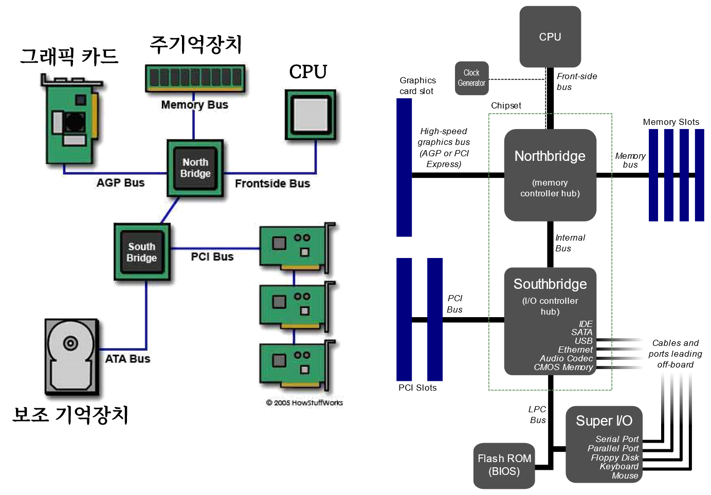

```{r setup, include=FALSE}
# source("tools/chunk-options.R")
knitr::opts_chunk$set(echo = TRUE, warning=FALSE, message=FALSE,
                    comment="", digits = 3, tidy = FALSE, 
                    prompt = FALSE, fig.align = 'center')

library(tidyverse)
```


# 하드웨어


-  GPU: [Jarred Walton (2022-07-01), "GPU Prices, June 2022: Supply Up and Demand Down", tom's HARDWARE](https://www.tomshardware.com/news/gpu-pricing-index)
- 메모리: [memory.net, July 2022 Server Memory Prices](https://memory.net/memory-prices/)

```{r}
library(tidyverse)
library(readxl)
library(rvest)

gpu_raw <- read_excel("data/deep-learning-server.xlsx", sheet = "GPU")

memory_url <- "https://memory.net/memory-prices/"

memory_raw <- read_html(memory_url) %>% 
  html_element(css = "#table_1") %>% 
  html_table(fill = TRUE)

memory_tbl <- memory_raw %>% 
  janitor::clean_names() %>% 
  mutate(price = parse_number(price),
         capacity = parse_number(capacity))
  
memory_tbl %>% 
  write_rds("data/memory_tbl_20220705.rds")

memory_tbl %>% 
  ggplot(aes(x = capacity, y = price)) +
    geom_jitter()

single_cpu_raw <- read_lines("data/CPU_raw.txt")
multiple_cpu_raw <- read_lines("data/CPU_multicore.txt")


get_field <- function(raw_data, field = 1) {
  raw_data %>% 
    as_tibble() %>% 
    filter(row_number() %% 5 == field)
}

single_cpu_tbl <- tibble(cpu = get_field(single_cpu_raw, 1) %>% unlist,
                        cpu_value = get_field(single_cpu_raw, 2) %>% unlist,
                        cpu_index = get_field(single_cpu_raw, 3) %>% unlist,
                        cpu_mark  = get_field(single_cpu_raw, 4) %>% unlist,
                        cpu_price = get_field(single_cpu_raw, 0) %>% unlist) 


multiple_cpu_tbl <- tibble(cpu = get_field(multiple_cpu_raw, 1) %>% unlist,
                        cpu_value = get_field(multiple_cpu_raw, 2) %>% unlist,
                        cpu_index = get_field(multiple_cpu_raw, 3) %>% unlist,
                        cpu_mark  = get_field(multiple_cpu_raw, 4) %>% unlist,
                        cpu_price = get_field(multiple_cpu_raw, 0) %>% unlist) 

cpu_tbl <- single_cpu_tbl %>% 
  mutate(type = "Single") %>% 
  bind_rows(multiple_cpu_tbl %>% mutate(type = "Mulitple")) %>% 
  select(type, everything()) %>% 
  slice(2:n()) %>% 
  set_names(c("type", "spec", "value", "index", "cpu_mark", "price")) %>% 
  mutate(across(value:price, parse_number))

cpu_tbl %>% 
  ggplot(aes( x = cpu_mark, y = price, color = type)) +
    geom_point() +
    geom_line()

ssd_url <- "https://diskprices.com/?locale=us&condition=new&disk_types=external_ssd,internal_ssd,m2_ssd,m2_nvme,u2"

ssd_raw <- read_html(ssd_url) %>% 
  html_element(css = "#diskprices") %>% 
  html_table(fill = TRUE)

ssd_tbl <- ssd_raw %>% 
  janitor::clean_names() %>% 
  filter(condition == "New",
         !str_detect(capacity, "x[\\d+]"),
         str_detect(capacity, "TB")) %>% 
  mutate(price = parse_number(price),
         capacity = parse_number(capacity)) %>% 
  mutate(name = str_to_lower(name)) %>% 
  mutate(supplier = case_when(str_detect(name, "samsung") ~ "Samsung",
                              str_detect(name, "hynix") ~ "SK Hynix",
                              str_detect(name, "^WD|^westrn") ~ "Western Digital",
                              str_detect(name, "seagate") ~ "Seagate",
                              str_detect(name, "micron") ~ "Micron",
                              str_detect(name, "intel") ~ "Intel",
                              str_detect(name, "toshiba") ~ "Toshiba",
                              TRUE ~ "ETC"))

ssd_tbl %>% 
  filter(supplier != "ETC") %>% 
  ggplot(aes(x = capacity, y = price, color = supplier)) +
    geom_point()

```

# 컴퓨터 하드웨어 {.tabset}


## 1단계


## 2단계


## 3단계



## 4단계


