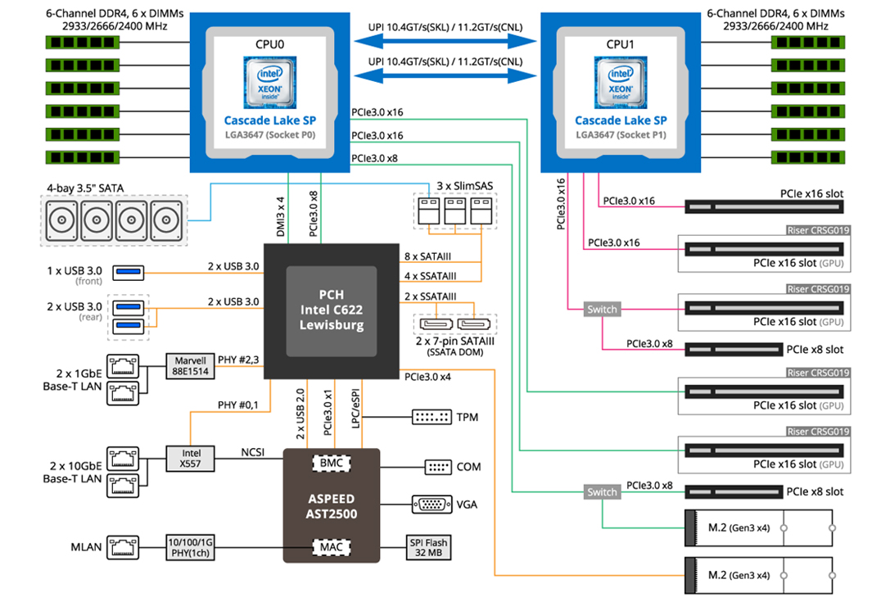
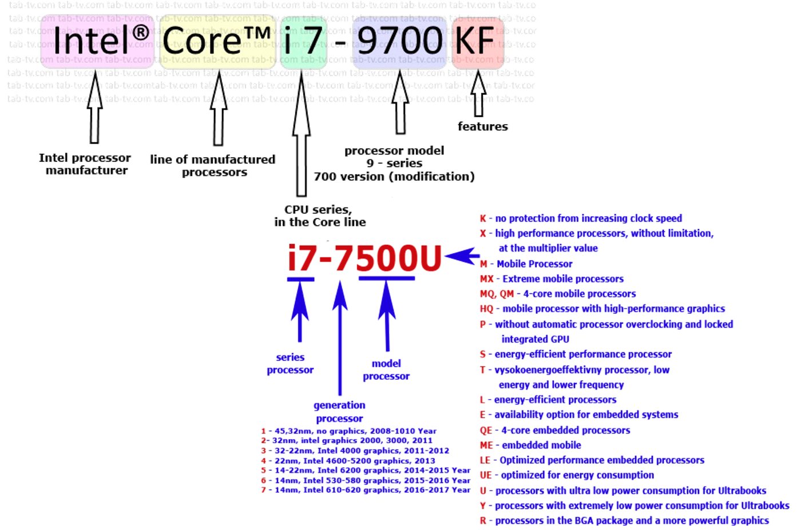

```{r setup, include=FALSE}
# source("tools/chunk-options.R")
knitr::opts_chunk$set(echo = TRUE, warning=FALSE, message=FALSE,
                    comment="", digits = 3, tidy = FALSE, 
                    prompt = FALSE, fig.align = 'center')

library(tidyverse)
```


# 컴퓨터 하드웨어 {.tabset}

컴퓨터는 입력을 받아 중앙처리장치(메모리)에서 지정된 작업을 처리하여 결과값을 출력하는 기계장치다. 이러한 간단한 아이디어를 오랜동안 진화시켜 지금의 모습이 되었다.


## 1단계


## 2단계


## 3단계


## 4단계


# 컴퓨터 산업 {.tabset}

- 빌게이츠 DOJ testimony 2002
- [Steve Blank (02-06-2022), "The Semiconductor Ecosystem Explained", SemiWiki.com](https://semiwiki.com/eda/307494-the-semiconductor-ecosystem-explained/)

## 1983년


## 2002년


## 반도체


# 컴퓨터 부품 제조사

위키백과 사전 [List of computer hardware manufacturers](https://en.wikipedia.org/wiki/List_of_computer_hardware_manufacturers)

- 마더보드
    - Asus
    - Gigabyte Technology
    - MSI (Micro-Star International)
    - ASRock
    - ~~Biostar~~
    - ~~EVGA Corporation~~
    - ~~Intel~~
- Random-access memory (RAM)
    - Micron Technology
    - Samsung Semiconductor
    - SK hynix
    - ~~ChangXin Memory Technologies~~
    - ~~Nanya Technology~~
    - ~~Powerchip Semiconductor~~
    - ~~Winbond~~
- CPU
    - AMD
    - Intel
- GPU
    - AMD(Advanced Micro Devices)
    - Nvidia
- HDD
    - Seagate Technology
    - Toshiba
    - Western Digital
- SSD
    - Samsung Electronics – 34.9%
    - SK Hynix – 10.3%
    - Micron Technology – 13.5%
    - Western Digital Corporation – 14%
    - Kioxia – 18.1%
    - ~~Intel – 8.7% Note: SK Hynix acquired Intel's NAND business at the end of 2021~~
    
# 각 제조사별 제품

## CPU {.tabset}

### 두회사 역사

```{r}
library(tidyverse)
library(reactable)
intel_amd <- readxl::read_excel("data/deep-learning-server.xlsx", sheet = "amd_intel")

intel_amd %>% 
  janitor::clean_names() %>% 
  arrange(desc(year)) %>% 
  reactable::reactable(
    columns = list(
      year = colDef(width = 80),
      notes = colDef(width = 300)
  ))
```

### AMD


### 인텔


### Intel Cascade Lake



### 독해법

[Anatoliy Sheridan (07/06/2019), "Model number Intel CPU i3, i5, i7, i9 2011-2019 explained, Decode", tab_tv](https://en.tab-tv.com/?p=14222)



## GPU {.tabset}


### 역사

-[Nick Evanson (April 14, 2020), "25 Years Later: A Brief Analysis of GPU Processing Efficiency Transistor Count, Die Size and Power Consumption", ](https://www.techspot.com/article/2008-gpu-efficiency-historical-analysis/)


### Nvidia vs AMD

- [reddit (2022년 2월), Updated GPU comparison Chart - Data Source: Tom's Hardware](https://www.reddit.com/r/nvidia/comments/srbcxn/updated_gpu_comparison_chart_data_source_toms/)
- [tom's HARDWARE, "GPU Benchmarks Ranking 2022"](https://www.tomshardware.com/reviews/gpu-hierarchy,4388.html)


### GPU 코드 독해

- [reddit, "I made a chart explaining AMD and Nvidias GPU naming scheme"](https://www.reddit.com/r/pcmasterrace/comments/4wzer6/i_made_a_chart_explaining_amd_and_nvidias_gpu/)


## 메모리 {.tabset}

### 기술 지도

- [Dick James, Jeongdong Choe (April 11, 2019), "TechInsights memory technology update from IEDM18"](https://www.techinsights.com/blog/techinsights-memory-technology-update-iedm18)


# 하드웨어


-  GPU: [Jarred Walton (2022-07-01), "GPU Prices, June 2022: Supply Up and Demand Down", tom's HARDWARE](https://www.tomshardware.com/news/gpu-pricing-index)
- 메모리: [memory.net, July 2022 Server Memory Prices](https://memory.net/memory-prices/)

## 메모리 가격

```{r}
library(tidyverse)
library(readxl)
library(rvest)

gpu_raw <- read_excel("data/deep-learning-server.xlsx", sheet = "GPU")

memory_url <- "https://memory.net/memory-prices/"

memory_raw <- read_html(memory_url) %>% 
  html_element(css = "#table_1") %>% 
  html_table(fill = TRUE)

memory_tbl <- memory_raw %>% 
  janitor::clean_names() %>% 
  mutate(price = parse_number(price),
         capacity = parse_number(capacity))
  
memory_tbl %>% 
  write_rds("data/memory_tbl_20220705.rds")

gb_units <- c(4, 8, 16, 32, 64, 128, 256) * 10^9

memory_tbl %>% 
  mutate(gb_price = price / capacity) %>% 
  mutate(capacity_gb = capacity * 10^9) %>% 
  ggplot(aes(x = capacity_gb, y = gb_price)) +
    geom_jitter() +
    geom_smooth(se=FALSE) +
    geom_vline(xintercept = gb_units, linetype = 2) +
    scale_x_continuous(labels = scales::label_bytes("GB", accuracy = 0)) +
    theme_light() +
    labs(title = "DRAM 가격",
         subtitle = "달러($)/GigaByte",
         x = "용량(기가바이트, GB)",
         y = "달러($)")

```

## CPU 가격

```{r}

single_cpu_raw <- read_lines("data/CPU_raw.txt")
multiple_cpu_raw <- read_lines("data/CPU_multicore.txt")


get_field <- function(raw_data, field = 1) {
  raw_data %>% 
    as_tibble() %>% 
    filter(row_number() %% 5 == field)
}

single_cpu_tbl <- tibble(cpu = get_field(single_cpu_raw, 1) %>% unlist,
                        cpu_value = get_field(single_cpu_raw, 2) %>% unlist,
                        cpu_index = get_field(single_cpu_raw, 3) %>% unlist,
                        cpu_mark  = get_field(single_cpu_raw, 4) %>% unlist,
                        cpu_price = get_field(single_cpu_raw, 0) %>% unlist) 


multiple_cpu_tbl <- tibble(cpu = get_field(multiple_cpu_raw, 1) %>% unlist,
                        cpu_value = get_field(multiple_cpu_raw, 2) %>% unlist,
                        cpu_index = get_field(multiple_cpu_raw, 3) %>% unlist,
                        cpu_mark  = get_field(multiple_cpu_raw, 4) %>% unlist,
                        cpu_price = get_field(multiple_cpu_raw, 0) %>% unlist) 

cpu_tbl <- single_cpu_tbl %>% 
  mutate(type = "Single") %>% 
  bind_rows(multiple_cpu_tbl %>% mutate(type = "Mulitple")) %>% 
  select(type, everything()) %>% 
  slice(2:n()) %>% 
  set_names(c("type", "spec", "value", "index", "cpu_mark", "price")) %>% 
  mutate(across(value:price, parse_number))

cpu_tbl %>% 
  ggplot(aes( x = cpu_mark, y = price, color = type)) +
    geom_point() +
    facet_wrap(~type, scales = "free") +
    theme(legend.position = "none") +
    geom_smooth(se = FALSE) +
    theme_light() +
    labs(title = "CPU 가격",
         x = "CPU 성능 벤치마크",
         y = "달러($)") +
    theme(legend.position = "none") +
    scale_x_continuous(labels = scales::comma) +
    scale_y_continuous(labels = scales::comma)

```

## SSD 가격

```{r}

ssd_url <- "https://diskprices.com/?locale=us&condition=new&disk_types=external_ssd,internal_ssd,m2_ssd,m2_nvme,u2"

ssd_raw <- read_html(ssd_url) %>% 
  html_element(css = "#diskprices") %>% 
  html_table(fill = TRUE)

ssd_tbl <- ssd_raw %>% 
  janitor::clean_names() %>% 
  filter(condition == "New",
         !str_detect(capacity, "x[\\d+]"),
         str_detect(capacity, "TB")) %>% 
  mutate(price = parse_number(price),
         price_per_tb = parse_number(price_per_tb),
         capacity = parse_number(capacity)) %>% 
  mutate(name = str_to_lower(name)) %>% 
  mutate(supplier = case_when(str_detect(name, "samsung") ~ "Samsung",
                              str_detect(name, "hynix") ~ "SK Hynix",
                              str_detect(name, "^WD|^westrn") ~ "Western Digital",
                              str_detect(name, "seagate") ~ "Seagate",
                              str_detect(name, "micron") ~ "Micron",
                              str_detect(name, "intel") ~ "Intel",
                              str_detect(name, "toshiba") ~ "Toshiba",
                              TRUE ~ "ETC"))

ssd_tbl %>% 
  # count(technology, sort = T)
  filter(supplier != "ETC",
         technology %in% c("NVMe", "SSD", "HDD")) %>%
  mutate(capacity_tb = capacity * 10^12) %>% 
  ggplot(aes(x = capacity, y = price_per_tb, color = supplier)) +
    geom_point()  +
    geom_smooth(se = FALSE) +
    theme(legend.position = "none") +
    theme_light() +
    labs(title = "SSD 가격",
         x = "SSD 용량 (TB)",
         y = "달러($)") +
    theme(legend.position = "none") +
    facet_wrap(~technology)
```


# 딥러닝 워크스테이션

### 그래프

```{r}
dl_svr <- read_excel("data/deep-learning-server.xlsx", sheet = "server")

dl_svr %>% 
  filter(! is.na(품명)) %>% 
  ggplot(aes(x = fct_reorder(품명, 비율), y=비율, fill = 품명)) +
    geom_col(width = 0.5) +
    coord_flip() +
    theme(legend.position = "none") +
    theme_light() +
    labs(title = "딥러닝 워크스테이션 원가비중",
         x = "",
         y = "비중 (부품가/총비용)") +
    theme(legend.position = "none") +
    scale_y_continuous(labels = scales::percent, limits = c(0, 0.5)) +
    geom_text(aes(label = scales::percent(비율, accuracy = 0.1)), size = 4, hjust = -0.1 )

```

### 스펙

```{r}
library(reactable)
dl_svr %>% 
  filter(! is.na(품명)) %>%   
  select(-순) %>% 
  reactable::reactable(
    striped = TRUE,
    highlight = TRUE,
    bordered = TRUE,
    showPageSizeOptions = TRUE,
    groupBy = c("구분"),
    columns = list(
       품명 = colDef(width = 80),
       제품사양 = colDef(width = 350),
       수량 = colDef(width = 50),
       가격 = colDef(aggregate = "sum",  
                              format = colFormat(separators =TRUE)),
       단가 = colDef(format = colFormat(separators =TRUE)),
       비율 = colDef(width = 70, format = colFormat(percent = TRUE, digits = 1)),
       누적비율 = colDef(width = 70, format = colFormat(percent = TRUE, digits = 1))
  ))


```


