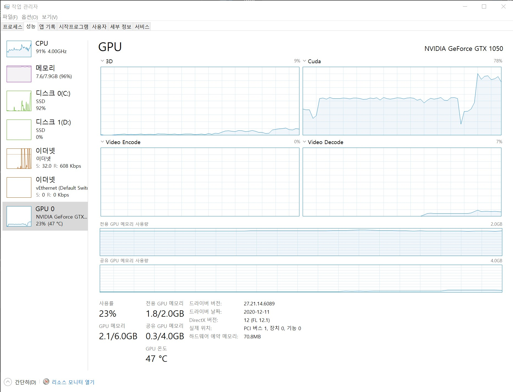

```{r setup, include=FALSE}
# source("tools/chunk-options.R")
knitr::opts_chunk$set(echo = TRUE, warning=FALSE, message=FALSE,
                    comment="", digits = 3, tidy = FALSE, 
                    prompt = FALSE, fig.align = 'center')

library(tidyverse)
```


# 딥러닝 개발 환경

딥러닝 개발환경은 결국 Nvidia GPU 그래픽 카드를 구매하여 마더보드에 장착을 한 후에 이를 구동하기 위한 1) 드라이버 2) C 컴파일러 3) CUDA 4) 딥러닝 프레임워크를 순차적으로 설치하여 딥러닝 응용프로그램 개발에 적용하는 것으로 간략히 정리할 수 있다.

구글 Colab을 사용하는 경우 상기 1~4번 과정이 이미 클라우드 상에 구현되어 있으니 신경을 쓰지 않아도 되지만 극단적으로 연구실/집/회사에 자체 딥러닝 서버 혹은 워크스테이션을 구축한 경우 상기 1~4번 뿐만 아니라 전기세(?)도 신경을 써서 관리해야 한다.


- [Techzizou (Aug 25, 2021), "Install CUDA and CUDNN on Windows & Linux", Published in Geek Culture](https://medium.com/geekculture/install-cuda-and-cudnn-on-windows-linux-52d1501a8805)

# 소프트웨어 스택

## 드라이버 {.tabset}

드라이버는 하드웨어와 운영체제를 연결해주는 소프트웨어다. 예를 들어 GPU 그래픽 카드로 Nvidia Geforce GTX 1050 그래픽 카드 마더보드에 장착했다고 가정하면 운영체제(윈도우 10)에서 인식하여 활용할 수 있도록 드라이버 소프트웨어를 설치해줘야 한다.

오래된 GPU는 GPU 드라이버 지원이 중지될 것이 확실하기 때문에 오래된 GPU를 계속해서 사용하고자 하는 경우 GPU 세대별 지원 드라이버 버전을 확인하고 가능하면 최신 GPU 드라이버 버전을 유지한다.

### 드라이버 다운로드

구입한 Nvidia Geforce 그래픽 카드에 매칭되는 드라이버를 [GEFORCE® 드라이버 다운로드](https://www.nvidia.com/ko-kr/geforce/drivers/)에서 선택하여 설치한다.


### 윈도우즈 10 설치 장착모습


### Nvidia 그래픽카드 확인

```{bash, eval = FALSE}
$ nvidia-smi
Sat Jul  9 19:41:41 2022
+-----------------------------------------------------------------------------+
| NVIDIA-SMI 460.89       Driver Version: 460.89       CUDA Version: 11.2     |
|-------------------------------+----------------------+----------------------+
| GPU  Name            TCC/WDDM | Bus-Id        Disp.A | Volatile Uncorr. ECC |
| Fan  Temp  Perf  Pwr:Usage/Cap|         Memory-Usage | GPU-Util  Compute M. |
|                               |                      |               MIG M. |
|===============================+======================+======================|
|   0  GeForce GTX 1050   WDDM  | 00000000:01:00.0  On |                  N/A |
| 20%   35C    P5    N/A /  75W |   1836MiB /  2048MiB |      2%      Default |
|                               |                      |                  N/A |
+-------------------------------+----------------------+----------------------+

+-----------------------------------------------------------------------------+
| Processes:                                                                  |
|  GPU   GI   CI        PID   Type   Process name                  GPU Memory |
|        ID   ID                                                   Usage      |
|=============================================================================|

```


## Visual Studio 설치

[Visual Studio](https://visualstudio.microsoft.com/ko/downloads/)를 다운로드 받는 이유는 C 컴파일러를 설치하기 위해 필요한 것이다. Visual Studio IDE를 통해 필요한 개발에 필요한 언어 구성요소를 설치할 수 있다. 예를 들어 .NET, Node.js, 파이썬 등... 하지만 딥러닝을 위해 꼭 필요한 것은 C/C++ 개발 구성요소라 필히 설치하고 너무 낮은 버전 Visual Studio 2015 와 같은 너무 오래된 Visual Studio 버전은 업그레이드 하는 것이 필요하다.


## CUDA 설치 {.tabset}

위키백과에 따르면 **CUDA("Compute Unified Device Architecture", 쿠다)**는 그래픽 처리 장치에서 수행하는 알고리즘을 C 프로그래밍 언어를 비롯한 산업 표준 언어를 사용하여 작성할 수 있도록 하는 GPGPU ('GPU의 범용 연산', General-Purpose computing on Graphics Processing Units) 기술이다. CUDA는 엔비디아가 개발해오고 있으며 이 아키텍처를 사용하려면 엔비디아 GPU와 특별한 스트림 처리 드라이버가 필요하다.

CUDA는 응용프로그램을 실행하는 부분과 응용프로그램 개발을 지원하는 툴킷으로 구성된다. GPU 하드웨어에 맞춰 CUDA 버전을 맞춰줘야 하드웨어 성능을 최상으로 유지시킬 수 있다.


### 설치할 CUDA 버전 검색

CUDA 모든 버전이 Nvidia Geforce 그래픽 카드에 맞지 않기 때문에 예를 들어 GTX 1050을 소유하고 있다면 GTX 1050 제품이 속한 아키텍처가 "파스칼(Pascal)"  이기 때문에 CUDA 8 이후 버전을 [CUDA Toolkit Archive](https://developer.nvidia.com/cuda-toolkit-archive) 에서 찾아 GTX 1050을 가장 잘 지원하는 하드웨어 CUDA 버전을 다운로드해서 설치한다.

[Arnon Shimoni (27/10/2020), "Matching CUDA arch and CUDA gencode for various NVIDIA architectures"](https://arnon.dk/matching-sm-architectures-arch-and-gencode-for-various-nvidia-cards/)

GTX 1050에 적합한 CUDA 버전으로 8버전이후 가장 최신 버진이 아닌 11.2를 선택한다. ~~가장 최신 버전을 다운로드 받아 설치하면 안 됩니다~~


### CUDA 버전 확인

```{bash, eval = FALSE}
$ nvcc --version
nvcc: NVIDIA (R) Cuda compiler driver
Copyright (c) 2005-2020 NVIDIA Corporation
Built on Mon_Nov_30_19:15:10_Pacific_Standard_Time_2020
Cuda compilation tools, release 11.2, V11.2.67
Build cuda_11.2.r11.2/compiler.29373293_0
```


## cuDNN 설치 {.tabset}

GTX 1050 그래픽 카드 CUDA 버전을 확정(11.2) 했기 때문에 cuDNN 딥러닝 GPU 가속 라이브러리를 [cuDNN Archive](https://developer.nvidia.com/rdp/cudnn-archive) 에서 다운로드 받아 복사하여 붙여넣기를 한다.

### cuDNN 다운로드

`cudnn-windows-x86_64-8.4.0.27_cuda11.6-archive.zip` 파일명을 갖기 때문에 압축을 풀어 `bin\`, `include\`, `lib\` 폴더에 담긴 모든 파일을 `C:\Program Files\NVIDIA GPU Computing Toolkit\CUDA\v11.2\` 폴더에 다음과 같이 복사하여 붙여넣기한다.


### 복사하여 붙여넣기


이미지 출처: [5. Installing cuDNN](https://medium.com/analytics-vidhya/installing-cuda-and-cudnn-on-windows-d44b8e9876b5)

## 환경변수 등록

`C:\Program Files\NVIDIA GPU Computing Toolkit\CUDA\v11.2\` 폴더에 담긴 CUDA 정보를 윈도우즈 환경으로 등록한다.

- CUDA_PATH &rarr; C:\Program Files\NVIDIA GPU Computing Toolkit\CUDA\v11.2
- CUDA_PATH_V11_2 &rarr; C:\Program Files\NVIDIA GPU Computing Toolkit\CUDA\v11.2


## 딥러닝 프레임워크 설치

현 시점에서 가장 인기있는 딥러닝 프레임워크는 텐서플로우와 파이토치다. 

먼저 CUDA (11.2), cuDNN (8.1)에 해당되는 파이썬 버전과 tensorflow 버전은 `tensorflow_gpu-2.7.0`으로 확인되어 이를 설치한다.

<div class = "row">
  <div class = "col-md-6">
**tensorflow**

```{bash, eval = FALSE}
pip3 uninstall tensorflow
pip3 install 'tensorflow-gpu==2.7.0'
```

  </div>
  <div class = "col-md-6">
**pytorch**

```{bash, eval = FALSE}
conda install pytorch torchvision cudatoolkit=11.2 -c pytorch
```

  </div>
</div>


- [윈도우즈](https://www.tensorflow.org/install/source_windows#tested_build_configurations)
- [맥/리눅스](https://www.tensorflow.org/install/source#tested_build_configurations)


# 헬로우 월드 {.tabset}

## 텐서플로우


```{python tensorflow-gpu}
import tensorflow as tf

print(tf.config.list_physical_devices('GPU'))

print(tf.test.is_built_with_cuda)

print(tf.test.gpu_device_name())

print(tf.config.get_visible_devices())
```

## 파이토치

```{python pytorch-gpu, eval = FALSE}
import torch

device = torch.device("cuda") if torch.cuda.is_available() else torch.device("cpu")
print('Using device:', device)
# Using device: cuda

#Additional Info when using cuda
if device.type == 'cuda':
    print(torch.cuda.get_device_name(0))
    print('Memory Usage:')
    print('Allocated:', round(torch.cuda.memory_allocated(0)/1024**3,1), 'GB')
    print('Cached:   ', round(torch.cuda.memory_reserved(0)/1024**3,1), 'GB')
# GeForce GTX 1050
# Memory Usage:
# Allocated: 0.0 GB
# Cached:    0.0 GB

```


# 성능 비교

GPU를 사용해서 딥러닝 모형을 만들면 CPU 대비 얼마나 효과가 있을까? 이 문제에 답을 구하기 위해 MNIST 데이터셋을 Keras로 작성된 코드를 다음 하드웨어를 갖춘 컴퓨터로 확인해보자.

- H/W
    - CPU: Intel Core i7 7700
    - Memory: DDR4 8 GB
    - GPU: NVIDIA GeForece GTX 1050
- S/W
    - Windows 10
    - CUDA: 11.2
    - cuDNN: 8.4.0
    - Python: 3.8.8
    

```{python, eval = FALSE}
import tensorflow as tf
import numpy as np                                
import matplotlib.pyplot as plt
import keras as k
from keras.datasets import mnist
from keras.models import Sequential
from keras.layers import Dense, Dropout, Flatten
from keras.layers import Conv2D, MaxPooling2D, BatchNormalization
from keras.optimizers import SGD, Adam
from keras.models import load_model
from keras import backend as K
import os

os.environ["TF_CPP_MIN_LOG_LEVEL"] = "2"
import tensorflow as tf
from tensorflow import keras
from tensorflow.keras import layers

physical_devices = tf.config.list_physical_devices("GPU")
tf.config.experimental.set_memory_growth(physical_devices[0], True)


#data preprocessing
(x_train, y_train), (x_test, y_test) = mnist.load_data()
img_rows, img_cols = 28,28
x_train = x_train.reshape(x_train.shape[0], img_rows, img_cols, 1)
x_test = x_test.reshape(x_test.shape[0], img_rows, img_cols, 1)
input_shape = (img_rows, img_cols, 1)
x_test=x_test.astype('float32')
x_train=x_train.astype('float32')
mean=np.mean(x_train)
std=np.std(x_train)
x_test = (x_test-mean)/std
x_train = (x_train-mean)/std

#labels
num_classes=10
y_train = k.utils.to_categorical(y_train, num_classes)
y_test = k.utils.to_categorical(y_test, num_classes)
```


## GPU 훈련

```{python, eval = FALSE}

#build model

num_filter=32
num_dense=512
drop_dense=0.7
ac='relu'
learningrate=0.001

model = Sequential()

model.add(Conv2D(num_filter, (3, 3), activation=ac, input_shape=(28, 28, 1),padding='same'))
model.add(BatchNormalization(axis=-1))
model.add(Conv2D(num_filter, (3, 3), activation=ac,padding='same'))
model.add(BatchNormalization(axis=-1))
model.add(MaxPooling2D(pool_size=(2, 2)))   # reduces to 14x14x32

model.add(Conv2D(2*num_filter, (3, 3), activation=ac,padding='same'))
model.add(BatchNormalization(axis=-1))
model.add(Conv2D(2*num_filter, (3, 3), activation=ac,padding='same'))
model.add(BatchNormalization(axis=-1))
model.add(MaxPooling2D(pool_size=(2, 2)))   # reduces to 7x7x64 = 3136 neurons

model.add(Flatten())                        
model.add(Dense(num_dense, activation=ac))
model.add(BatchNormalization())
model.add(Dropout(drop_dense))
model.add(Dense(10, activation='softmax'))

adm=Adam(learning_rate=learningrate, beta_1=0.9, beta_2=0.999, epsilon=1e-08)
model.compile(loss='categorical_crossentropy', metrics=['accuracy'],optimizer=adm)

# Allocator (GPU_0_bfc) ran out of memory trying to allocate 오류
# gpus = tf.config.experimental.list_physical_devices('GPU')
# if gpus:
#     # Restrict TensorFlow to only allocate 1GB of memory on the first GPU
#     try:
#         tf.config.experimental.set_virtual_device_configuration(gpus[0],
#        [tf.config.experimental.VirtualDeviceConfiguration(memory_limit=1024)])
#         logical_gpus = tf.config.experimental.list_logical_devices('GPU')
#         print(len(gpus), "Physical GPUs,", len(logical_gpus), "Logical GPUs")
#     except RuntimeError as e:
#         # Virtual devices must be set before GPUs have been initialized
#         print(e)

# with GPU (the default in my setup)
for i in range(7):
    k=8*2**i
    print("batch size "+str(k))
    model.fit(x_train, y_train, batch_size=k, epochs=1, validation_data=(x_test, y_test))

```

```
batch size 32

   1/1875 [..............................] - ETA: 40:04 - loss: 0.0340 - accuracy: 1.0000
   3/1875 [..............................] - ETA: 1:25 - loss: 0.0783 - accuracy: 0.9792 
   5/1875 [..............................] - ETA: 1:33 - loss: 0.0812 - accuracy: 0.9812
   7/1875 [..............................] - ETA: 1:30 - loss: 0.0768 - accuracy: 0.9777
   9/1875 [..............................] - ETA: 1:34 - loss: 0.0655 - accuracy: 0.9792
  11/1875 [..............................] - ETA: 1:31 - loss: 0.0569 - accuracy: 0.9801
  13/1875 [..............................] - ETA: 1:31 - loss: 0.0492 - accuracy: 0.9832
  15/1875 [..............................] - ETA: 1:31 - loss: 0.0438 - accuracy: 0.9854
  17/1875 [..............................] - ETA: 1:30 - loss: 0.0420 - accuracy: 0.9853
  18/1875 [..............................] - ETA: 1:32 - loss: 0.0400 - accuracy: 0.9861
  20/1875 [..............................] - ETA: 1:31 - loss: 0.0415 - accuracy: 0.9859
  22/1875 [..............................] - ETA: 1:32 - loss: 0.0455 - accuracy: 0.9830
  24/1875 [..............................] - ETA: 1:31 - loss: 0.0540 - accuracy: 0.9831
  26/1875 [..............................] - ETA: 1:32 - loss: 0.0556 - accuracy: 0.9820
  27/1875 [..............................] - ETA: 1:33 - loss: 0.0540 - accuracy: 0.9826
  29/1875 [..............................] - ETA: 1:33 - loss: 0.0517 - accuracy: 0.9828
  30/1875 [..............................] - ETA: 1:34 - loss: 0.0537 - accuracy: 0.9823
  32/1875 [..............................] - ETA: 1:33 - loss: 0.0537 - accuracy: 0.9824
  34/1875 [..............................] - ETA: 1:33 - loss: 0.0565 - accuracy: 0.9825
  36/1875 [..............................] - ETA: 1:32 - loss: 0.0563 - accuracy: 0.9818
  38/1875 [..............................] - ETA: 1:32 - loss: 0.0550 - accuracy: 0.9819
  39/1875 [..............................] - ETA: 1:32 - loss: 0.0561 - accuracy: 0.9816
  41/1875 [..............................] - ETA: 1:32 - loss: 0.0556 - accuracy: 0.9817
  43/1875 [..............................] - ETA: 1:31 - loss: 0.0541 - accuracy: 0.9826
  45/1875 [..............................] - ETA: 1:31 - loss: 0.0518 - accuracy: 0.9833
  47/1875 [..............................] - ETA: 1:30 - loss: 0.0517 - accuracy: 0.9827
  49/1875 [..............................] - ETA: 1:30 - loss: 0.0518 - accuracy: 0.9828
  51/1875 [..............................] - ETA: 1:30 - loss: 0.0501 - accuracy: 0.9835
  52/1875 [..............................] - ETA: 1:30 - loss: 0.0493 - accuracy: 0.9838
  53/1875 [..............................] - ETA: 1:31 - loss: 0.0485 - accuracy: 0.9841
  55/1875 [..............................] - ETA: 1:30 - loss: 0.0517 - accuracy: 0.9841
  57/1875 [..............................] - ETA: 1:30 - loss: 0.0550 - accuracy: 0.9830
  59/1875 [..............................] - ETA: 1:30 - loss: 0.0540 - accuracy: 0.9831
  60/1875 [..............................] - ETA: 1:30 - loss: 0.0557 - accuracy: 0.9823
  62/1875 [..............................] - ETA: 1:30 - loss: 0.0555 - accuracy: 0.9824
  64/1875 [>.............................] - ETA: 1:29 - loss: 0.0542 - accuracy: 0.9829
  66/1875 [>.............................] - ETA: 1:29 - loss: 0.0547 - accuracy: 0.9830
  67/1875 [>.............................] - ETA: 1:29 - loss: 0.0551 - accuracy: 0.9827
  69/1875 [>.............................] - ETA: 1:30 - loss: 0.0570 - accuracy: 0.9823
  71/1875 [>.............................] - ETA: 1:29 - loss: 0.0581 - accuracy: 0.9824
  73/1875 [>.............................] - ETA: 1:30 - loss: 0.0596 - accuracy: 0.9820
  75/1875 [>.............................] - ETA: 1:29 - loss: 0.0589 - accuracy: 0.9821
  77/1875 [>.............................] - ETA: 1:29 - loss: 0.0587 - accuracy: 0.9821
  79/1875 [>.............................] - ETA: 1:29 - loss: 0.0574 - accuracy: 0.9826
  81/1875 [>.............................] - ETA: 1:30 - loss: 0.0564 - accuracy: 0.9826
  82/1875 [>.............................] - ETA: 1:30 - loss: 0.0560 - accuracy: 0.9829
  84/1875 [>.............................] - ETA: 1:29 - loss: 0.0561 - accuracy: 0.9825
  85/1875 [>.............................] - ETA: 1:29 - loss: 0.0559 - accuracy: 0.9824
  87/1875 [>.............................] - ETA: 1:29 - loss: 0.0548 - accuracy: 0.9828
  89/1875 [>.............................] - ETA: 1:30 - loss: 0.0538 - accuracy: 0.9831
  91/1875 [>.............................] - ETA: 1:29 - loss: 0.0554 - accuracy: 0.9832
  92/1875 [>.............................] - ETA: 1:29 - loss: 0.0551 - accuracy: 0.9830
  93/1875 [>.............................] - ETA: 1:30 - loss: 0.0546 - accuracy: 0.9832
  94/1875 [>.............................] - ETA: 1:30 - loss: 0.0580 - accuracy: 0.9820
  96/1875 [>.............................] - ETA: 1:30 - loss: 0.0570 - accuracy: 0.9824
  98/1875 [>.............................] - ETA: 1:29 - loss: 0.0560 - accuracy: 0.9828
 100/1875 [>.............................] - ETA: 1:29 - loss: 0.0559 - accuracy: 0.9825
 101/1875 [>.............................] - ETA: 1:30 - loss: 0.0554 - accuracy: 0.9827
 102/1875 [>.............................] - ETA: 1:30 - loss: 0.0555 - accuracy: 0.9825
 103/1875 [>.............................] - ETA: 1:30 - loss: 0.0552 - accuracy: 0.9824
 104/1875 [>.............................] - ETA: 1:30 - loss: 0.0548 - accuracy: 0.9826
 105/1875 [>.............................] - ETA: 1:30 - loss: 0.0545 - accuracy: 0.9827
 106/1875 [>.............................] - ETA: 1:30 - loss: 0.0545 - accuracy: 0.9826
 107/1875 [>.............................] - ETA: 1:31 - loss: 0.0545 - accuracy: 0.9825
 109/1875 [>.............................] - ETA: 1:30 - loss: 0.0547 - accuracy: 0.9822
 110/1875 [>.............................] - ETA: 1:30 - loss: 0.0547 - accuracy: 0.9821
 112/1875 [>.............................] - ETA: 1:31 - loss: 0.0553 - accuracy: 0.9821
 114/1875 [>.............................] - ETA: 1:30 - loss: 0.0553 - accuracy: 0.9822
 116/1875 [>.............................] - ETA: 1:30 - loss: 0.0550 - accuracy: 0.9822
 118/1875 [>.............................] - ETA: 1:30 - loss: 0.0543 - accuracy: 0.9823
 119/1875 [>.............................] - ETA: 1:30 - loss: 0.0540 - accuracy: 0.9824
 120/1875 [>.............................] - ETA: 1:30 - loss: 0.0537 - accuracy: 0.9826
 122/1875 [>.............................] - ETA: 1:30 - loss: 0.0554 - accuracy: 0.9826
 123/1875 [>.............................] - ETA: 1:30 - loss: 0.0550 - accuracy: 0.9827
 124/1875 [>.............................] - ETA: 1:30 - loss: 0.0552 - accuracy: 0.9826
 125/1875 [=>............................] - ETA: 1:30 - loss: 0.0557 - accuracy: 0.9825
 126/1875 [=>............................] - ETA: 1:30 - loss: 0.0570 - accuracy: 0.9819
 127/1875 [=>............................] - ETA: 1:31 - loss: 0.0566 - accuracy: 0.9820
 128/1875 [=>............................] - ETA: 1:31 - loss: 0.0562 - accuracy: 0.9822
 129/1875 [=>............................] - ETA: 1:31 - loss: 0.0559 - accuracy: 0.9823
 130/1875 [=>............................] - ETA: 1:31 - loss: 0.0556 - accuracy: 0.9825
 131/1875 [=>............................] - ETA: 1:31 - loss: 0.0552 - accuracy: 0.9826
 133/1875 [=>............................] - ETA: 1:30 - loss: 0.0570 - accuracy: 0.9821
 134/1875 [=>............................] - ETA: 1:31 - loss: 0.0568 - accuracy: 0.9823
 135/1875 [=>............................] - ETA: 1:31 - loss: 0.0566 - accuracy: 0.9822
 136/1875 [=>............................] - ETA: 1:31 - loss: 0.0562 - accuracy: 0.9823
 137/1875 [=>............................] - ETA: 1:32 - loss: 0.0559 - accuracy: 0.9824
 138/1875 [=>............................] - ETA: 1:32 - loss: 0.0555 - accuracy: 0.9826
 139/1875 [=>............................] - ETA: 1:32 - loss: 0.0552 - accuracy: 0.9827
 140/1875 [=>............................] - ETA: 1:33 - loss: 0.0566 - accuracy: 0.9826
 141/1875 [=>............................] - ETA: 1:33 - loss: 0.0563 - accuracy: 0.9827
 142/1875 [=>............................] - ETA: 1:33 - loss: 0.0560 - accuracy: 0.9828
 143/1875 [=>............................] - ETA: 1:33 - loss: 0.0564 - accuracy: 0.9825
 144/1875 [=>............................] - ETA: 1:33 - loss: 0.0566 - accuracy: 0.9824
 145/1875 [=>............................] - ETA: 1:35 - loss: 0.0569 - accuracy: 0.9821
 146/1875 [=>............................] - ETA: 1:35 - loss: 0.0568 - accuracy: 0.9822
 147/1875 [=>............................] - ETA: 1:35 - loss: 0.0577 - accuracy: 0.9819
 148/1875 [=>............................] - ETA: 1:36 - loss: 0.0573 - accuracy: 0.9821
 149/1875 [=>............................] - ETA: 1:36 - loss: 0.0580 - accuracy: 0.9820
 150/1875 [=>............................] - ETA: 1:36 - loss: 0.0576 - accuracy: 0.9821
 151/1875 [=>............................] - ETA: 1:36 - loss: 0.0573 - accuracy: 0.9822
 152/1875 [=>............................] - ETA: 1:37 - loss: 0.0575 - accuracy: 0.9821
 153/1875 [=>............................] - ETA: 1:37 - loss: 0.0572 - accuracy: 0.9822
 154/1875 [=>............................] - ETA: 1:37 - loss: 0.0575 - accuracy: 0.9821
 155/1875 [=>............................] - ETA: 1:37 - loss: 0.0572 - accuracy: 0.9823
 156/1875 [=>............................] - ETA: 1:37 - loss: 0.0570 - accuracy: 0.9824
 157/1875 [=>............................] - ETA: 1:37 - loss: 0.0567 - accuracy: 0.9825
 158/1875 [=>............................] - ETA: 1:37 - loss: 0.0564 - accuracy: 0.9826
 159/1875 [=>............................] - ETA: 1:37 - loss: 0.0569 - accuracy: 0.9825
 160/1875 [=>............................] - ETA: 1:37 - loss: 0.0566 - accuracy: 0.9826
 161/1875 [=>............................] - ETA: 1:37 - loss: 0.0563 - accuracy: 0.9827
 162/1875 [=>............................] - ETA: 1:37 - loss: 0.0566 - accuracy: 0.9826
 163/1875 [=>............................] - ETA: 1:37 - loss: 0.0563 - accuracy: 0.9827
 165/1875 [=>............................] - ETA: 1:37 - loss: 0.0560 - accuracy: 0.9828
 166/1875 [=>............................] - ETA: 1:37 - loss: 0.0558 - accuracy: 0.9829
 168/1875 [=>............................] - ETA: 1:37 - loss: 0.0565 - accuracy: 0.9821
 169/1875 [=>............................] - ETA: 1:37 - loss: 0.0566 - accuracy: 0.9821
 170/1875 [=>............................] - ETA: 1:37 - loss: 0.0563 - accuracy: 0.9822
 171/1875 [=>............................] - ETA: 1:37 - loss: 0.0560 - accuracy: 0.9823
 173/1875 [=>............................] - ETA: 1:37 - loss: 0.0554 - accuracy: 0.9825
 175/1875 [=>............................] - ETA: 1:37 - loss: 0.0548 - accuracy: 0.9827
 177/1875 [=>............................] - ETA: 1:37 - loss: 0.0550 - accuracy: 0.9827
 179/1875 [=>............................] - ETA: 1:37 - loss: 0.0546 - accuracy: 0.9829
 181/1875 [=>............................] - ETA: 1:36 - loss: 0.0541 - accuracy: 0.9831
 183/1875 [=>............................] - ETA: 1:36 - loss: 0.0538 - accuracy: 0.9831
 184/1875 [=>............................] - ETA: 1:36 - loss: 0.0536 - accuracy: 0.9832
 185/1875 [=>............................] - ETA: 1:36 - loss: 0.0535 - accuracy: 0.9831
 186/1875 [=>............................] - ETA: 1:36 - loss: 0.0533 - accuracy: 0.9832
 188/1875 [==>...........................] - ETA: 1:36 - loss: 0.0531 - accuracy: 0.9832
 189/1875 [==>...........................] - ETA: 1:36 - loss: 0.0528 - accuracy: 0.9833
 190/1875 [==>...........................] - ETA: 1:36 - loss: 0.0526 - accuracy: 0.9834
 191/1875 [==>...........................] - ETA: 1:36 - loss: 0.0524 - accuracy: 0.9835
 192/1875 [==>...........................] - ETA: 1:36 - loss: 0.0521 - accuracy: 0.9836
 194/1875 [==>...........................] - ETA: 1:36 - loss: 0.0533 - accuracy: 0.9834
 196/1875 [==>...........................] - ETA: 1:36 - loss: 0.0528 - accuracy: 0.9836
 198/1875 [==>...........................] - ETA: 1:35 - loss: 0.0528 - accuracy: 0.9836
 199/1875 [==>...........................] - ETA: 1:35 - loss: 0.0526 - accuracy: 0.9837
 201/1875 [==>...........................] - ETA: 1:35 - loss: 0.0524 - accuracy: 0.9837
 203/1875 [==>...........................] - ETA: 1:35 - loss: 0.0520 - accuracy: 0.9838
 204/1875 [==>...........................] - ETA: 1:36 - loss: 0.0517 - accuracy: 0.9839
 208/1875 [==>...........................] - ETA: 1:34 - loss: 0.0511 - accuracy: 0.9842
 212/1875 [==>...........................] - ETA: 1:32 - loss: 0.0504 - accuracy: 0.9844
 217/1875 [==>...........................] - ETA: 1:31 - loss: 0.0499 - accuracy: 0.9843
 221/1875 [==>...........................] - ETA: 1:29 - loss: 0.0492 - accuracy: 0.9846
 225/1875 [==>...........................] - ETA: 1:28 - loss: 0.0486 - accuracy: 0.9847
 229/1875 [==>...........................] - ETA: 1:27 - loss: 0.0486 - accuracy: 0.9847
 231/1875 [==>...........................] - ETA: 1:26 - loss: 0.0482 - accuracy: 0.9848
 236/1875 [==>...........................] - ETA: 1:25 - loss: 0.0481 - accuracy: 0.9850
 241/1875 [==>...........................] - ETA: 1:23 - loss: 0.0483 - accuracy: 0.9852
 244/1875 [==>...........................] - ETA: 1:22 - loss: 0.0479 - accuracy: 0.9853
 248/1875 [==>...........................] - ETA: 1:21 - loss: 0.0473 - accuracy: 0.9855
 252/1875 [===>..........................] - ETA: 1:20 - loss: 0.0487 - accuracy: 0.9852
 256/1875 [===>..........................] - ETA: 1:19 - loss: 0.0481 - accuracy: 0.9855
 258/1875 [===>..........................] - ETA: 1:18 - loss: 0.0484 - accuracy: 0.9855
 262/1875 [===>..........................] - ETA: 1:17 - loss: 0.0480 - accuracy: 0.9854
 266/1875 [===>..........................] - ETA: 1:16 - loss: 0.0478 - accuracy: 0.9854
 270/1875 [===>..........................] - ETA: 1:15 - loss: 0.0473 - accuracy: 0.9855
 273/1875 [===>..........................] - ETA: 1:15 - loss: 0.0472 - accuracy: 0.9855
 277/1875 [===>..........................] - ETA: 1:14 - loss: 0.0471 - accuracy: 0.9856
 281/1875 [===>..........................] - ETA: 1:13 - loss: 0.0471 - accuracy: 0.9855
 285/1875 [===>..........................] - ETA: 1:12 - loss: 0.0467 - accuracy: 0.9857
 289/1875 [===>..........................] - ETA: 1:11 - loss: 0.0469 - accuracy: 0.9858
 293/1875 [===>..........................] - ETA: 1:10 - loss: 0.0472 - accuracy: 0.9858
 297/1875 [===>..........................] - ETA: 1:09 - loss: 0.0475 - accuracy: 0.9857
 300/1875 [===>..........................] - ETA: 1:09 - loss: 0.0476 - accuracy: 0.9856
 304/1875 [===>..........................] - ETA: 1:08 - loss: 0.0472 - accuracy: 0.9856
 308/1875 [===>..........................] - ETA: 1:07 - loss: 0.0468 - accuracy: 0.9857
 312/1875 [===>..........................] - ETA: 1:06 - loss: 0.0464 - accuracy: 0.9859
 314/1875 [====>.........................] - ETA: 1:06 - loss: 0.0464 - accuracy: 0.9858
 317/1875 [====>.........................] - ETA: 1:06 - loss: 0.0468 - accuracy: 0.9858
 321/1875 [====>.........................] - ETA: 1:05 - loss: 0.0470 - accuracy: 0.9859
 325/1875 [====>.........................] - ETA: 1:04 - loss: 0.0471 - accuracy: 0.9857
 328/1875 [====>.........................] - ETA: 1:04 - loss: 0.0474 - accuracy: 0.9857
 332/1875 [====>.........................] - ETA: 1:03 - loss: 0.0474 - accuracy: 0.9857
 336/1875 [====>.........................] - ETA: 1:02 - loss: 0.0472 - accuracy: 0.9858
 340/1875 [====>.........................] - ETA: 1:02 - loss: 0.0473 - accuracy: 0.9858
 344/1875 [====>.........................] - ETA: 1:01 - loss: 0.0471 - accuracy: 0.9859
 348/1875 [====>.........................] - ETA: 1:01 - loss: 0.0467 - accuracy: 0.9861
 352/1875 [====>.........................] - ETA: 1:00 - loss: 0.0462 - accuracy: 0.9862
 355/1875 [====>.........................] - ETA: 1:00 - loss: 0.0460 - accuracy: 0.9863
 359/1875 [====>.........................] - ETA: 59s - loss: 0.0456 - accuracy: 0.9863 
 363/1875 [====>.........................] - ETA: 58s - loss: 0.0456 - accuracy: 0.9864
 367/1875 [====>.........................] - ETA: 58s - loss: 0.0452 - accuracy: 0.9865
 368/1875 [====>.........................] - ETA: 58s - loss: 0.0451 - accuracy: 0.9865
 371/1875 [====>.........................] - ETA: 58s - loss: 0.0451 - accuracy: 0.9865
 375/1875 [=====>........................] - ETA: 57s - loss: 0.0451 - accuracy: 0.9865
 379/1875 [=====>........................] - ETA: 57s - loss: 0.0450 - accuracy: 0.9865
 384/1875 [=====>........................] - ETA: 56s - loss: 0.0451 - accuracy: 0.9865
 388/1875 [=====>........................] - ETA: 56s - loss: 0.0454 - accuracy: 0.9864
 391/1875 [=====>........................] - ETA: 55s - loss: 0.0451 - accuracy: 0.9865
 395/1875 [=====>........................] - ETA: 55s - loss: 0.0449 - accuracy: 0.9866
 399/1875 [=====>........................] - ETA: 54s - loss: 0.0448 - accuracy: 0.9865
 403/1875 [=====>........................] - ETA: 54s - loss: 0.0448 - accuracy: 0.9865
 406/1875 [=====>........................] - ETA: 54s - loss: 0.0446 - accuracy: 0.9865
 409/1875 [=====>........................] - ETA: 53s - loss: 0.0446 - accuracy: 0.9865
 413/1875 [=====>........................] - ETA: 53s - loss: 0.0444 - accuracy: 0.9865
 415/1875 [=====>........................] - ETA: 53s - loss: 0.0450 - accuracy: 0.9863
 419/1875 [=====>........................] - ETA: 52s - loss: 0.0449 - accuracy: 0.9863
 423/1875 [=====>........................] - ETA: 52s - loss: 0.0446 - accuracy: 0.9864
 427/1875 [=====>........................] - ETA: 51s - loss: 0.0445 - accuracy: 0.9865
 430/1875 [=====>........................] - ETA: 51s - loss: 0.0443 - accuracy: 0.9865
 434/1875 [=====>........................] - ETA: 51s - loss: 0.0447 - accuracy: 0.9863
 438/1875 [======>.......................] - ETA: 50s - loss: 0.0449 - accuracy: 0.9863
 442/1875 [======>.......................] - ETA: 50s - loss: 0.0446 - accuracy: 0.9864
 446/1875 [======>.......................] - ETA: 49s - loss: 0.0444 - accuracy: 0.9864
 451/1875 [======>.......................] - ETA: 49s - loss: 0.0448 - accuracy: 0.9863
 455/1875 [======>.......................] - ETA: 49s - loss: 0.0446 - accuracy: 0.9864
 459/1875 [======>.......................] - ETA: 48s - loss: 0.0443 - accuracy: 0.9865
 461/1875 [======>.......................] - ETA: 48s - loss: 0.0442 - accuracy: 0.9866
 465/1875 [======>.......................] - ETA: 48s - loss: 0.0441 - accuracy: 0.9866
 470/1875 [======>.......................] - ETA: 47s - loss: 0.0445 - accuracy: 0.9865
 474/1875 [======>.......................] - ETA: 47s - loss: 0.0446 - accuracy: 0.9866
 478/1875 [======>.......................] - ETA: 47s - loss: 0.0446 - accuracy: 0.9865
 481/1875 [======>.......................] - ETA: 46s - loss: 0.0444 - accuracy: 0.9865
 485/1875 [======>.......................] - ETA: 46s - loss: 0.0446 - accuracy: 0.9864
 489/1875 [======>.......................] - ETA: 46s - loss: 0.0444 - accuracy: 0.9865
 493/1875 [======>.......................] - ETA: 45s - loss: 0.0442 - accuracy: 0.9866
 496/1875 [======>.......................] - ETA: 45s - loss: 0.0440 - accuracy: 0.9866
 500/1875 [=======>......................] - ETA: 45s - loss: 0.0438 - accuracy: 0.9867
 502/1875 [=======>......................] - ETA: 45s - loss: 0.0440 - accuracy: 0.9867
 506/1875 [=======>......................] - ETA: 44s - loss: 0.0441 - accuracy: 0.9867
 509/1875 [=======>......................] - ETA: 44s - loss: 0.0441 - accuracy: 0.9867
 514/1875 [=======>......................] - ETA: 44s - loss: 0.0439 - accuracy: 0.9867
 518/1875 [=======>......................] - ETA: 43s - loss: 0.0440 - accuracy: 0.9867
 521/1875 [=======>......................] - ETA: 43s - loss: 0.0439 - accuracy: 0.9868
 525/1875 [=======>......................] - ETA: 43s - loss: 0.0441 - accuracy: 0.9868
 529/1875 [=======>......................] - ETA: 42s - loss: 0.0439 - accuracy: 0.9868
 533/1875 [=======>......................] - ETA: 42s - loss: 0.0437 - accuracy: 0.9869
 536/1875 [=======>......................] - ETA: 42s - loss: 0.0436 - accuracy: 0.9868
 541/1875 [=======>......................] - ETA: 42s - loss: 0.0440 - accuracy: 0.9868
 544/1875 [=======>......................] - ETA: 41s - loss: 0.0438 - accuracy: 0.9869
 548/1875 [=======>......................] - ETA: 41s - loss: 0.0436 - accuracy: 0.9870
 551/1875 [=======>......................] - ETA: 41s - loss: 0.0433 - accuracy: 0.9871
 556/1875 [=======>......................] - ETA: 40s - loss: 0.0431 - accuracy: 0.9871
 560/1875 [=======>......................] - ETA: 40s - loss: 0.0429 - accuracy: 0.9872
 564/1875 [========>.....................] - ETA: 40s - loss: 0.0427 - accuracy: 0.9873
 568/1875 [========>.....................] - ETA: 40s - loss: 0.0425 - accuracy: 0.9873
 572/1875 [========>.....................] - ETA: 39s - loss: 0.0422 - accuracy: 0.9874
 576/1875 [========>.....................] - ETA: 39s - loss: 0.0420 - accuracy: 0.9875
 579/1875 [========>.....................] - ETA: 39s - loss: 0.0419 - accuracy: 0.9875
 583/1875 [========>.....................] - ETA: 39s - loss: 0.0418 - accuracy: 0.9875
 587/1875 [========>.....................] - ETA: 38s - loss: 0.0416 - accuracy: 0.9876
 591/1875 [========>.....................] - ETA: 38s - loss: 0.0414 - accuracy: 0.9877
 594/1875 [========>.....................] - ETA: 38s - loss: 0.0413 - accuracy: 0.9877
 598/1875 [========>.....................] - ETA: 38s - loss: 0.0412 - accuracy: 0.9877
 602/1875 [========>.....................] - ETA: 37s - loss: 0.0413 - accuracy: 0.9877
 606/1875 [========>.....................] - ETA: 37s - loss: 0.0415 - accuracy: 0.9877
 609/1875 [========>.....................] - ETA: 37s - loss: 0.0413 - accuracy: 0.9877
 613/1875 [========>.....................] - ETA: 37s - loss: 0.0411 - accuracy: 0.9878
 617/1875 [========>.....................] - ETA: 37s - loss: 0.0409 - accuracy: 0.9878
 621/1875 [========>.....................] - ETA: 36s - loss: 0.0407 - accuracy: 0.9879
 625/1875 [=========>....................] - ETA: 36s - loss: 0.0411 - accuracy: 0.9878
 629/1875 [=========>....................] - ETA: 36s - loss: 0.0410 - accuracy: 0.9878
 633/1875 [=========>....................] - ETA: 36s - loss: 0.0408 - accuracy: 0.9879
 635/1875 [=========>....................] - ETA: 36s - loss: 0.0408 - accuracy: 0.9879
 639/1875 [=========>....................] - ETA: 35s - loss: 0.0407 - accuracy: 0.9880
 643/1875 [=========>....................] - ETA: 35s - loss: 0.0408 - accuracy: 0.9879
 647/1875 [=========>....................] - ETA: 35s - loss: 0.0406 - accuracy: 0.9880
 650/1875 [=========>....................] - ETA: 35s - loss: 0.0405 - accuracy: 0.9880
 654/1875 [=========>....................] - ETA: 34s - loss: 0.0405 - accuracy: 0.9880
 658/1875 [=========>....................] - ETA: 34s - loss: 0.0406 - accuracy: 0.9880
 662/1875 [=========>....................] - ETA: 34s - loss: 0.0406 - accuracy: 0.9880
 665/1875 [=========>....................] - ETA: 34s - loss: 0.0408 - accuracy: 0.9879
 669/1875 [=========>....................] - ETA: 34s - loss: 0.0408 - accuracy: 0.9879
 673/1875 [=========>....................] - ETA: 33s - loss: 0.0407 - accuracy: 0.9879
 677/1875 [=========>....................] - ETA: 33s - loss: 0.0407 - accuracy: 0.9878
 679/1875 [=========>....................] - ETA: 33s - loss: 0.0406 - accuracy: 0.9878
 683/1875 [=========>....................] - ETA: 33s - loss: 0.0409 - accuracy: 0.9877
 687/1875 [=========>....................] - ETA: 33s - loss: 0.0408 - accuracy: 0.9877
 691/1875 [==========>...................] - ETA: 33s - loss: 0.0408 - accuracy: 0.9876
 694/1875 [==========>...................] - ETA: 32s - loss: 0.0407 - accuracy: 0.9877
 698/1875 [==========>...................] - ETA: 32s - loss: 0.0405 - accuracy: 0.9877
 702/1875 [==========>...................] - ETA: 32s - loss: 0.0408 - accuracy: 0.9877
 706/1875 [==========>...................] - ETA: 32s - loss: 0.0407 - accuracy: 0.9877
 710/1875 [==========>...................] - ETA: 32s - loss: 0.0407 - accuracy: 0.9877
 714/1875 [==========>...................] - ETA: 31s - loss: 0.0407 - accuracy: 0.9877
 718/1875 [==========>...................] - ETA: 31s - loss: 0.0407 - accuracy: 0.9877
 721/1875 [==========>...................] - ETA: 31s - loss: 0.0406 - accuracy: 0.9877
 725/1875 [==========>...................] - ETA: 31s - loss: 0.0407 - accuracy: 0.9877
 728/1875 [==========>...................] - ETA: 31s - loss: 0.0407 - accuracy: 0.9877
 731/1875 [==========>...................] - ETA: 31s - loss: 0.0405 - accuracy: 0.9877
 733/1875 [==========>...................] - ETA: 31s - loss: 0.0405 - accuracy: 0.9878
 737/1875 [==========>...................] - ETA: 30s - loss: 0.0403 - accuracy: 0.9878
 741/1875 [==========>...................] - ETA: 30s - loss: 0.0405 - accuracy: 0.9878
 745/1875 [==========>...................] - ETA: 30s - loss: 0.0404 - accuracy: 0.9879
 749/1875 [==========>...................] - ETA: 30s - loss: 0.0404 - accuracy: 0.9879
 753/1875 [===========>..................] - ETA: 30s - loss: 0.0402 - accuracy: 0.9879
 757/1875 [===========>..................] - ETA: 30s - loss: 0.0401 - accuracy: 0.9880
 760/1875 [===========>..................] - ETA: 29s - loss: 0.0400 - accuracy: 0.9880
 764/1875 [===========>..................] - ETA: 29s - loss: 0.0399 - accuracy: 0.9880
 768/1875 [===========>..................] - ETA: 29s - loss: 0.0398 - accuracy: 0.9881
 772/1875 [===========>..................] - ETA: 29s - loss: 0.0399 - accuracy: 0.9881
 775/1875 [===========>..................] - ETA: 29s - loss: 0.0399 - accuracy: 0.9880
 779/1875 [===========>..................] - ETA: 29s - loss: 0.0401 - accuracy: 0.9879
 782/1875 [===========>..................] - ETA: 28s - loss: 0.0400 - accuracy: 0.9880
 783/1875 [===========>..................] - ETA: 29s - loss: 0.0399 - accuracy: 0.9880
 786/1875 [===========>..................] - ETA: 28s - loss: 0.0399 - accuracy: 0.9880
 790/1875 [===========>..................] - ETA: 28s - loss: 0.0400 - accuracy: 0.9880
 793/1875 [===========>..................] - ETA: 28s - loss: 0.0401 - accuracy: 0.9879
 796/1875 [===========>..................] - ETA: 28s - loss: 0.0401 - accuracy: 0.9879
 800/1875 [===========>..................] - ETA: 28s - loss: 0.0400 - accuracy: 0.9879
 804/1875 [===========>..................] - ETA: 28s - loss: 0.0399 - accuracy: 0.9879
 808/1875 [===========>..................] - ETA: 27s - loss: 0.0398 - accuracy: 0.9880
 811/1875 [===========>..................] - ETA: 27s - loss: 0.0397 - accuracy: 0.9880
 815/1875 [============>.................] - ETA: 27s - loss: 0.0396 - accuracy: 0.9880
 820/1875 [============>.................] - ETA: 27s - loss: 0.0395 - accuracy: 0.9881
 824/1875 [============>.................] - ETA: 27s - loss: 0.0393 - accuracy: 0.9881
 827/1875 [============>.................] - ETA: 27s - loss: 0.0393 - accuracy: 0.9881
 831/1875 [============>.................] - ETA: 27s - loss: 0.0392 - accuracy: 0.9881
 835/1875 [============>.................] - ETA: 26s - loss: 0.0391 - accuracy: 0.9881
 839/1875 [============>.................] - ETA: 26s - loss: 0.0390 - accuracy: 0.9882
 843/1875 [============>.................] - ETA: 26s - loss: 0.0392 - accuracy: 0.9881
 848/1875 [============>.................] - ETA: 26s - loss: 0.0391 - accuracy: 0.9881
 852/1875 [============>.................] - ETA: 26s - loss: 0.0389 - accuracy: 0.9882
 855/1875 [============>.................] - ETA: 26s - loss: 0.0389 - accuracy: 0.9881
 859/1875 [============>.................] - ETA: 25s - loss: 0.0389 - accuracy: 0.9881
 863/1875 [============>.................] - ETA: 25s - loss: 0.0391 - accuracy: 0.9880
 867/1875 [============>.................] - ETA: 25s - loss: 0.0392 - accuracy: 0.9880
 870/1875 [============>.................] - ETA: 25s - loss: 0.0392 - accuracy: 0.9880
 874/1875 [============>.................] - ETA: 25s - loss: 0.0392 - accuracy: 0.9880
 878/1875 [=============>................] - ETA: 25s - loss: 0.0392 - accuracy: 0.9880
 882/1875 [=============>................] - ETA: 25s - loss: 0.0393 - accuracy: 0.9879
 886/1875 [=============>................] - ETA: 24s - loss: 0.0394 - accuracy: 0.9879
 890/1875 [=============>................] - ETA: 24s - loss: 0.0395 - accuracy: 0.9878
 894/1875 [=============>................] - ETA: 24s - loss: 0.0397 - accuracy: 0.9877
 897/1875 [=============>................] - ETA: 24s - loss: 0.0397 - accuracy: 0.9877
 901/1875 [=============>................] - ETA: 24s - loss: 0.0397 - accuracy: 0.9877
 905/1875 [=============>................] - ETA: 24s - loss: 0.0399 - accuracy: 0.9876
 909/1875 [=============>................] - ETA: 24s - loss: 0.0397 - accuracy: 0.9877
 912/1875 [=============>................] - ETA: 23s - loss: 0.0396 - accuracy: 0.9877
 915/1875 [=============>................] - ETA: 23s - loss: 0.0397 - accuracy: 0.9877
 919/1875 [=============>................] - ETA: 23s - loss: 0.0395 - accuracy: 0.9877
 923/1875 [=============>................] - ETA: 23s - loss: 0.0397 - accuracy: 0.9877
 926/1875 [=============>................] - ETA: 23s - loss: 0.0395 - accuracy: 0.9877
 930/1875 [=============>................] - ETA: 23s - loss: 0.0394 - accuracy: 0.9878
 934/1875 [=============>................] - ETA: 23s - loss: 0.0393 - accuracy: 0.9878
 938/1875 [==============>...............] - ETA: 23s - loss: 0.0392 - accuracy: 0.9878
 942/1875 [==============>...............] - ETA: 22s - loss: 0.0392 - accuracy: 0.9879
 946/1875 [==============>...............] - ETA: 22s - loss: 0.0396 - accuracy: 0.9878
 950/1875 [==============>...............] - ETA: 22s - loss: 0.0398 - accuracy: 0.9876
 953/1875 [==============>...............] - ETA: 22s - loss: 0.0397 - accuracy: 0.9876
 957/1875 [==============>...............] - ETA: 22s - loss: 0.0399 - accuracy: 0.9876
 961/1875 [==============>...............] - ETA: 22s - loss: 0.0398 - accuracy: 0.9876
 965/1875 [==============>...............] - ETA: 22s - loss: 0.0400 - accuracy: 0.9876
 968/1875 [==============>...............] - ETA: 22s - loss: 0.0404 - accuracy: 0.9875
 972/1875 [==============>...............] - ETA: 21s - loss: 0.0402 - accuracy: 0.9876
 976/1875 [==============>...............] - ETA: 21s - loss: 0.0402 - accuracy: 0.9875
 980/1875 [==============>...............] - ETA: 21s - loss: 0.0404 - accuracy: 0.9875
 984/1875 [==============>...............] - ETA: 21s - loss: 0.0404 - accuracy: 0.9875
 988/1875 [==============>...............] - ETA: 21s - loss: 0.0407 - accuracy: 0.9874
 992/1875 [==============>...............] - ETA: 21s - loss: 0.0407 - accuracy: 0.9873
 995/1875 [==============>...............] - ETA: 21s - loss: 0.0406 - accuracy: 0.9873
 999/1875 [==============>...............] - ETA: 21s - loss: 0.0405 - accuracy: 0.9874
1003/1875 [===============>..............] - ETA: 20s - loss: 0.0407 - accuracy: 0.9873
1007/1875 [===============>..............] - ETA: 20s - loss: 0.0406 - accuracy: 0.9873
1010/1875 [===============>..............] - ETA: 20s - loss: 0.0406 - accuracy: 0.9873
1014/1875 [===============>..............] - ETA: 20s - loss: 0.0406 - accuracy: 0.9873
1018/1875 [===============>..............] - ETA: 20s - loss: 0.0406 - accuracy: 0.9873
1022/1875 [===============>..............] - ETA: 20s - loss: 0.0408 - accuracy: 0.9873
1025/1875 [===============>..............] - ETA: 20s - loss: 0.0409 - accuracy: 0.9873
1029/1875 [===============>..............] - ETA: 20s - loss: 0.0409 - accuracy: 0.9872
1033/1875 [===============>..............] - ETA: 19s - loss: 0.0408 - accuracy: 0.9873
1037/1875 [===============>..............] - ETA: 19s - loss: 0.0407 - accuracy: 0.9873
1039/1875 [===============>..............] - ETA: 19s - loss: 0.0407 - accuracy: 0.9873
1043/1875 [===============>..............] - ETA: 19s - loss: 0.0410 - accuracy: 0.9872
1047/1875 [===============>..............] - ETA: 19s - loss: 0.0410 - accuracy: 0.9873
1050/1875 [===============>..............] - ETA: 19s - loss: 0.0409 - accuracy: 0.9873
1054/1875 [===============>..............] - ETA: 19s - loss: 0.0410 - accuracy: 0.9873
1058/1875 [===============>..............] - ETA: 19s - loss: 0.0411 - accuracy: 0.9873
1062/1875 [===============>..............] - ETA: 19s - loss: 0.0410 - accuracy: 0.9873
1065/1875 [================>.............] - ETA: 19s - loss: 0.0410 - accuracy: 0.9873
1069/1875 [================>.............] - ETA: 18s - loss: 0.0410 - accuracy: 0.9873
1073/1875 [================>.............] - ETA: 18s - loss: 0.0410 - accuracy: 0.9873
1077/1875 [================>.............] - ETA: 18s - loss: 0.0410 - accuracy: 0.9873
1080/1875 [================>.............] - ETA: 18s - loss: 0.0410 - accuracy: 0.9873
1084/1875 [================>.............] - ETA: 18s - loss: 0.0411 - accuracy: 0.9872
1088/1875 [================>.............] - ETA: 18s - loss: 0.0410 - accuracy: 0.9872
1092/1875 [================>.............] - ETA: 18s - loss: 0.0409 - accuracy: 0.9873
1095/1875 [================>.............] - ETA: 18s - loss: 0.0408 - accuracy: 0.9873
1099/1875 [================>.............] - ETA: 18s - loss: 0.0408 - accuracy: 0.9873
1103/1875 [================>.............] - ETA: 17s - loss: 0.0407 - accuracy: 0.9874
1107/1875 [================>.............] - ETA: 17s - loss: 0.0408 - accuracy: 0.9873
1111/1875 [================>.............] - ETA: 17s - loss: 0.0411 - accuracy: 0.9873
1115/1875 [================>.............] - ETA: 17s - loss: 0.0413 - accuracy: 0.9873
1119/1875 [================>.............] - ETA: 17s - loss: 0.0412 - accuracy: 0.9873
1122/1875 [================>.............] - ETA: 17s - loss: 0.0411 - accuracy: 0.9873
1126/1875 [=================>............] - ETA: 17s - loss: 0.0412 - accuracy: 0.9873
1130/1875 [=================>............] - ETA: 17s - loss: 0.0411 - accuracy: 0.9873
1134/1875 [=================>............] - ETA: 17s - loss: 0.0410 - accuracy: 0.9874
1138/1875 [=================>............] - ETA: 16s - loss: 0.0410 - accuracy: 0.9874
1142/1875 [=================>............] - ETA: 16s - loss: 0.0409 - accuracy: 0.9874
1146/1875 [=================>............] - ETA: 16s - loss: 0.0409 - accuracy: 0.9874
1149/1875 [=================>............] - ETA: 16s - loss: 0.0408 - accuracy: 0.9874
1154/1875 [=================>............] - ETA: 16s - loss: 0.0407 - accuracy: 0.9875
1158/1875 [=================>............] - ETA: 16s - loss: 0.0410 - accuracy: 0.9875
1162/1875 [=================>............] - ETA: 16s - loss: 0.0411 - accuracy: 0.9874
1164/1875 [=================>............] - ETA: 16s - loss: 0.0411 - accuracy: 0.9874
1168/1875 [=================>............] - ETA: 16s - loss: 0.0412 - accuracy: 0.9874
1172/1875 [=================>............] - ETA: 15s - loss: 0.0412 - accuracy: 0.9874
1176/1875 [=================>............] - ETA: 15s - loss: 0.0411 - accuracy: 0.9874
1180/1875 [=================>............] - ETA: 15s - loss: 0.0410 - accuracy: 0.9874
1184/1875 [=================>............] - ETA: 15s - loss: 0.0410 - accuracy: 0.9874
1188/1875 [==================>...........] - ETA: 15s - loss: 0.0409 - accuracy: 0.9874
1190/1875 [==================>...........] - ETA: 15s - loss: 0.0409 - accuracy: 0.9874
1194/1875 [==================>...........] - ETA: 15s - loss: 0.0409 - accuracy: 0.9874
1198/1875 [==================>...........] - ETA: 15s - loss: 0.0413 - accuracy: 0.9874
1202/1875 [==================>...........] - ETA: 15s - loss: 0.0418 - accuracy: 0.9874
1205/1875 [==================>...........] - ETA: 15s - loss: 0.0417 - accuracy: 0.9874
1209/1875 [==================>...........] - ETA: 14s - loss: 0.0418 - accuracy: 0.9874
1213/1875 [==================>...........] - ETA: 14s - loss: 0.0419 - accuracy: 0.9874
1217/1875 [==================>...........] - ETA: 14s - loss: 0.0419 - accuracy: 0.9874
1221/1875 [==================>...........] - ETA: 14s - loss: 0.0418 - accuracy: 0.9874
1225/1875 [==================>...........] - ETA: 14s - loss: 0.0420 - accuracy: 0.9874
1229/1875 [==================>...........] - ETA: 14s - loss: 0.0420 - accuracy: 0.9874
1232/1875 [==================>...........] - ETA: 14s - loss: 0.0420 - accuracy: 0.9874
1236/1875 [==================>...........] - ETA: 14s - loss: 0.0419 - accuracy: 0.9874
1240/1875 [==================>...........] - ETA: 14s - loss: 0.0420 - accuracy: 0.9873
1244/1875 [==================>...........] - ETA: 14s - loss: 0.0421 - accuracy: 0.9873
1247/1875 [==================>...........] - ETA: 13s - loss: 0.0422 - accuracy: 0.9873
1251/1875 [===================>..........] - ETA: 13s - loss: 0.0422 - accuracy: 0.9872
1255/1875 [===================>..........] - ETA: 13s - loss: 0.0422 - accuracy: 0.9873
1259/1875 [===================>..........] - ETA: 13s - loss: 0.0424 - accuracy: 0.9872
1261/1875 [===================>..........] - ETA: 13s - loss: 0.0424 - accuracy: 0.9872
1265/1875 [===================>..........] - ETA: 13s - loss: 0.0424 - accuracy: 0.9872
1269/1875 [===================>..........] - ETA: 13s - loss: 0.0423 - accuracy: 0.9872
1271/1875 [===================>..........] - ETA: 13s - loss: 0.0423 - accuracy: 0.9873
1276/1875 [===================>..........] - ETA: 13s - loss: 0.0425 - accuracy: 0.9872
1280/1875 [===================>..........] - ETA: 13s - loss: 0.0426 - accuracy: 0.9871
1285/1875 [===================>..........] - ETA: 13s - loss: 0.0425 - accuracy: 0.9872
1288/1875 [===================>..........] - ETA: 12s - loss: 0.0429 - accuracy: 0.9871
1292/1875 [===================>..........] - ETA: 12s - loss: 0.0429 - accuracy: 0.9870
1296/1875 [===================>..........] - ETA: 12s - loss: 0.0428 - accuracy: 0.9871
1299/1875 [===================>..........] - ETA: 12s - loss: 0.0428 - accuracy: 0.9871
1303/1875 [===================>..........] - ETA: 12s - loss: 0.0427 - accuracy: 0.9871
1307/1875 [===================>..........] - ETA: 12s - loss: 0.0426 - accuracy: 0.9872
1311/1875 [===================>..........] - ETA: 12s - loss: 0.0425 - accuracy: 0.9872
1314/1875 [====================>.........] - ETA: 12s - loss: 0.0426 - accuracy: 0.9872
1318/1875 [====================>.........] - ETA: 12s - loss: 0.0425 - accuracy: 0.9872
1322/1875 [====================>.........] - ETA: 12s - loss: 0.0428 - accuracy: 0.9872
1326/1875 [====================>.........] - ETA: 11s - loss: 0.0428 - accuracy: 0.9872
1329/1875 [====================>.........] - ETA: 11s - loss: 0.0428 - accuracy: 0.9872
1333/1875 [====================>.........] - ETA: 11s - loss: 0.0428 - accuracy: 0.9872
1337/1875 [====================>.........] - ETA: 11s - loss: 0.0428 - accuracy: 0.9872
1341/1875 [====================>.........] - ETA: 11s - loss: 0.0430 - accuracy: 0.9872
1344/1875 [====================>.........] - ETA: 11s - loss: 0.0430 - accuracy: 0.9872
1348/1875 [====================>.........] - ETA: 11s - loss: 0.0429 - accuracy: 0.9872
1352/1875 [====================>.........] - ETA: 11s - loss: 0.0428 - accuracy: 0.9872
1356/1875 [====================>.........] - ETA: 11s - loss: 0.0430 - accuracy: 0.9872
1360/1875 [====================>.........] - ETA: 11s - loss: 0.0429 - accuracy: 0.9872
1364/1875 [====================>.........] - ETA: 11s - loss: 0.0428 - accuracy: 0.9872
1368/1875 [====================>.........] - ETA: 10s - loss: 0.0427 - accuracy: 0.9872
1371/1875 [====================>.........] - ETA: 10s - loss: 0.0427 - accuracy: 0.9873
1375/1875 [=====================>........] - ETA: 10s - loss: 0.0426 - accuracy: 0.9873
1379/1875 [=====================>........] - ETA: 10s - loss: 0.0428 - accuracy: 0.9872
1383/1875 [=====================>........] - ETA: 10s - loss: 0.0428 - accuracy: 0.9873
1386/1875 [=====================>........] - ETA: 10s - loss: 0.0427 - accuracy: 0.9873
1390/1875 [=====================>........] - ETA: 10s - loss: 0.0428 - accuracy: 0.9873
1394/1875 [=====================>........] - ETA: 10s - loss: 0.0429 - accuracy: 0.9872
1398/1875 [=====================>........] - ETA: 10s - loss: 0.0429 - accuracy: 0.9872
1402/1875 [=====================>........] - ETA: 10s - loss: 0.0428 - accuracy: 0.9872
1406/1875 [=====================>........] - ETA: 10s - loss: 0.0428 - accuracy: 0.9872
1410/1875 [=====================>........] - ETA: 9s - loss: 0.0427 - accuracy: 0.9873 
1413/1875 [=====================>........] - ETA: 9s - loss: 0.0426 - accuracy: 0.9873
1417/1875 [=====================>........] - ETA: 9s - loss: 0.0425 - accuracy: 0.9873
1421/1875 [=====================>........] - ETA: 9s - loss: 0.0424 - accuracy: 0.9873
1425/1875 [=====================>........] - ETA: 9s - loss: 0.0424 - accuracy: 0.9873
1429/1875 [=====================>........] - ETA: 9s - loss: 0.0425 - accuracy: 0.9873
1432/1875 [=====================>........] - ETA: 9s - loss: 0.0425 - accuracy: 0.9873
1436/1875 [=====================>........] - ETA: 9s - loss: 0.0425 - accuracy: 0.9873
1440/1875 [======================>.......] - ETA: 9s - loss: 0.0425 - accuracy: 0.9873
1444/1875 [======================>.......] - ETA: 9s - loss: 0.0425 - accuracy: 0.9873
1448/1875 [======================>.......] - ETA: 9s - loss: 0.0426 - accuracy: 0.9873
1449/1875 [======================>.......] - ETA: 9s - loss: 0.0426 - accuracy: 0.9873
1453/1875 [======================>.......] - ETA: 9s - loss: 0.0425 - accuracy: 0.9873
1457/1875 [======================>.......] - ETA: 9s - loss: 0.0424 - accuracy: 0.9873
1461/1875 [======================>.......] - ETA: 9s - loss: 0.0424 - accuracy: 0.9873
1465/1875 [======================>.......] - ETA: 8s - loss: 0.0424 - accuracy: 0.9873
1468/1875 [======================>.......] - ETA: 8s - loss: 0.0424 - accuracy: 0.9873
1472/1875 [======================>.......] - ETA: 8s - loss: 0.0423 - accuracy: 0.9873
1476/1875 [======================>.......] - ETA: 8s - loss: 0.0423 - accuracy: 0.9873
1480/1875 [======================>.......] - ETA: 8s - loss: 0.0422 - accuracy: 0.9874
1483/1875 [======================>.......] - ETA: 8s - loss: 0.0422 - accuracy: 0.9874
1487/1875 [======================>.......] - ETA: 8s - loss: 0.0422 - accuracy: 0.9874
1491/1875 [======================>.......] - ETA: 8s - loss: 0.0421 - accuracy: 0.9874
1495/1875 [======================>.......] - ETA: 8s - loss: 0.0420 - accuracy: 0.9874
1498/1875 [======================>.......] - ETA: 8s - loss: 0.0419 - accuracy: 0.9874
1502/1875 [=======================>......] - ETA: 8s - loss: 0.0419 - accuracy: 0.9874
1507/1875 [=======================>......] - ETA: 7s - loss: 0.0418 - accuracy: 0.9874
1509/1875 [=======================>......] - ETA: 7s - loss: 0.0419 - accuracy: 0.9874
1513/1875 [=======================>......] - ETA: 7s - loss: 0.0419 - accuracy: 0.9874
1517/1875 [=======================>......] - ETA: 7s - loss: 0.0418 - accuracy: 0.9875
1521/1875 [=======================>......] - ETA: 7s - loss: 0.0417 - accuracy: 0.9875
1524/1875 [=======================>......] - ETA: 7s - loss: 0.0417 - accuracy: 0.9875
1528/1875 [=======================>......] - ETA: 7s - loss: 0.0416 - accuracy: 0.9875
1532/1875 [=======================>......] - ETA: 7s - loss: 0.0417 - accuracy: 0.9875
1536/1875 [=======================>......] - ETA: 7s - loss: 0.0416 - accuracy: 0.9875
1539/1875 [=======================>......] - ETA: 7s - loss: 0.0416 - accuracy: 0.9875
1543/1875 [=======================>......] - ETA: 7s - loss: 0.0416 - accuracy: 0.9875
1547/1875 [=======================>......] - ETA: 7s - loss: 0.0416 - accuracy: 0.9875
1551/1875 [=======================>......] - ETA: 6s - loss: 0.0415 - accuracy: 0.9875
1554/1875 [=======================>......] - ETA: 6s - loss: 0.0415 - accuracy: 0.9875
1559/1875 [=======================>......] - ETA: 6s - loss: 0.0415 - accuracy: 0.9875
1563/1875 [========================>.....] - ETA: 6s - loss: 0.0414 - accuracy: 0.9875
1567/1875 [========================>.....] - ETA: 6s - loss: 0.0413 - accuracy: 0.9876
1572/1875 [========================>.....] - ETA: 6s - loss: 0.0413 - accuracy: 0.9876
1576/1875 [========================>.....] - ETA: 6s - loss: 0.0412 - accuracy: 0.9876
1580/1875 [========================>.....] - ETA: 6s - loss: 0.0411 - accuracy: 0.9876
1583/1875 [========================>.....] - ETA: 6s - loss: 0.0412 - accuracy: 0.9876
1587/1875 [========================>.....] - ETA: 6s - loss: 0.0414 - accuracy: 0.9875
1591/1875 [========================>.....] - ETA: 6s - loss: 0.0413 - accuracy: 0.9875
1595/1875 [========================>.....] - ETA: 5s - loss: 0.0415 - accuracy: 0.9874
1599/1875 [========================>.....] - ETA: 5s - loss: 0.0415 - accuracy: 0.9875
1603/1875 [========================>.....] - ETA: 5s - loss: 0.0414 - accuracy: 0.9874
1607/1875 [========================>.....] - ETA: 5s - loss: 0.0414 - accuracy: 0.9875
1610/1875 [========================>.....] - ETA: 5s - loss: 0.0414 - accuracy: 0.9875
1614/1875 [========================>.....] - ETA: 5s - loss: 0.0415 - accuracy: 0.9874
1618/1875 [========================>.....] - ETA: 5s - loss: 0.0414 - accuracy: 0.9874
1622/1875 [========================>.....] - ETA: 5s - loss: 0.0413 - accuracy: 0.9875
1625/1875 [=========================>....] - ETA: 5s - loss: 0.0413 - accuracy: 0.9875
1629/1875 [=========================>....] - ETA: 5s - loss: 0.0412 - accuracy: 0.9875
1633/1875 [=========================>....] - ETA: 5s - loss: 0.0413 - accuracy: 0.9875
1637/1875 [=========================>....] - ETA: 5s - loss: 0.0413 - accuracy: 0.9875
1640/1875 [=========================>....] - ETA: 4s - loss: 0.0413 - accuracy: 0.9875
1644/1875 [=========================>....] - ETA: 4s - loss: 0.0413 - accuracy: 0.9875
1648/1875 [=========================>....] - ETA: 4s - loss: 0.0412 - accuracy: 0.9875
1652/1875 [=========================>....] - ETA: 4s - loss: 0.0411 - accuracy: 0.9875
1656/1875 [=========================>....] - ETA: 4s - loss: 0.0411 - accuracy: 0.9875
1660/1875 [=========================>....] - ETA: 4s - loss: 0.0410 - accuracy: 0.9875
1664/1875 [=========================>....] - ETA: 4s - loss: 0.0410 - accuracy: 0.9876
1668/1875 [=========================>....] - ETA: 4s - loss: 0.0410 - accuracy: 0.9876
1672/1875 [=========================>....] - ETA: 4s - loss: 0.0410 - accuracy: 0.9876
1676/1875 [=========================>....] - ETA: 4s - loss: 0.0409 - accuracy: 0.9876
1680/1875 [=========================>....] - ETA: 4s - loss: 0.0409 - accuracy: 0.9876
1683/1875 [=========================>....] - ETA: 4s - loss: 0.0409 - accuracy: 0.9876
1687/1875 [=========================>....] - ETA: 3s - loss: 0.0408 - accuracy: 0.9876
1691/1875 [==========================>...] - ETA: 3s - loss: 0.0408 - accuracy: 0.9876
1694/1875 [==========================>...] - ETA: 3s - loss: 0.0408 - accuracy: 0.9877
1698/1875 [==========================>...] - ETA: 3s - loss: 0.0407 - accuracy: 0.9877
1702/1875 [==========================>...] - ETA: 3s - loss: 0.0406 - accuracy: 0.9877
1706/1875 [==========================>...] - ETA: 3s - loss: 0.0405 - accuracy: 0.9877
1709/1875 [==========================>...] - ETA: 3s - loss: 0.0406 - accuracy: 0.9877
1713/1875 [==========================>...] - ETA: 3s - loss: 0.0405 - accuracy: 0.9877
1717/1875 [==========================>...] - ETA: 3s - loss: 0.0405 - accuracy: 0.9877
1721/1875 [==========================>...] - ETA: 3s - loss: 0.0406 - accuracy: 0.9877
1725/1875 [==========================>...] - ETA: 3s - loss: 0.0405 - accuracy: 0.9877
1729/1875 [==========================>...] - ETA: 3s - loss: 0.0406 - accuracy: 0.9877
1733/1875 [==========================>...] - ETA: 2s - loss: 0.0407 - accuracy: 0.9877
1736/1875 [==========================>...] - ETA: 2s - loss: 0.0407 - accuracy: 0.9877
1740/1875 [==========================>...] - ETA: 2s - loss: 0.0407 - accuracy: 0.9877
1744/1875 [==========================>...] - ETA: 2s - loss: 0.0407 - accuracy: 0.9877
1748/1875 [==========================>...] - ETA: 2s - loss: 0.0406 - accuracy: 0.9877
1751/1875 [===========================>..] - ETA: 2s - loss: 0.0406 - accuracy: 0.9877
1755/1875 [===========================>..] - ETA: 2s - loss: 0.0406 - accuracy: 0.9877
1759/1875 [===========================>..] - ETA: 2s - loss: 0.0406 - accuracy: 0.9877
1762/1875 [===========================>..] - ETA: 2s - loss: 0.0405 - accuracy: 0.9877
1766/1875 [===========================>..] - ETA: 2s - loss: 0.0405 - accuracy: 0.9877
1770/1875 [===========================>..] - ETA: 2s - loss: 0.0405 - accuracy: 0.9877
1774/1875 [===========================>..] - ETA: 2s - loss: 0.0405 - accuracy: 0.9878
1777/1875 [===========================>..] - ETA: 2s - loss: 0.0405 - accuracy: 0.9878
1781/1875 [===========================>..] - ETA: 1s - loss: 0.0406 - accuracy: 0.9877
1785/1875 [===========================>..] - ETA: 1s - loss: 0.0406 - accuracy: 0.9877
1789/1875 [===========================>..] - ETA: 1s - loss: 0.0405 - accuracy: 0.9877
1792/1875 [===========================>..] - ETA: 1s - loss: 0.0405 - accuracy: 0.9877
1796/1875 [===========================>..] - ETA: 1s - loss: 0.0404 - accuracy: 0.9878
1799/1875 [===========================>..] - ETA: 1s - loss: 0.0405 - accuracy: 0.9878
1803/1875 [===========================>..] - ETA: 1s - loss: 0.0404 - accuracy: 0.9878
1807/1875 [===========================>..] - ETA: 1s - loss: 0.0403 - accuracy: 0.9878
1811/1875 [===========================>..] - ETA: 1s - loss: 0.0404 - accuracy: 0.9878
1815/1875 [============================>.] - ETA: 1s - loss: 0.0403 - accuracy: 0.9878
1818/1875 [============================>.] - ETA: 1s - loss: 0.0403 - accuracy: 0.9878
1823/1875 [============================>.] - ETA: 1s - loss: 0.0402 - accuracy: 0.9878
1828/1875 [============================>.] - ETA: 0s - loss: 0.0401 - accuracy: 0.9878
1832/1875 [============================>.] - ETA: 0s - loss: 0.0401 - accuracy: 0.9878
1836/1875 [============================>.] - ETA: 0s - loss: 0.0402 - accuracy: 0.9878
1840/1875 [============================>.] - ETA: 0s - loss: 0.0402 - accuracy: 0.9878
1844/1875 [============================>.] - ETA: 0s - loss: 0.0402 - accuracy: 0.9878
1846/1875 [============================>.] - ETA: 0s - loss: 0.0403 - accuracy: 0.9877
1850/1875 [============================>.] - ETA: 0s - loss: 0.0403 - accuracy: 0.9877
1854/1875 [============================>.] - ETA: 0s - loss: 0.0403 - accuracy: 0.9877
1858/1875 [============================>.] - ETA: 0s - loss: 0.0404 - accuracy: 0.9877
1861/1875 [============================>.] - ETA: 0s - loss: 0.0404 - accuracy: 0.9877
1866/1875 [============================>.] - ETA: 0s - loss: 0.0403 - accuracy: 0.9878
1870/1875 [============================>.] - ETA: 0s - loss: 0.0404 - accuracy: 0.9878
1874/1875 [============================>.] - ETA: 0s - loss: 0.0404 - accuracy: 0.9877
1875/1875 [==============================] - 42s 22ms/step - loss: 0.0404 - accuracy: 0.9877 - val_loss: 0.0239 - val_accuracy: 0.9934
```



## CPU 훈련 


```{python, eval = FALSE}
# with CPU only: (tensorflow tries to use all cores available)

with tf.device("/cpu:0"):
    model = Sequential()

    model.add(Conv2D(num_filter, (3, 3), activation=ac, input_shape=(28, 28, 1),padding='same'))
    model.add(BatchNormalization(axis=-1))
    model.add(Conv2D(num_filter, (3, 3), activation=ac,padding='same'))
    model.add(BatchNormalization(axis=-1))
    model.add(MaxPooling2D(pool_size=(2, 2)))   # reduces to 14x14x32

    model.add(Conv2D(2*num_filter, (3, 3), activation=ac,padding='same'))
    model.add(BatchNormalization(axis=-1))
    model.add(Conv2D(2*num_filter, (3, 3), activation=ac,padding='same'))
    model.add(BatchNormalization(axis=-1))
    model.add(MaxPooling2D(pool_size=(2, 2)))   # reduces to 7x7x64 = 3136 neurons

    model.add(Flatten())                        
    model.add(Dense(num_dense, activation=ac))
    model.add(BatchNormalization())
    model.add(Dropout(drop_dense))
    model.add(Dense(10, activation='softmax'))

    adm=Adam(learning_rate=learningrate, beta_1=0.9, beta_2=0.999, epsilon=1e-08)
    model.compile(loss='categorical_crossentropy', metrics=['accuracy'],optimizer=adm)
    
    
with tf.device("/cpu:0"):
    for i in range(1):
        k=8*2**i
        print("batch size "+str(k))
        model.fit(x_train, y_train, batch_size=k, epochs=1, validation_data=(x_test, y_test))


```


```
...
batch size 512

  1/118 [..............................] - ETA: 2:16 - loss: 0.0022 - accuracy: 1.0000
  2/118 [..............................] - ETA: 2:24 - loss: 0.0080 - accuracy: 0.9980
  3/118 [..............................] - ETA: 2:15 - loss: 0.0118 - accuracy: 0.9967
  4/118 [>.............................] - ETA: 2:15 - loss: 0.0094 - accuracy: 0.9976
  5/118 [>.............................] - ETA: 2:13 - loss: 0.0112 - accuracy: 0.9969
  6/118 [>.............................] - ETA: 2:12 - loss: 0.0105 - accuracy: 0.9967
  7/118 [>.............................] - ETA: 2:11 - loss: 0.0129 - accuracy: 0.9955
  8/118 [=>............................] - ETA: 2:09 - loss: 0.0122 - accuracy: 0.9958
  9/118 [=>............................] - ETA: 2:08 - loss: 0.0114 - accuracy: 0.9961
 10/118 [=>............................] - ETA: 2:06 - loss: 0.0116 - accuracy: 0.9961
 11/118 [=>............................] - ETA: 2:05 - loss: 0.0124 - accuracy: 0.9959
 12/118 [==>...........................] - ETA: 2:03 - loss: 0.0117 - accuracy: 0.9963
 13/118 [==>...........................] - ETA: 2:02 - loss: 0.0122 - accuracy: 0.9959
 14/118 [==>...........................] - ETA: 2:01 - loss: 0.0116 - accuracy: 0.9962
 15/118 [==>...........................] - ETA: 2:00 - loss: 0.0111 - accuracy: 0.9964
 16/118 [===>..........................] - ETA: 2:01 - loss: 0.0108 - accuracy: 0.9965
 17/118 [===>..........................] - ETA: 2:00 - loss: 0.0106 - accuracy: 0.9966
 18/118 [===>..........................] - ETA: 1:59 - loss: 0.0108 - accuracy: 0.9965
 19/118 [===>..........................] - ETA: 1:58 - loss: 0.0105 - accuracy: 0.9966
 20/118 [====>.........................] - ETA: 1:57 - loss: 0.0103 - accuracy: 0.9966
 21/118 [====>.........................] - ETA: 1:55 - loss: 0.0099 - accuracy: 0.9967
 22/118 [====>.........................] - ETA: 1:54 - loss: 0.0097 - accuracy: 0.9968
 23/118 [====>.........................] - ETA: 1:53 - loss: 0.0096 - accuracy: 0.9969
 24/118 [=====>........................] - ETA: 1:52 - loss: 0.0097 - accuracy: 0.9967
 25/118 [=====>........................] - ETA: 1:51 - loss: 0.0099 - accuracy: 0.9966
 26/118 [=====>........................] - ETA: 1:51 - loss: 0.0109 - accuracy: 0.9966
 27/118 [=====>........................] - ETA: 1:49 - loss: 0.0108 - accuracy: 0.9966
 28/118 [======>.......................] - ETA: 1:48 - loss: 0.0104 - accuracy: 0.9967
 29/118 [======>.......................] - ETA: 1:47 - loss: 0.0107 - accuracy: 0.9966
 30/118 [======>.......................] - ETA: 1:46 - loss: 0.0105 - accuracy: 0.9966
 31/118 [======>.......................] - ETA: 1:45 - loss: 0.0106 - accuracy: 0.9966
 32/118 [=======>......................] - ETA: 1:43 - loss: 0.0107 - accuracy: 0.9966
 33/118 [=======>......................] - ETA: 1:42 - loss: 0.0108 - accuracy: 0.9966
 34/118 [=======>......................] - ETA: 1:41 - loss: 0.0106 - accuracy: 0.9967
 35/118 [=======>......................] - ETA: 1:40 - loss: 0.0110 - accuracy: 0.9964
 36/118 [========>.....................] - ETA: 1:39 - loss: 0.0110 - accuracy: 0.9964
 37/118 [========>.....................] - ETA: 1:37 - loss: 0.0108 - accuracy: 0.9965
 38/118 [========>.....................] - ETA: 1:36 - loss: 0.0105 - accuracy: 0.9966
 39/118 [========>.....................] - ETA: 1:35 - loss: 0.0104 - accuracy: 0.9967
 40/118 [=========>....................] - ETA: 1:34 - loss: 0.0105 - accuracy: 0.9967
 41/118 [=========>....................] - ETA: 1:32 - loss: 0.0103 - accuracy: 0.9968
 42/118 [=========>....................] - ETA: 1:31 - loss: 0.0104 - accuracy: 0.9968
 43/118 [=========>....................] - ETA: 1:30 - loss: 0.0102 - accuracy: 0.9968
 44/118 [==========>...................] - ETA: 1:29 - loss: 0.0102 - accuracy: 0.9968
 45/118 [==========>...................] - ETA: 1:28 - loss: 0.0101 - accuracy: 0.9969
 46/118 [==========>...................] - ETA: 1:27 - loss: 0.0099 - accuracy: 0.9969
 47/118 [==========>...................] - ETA: 1:26 - loss: 0.0099 - accuracy: 0.9969
 48/118 [===========>..................] - ETA: 1:24 - loss: 0.0101 - accuracy: 0.9969
 49/118 [===========>..................] - ETA: 1:23 - loss: 0.0099 - accuracy: 0.9969
 50/118 [===========>..................] - ETA: 1:22 - loss: 0.0101 - accuracy: 0.9967
 51/118 [===========>..................] - ETA: 1:21 - loss: 0.0102 - accuracy: 0.9966
 52/118 [============>.................] - ETA: 1:19 - loss: 0.0101 - accuracy: 0.9967
 53/118 [============>.................] - ETA: 1:18 - loss: 0.0101 - accuracy: 0.9967
 54/118 [============>.................] - ETA: 1:17 - loss: 0.0101 - accuracy: 0.9967
 55/118 [============>.................] - ETA: 1:16 - loss: 0.0102 - accuracy: 0.9967
 56/118 [=============>................] - ETA: 1:15 - loss: 0.0101 - accuracy: 0.9967
 57/118 [=============>................] - ETA: 1:13 - loss: 0.0100 - accuracy: 0.9967
 58/118 [=============>................] - ETA: 1:12 - loss: 0.0100 - accuracy: 0.9968
 59/118 [==============>...............] - ETA: 1:11 - loss: 0.0099 - accuracy: 0.9968
 60/118 [==============>...............] - ETA: 1:10 - loss: 0.0099 - accuracy: 0.9968
 61/118 [==============>...............] - ETA: 1:08 - loss: 0.0100 - accuracy: 0.9967
 62/118 [==============>...............] - ETA: 1:07 - loss: 0.0099 - accuracy: 0.9968
 63/118 [===============>..............] - ETA: 1:06 - loss: 0.0099 - accuracy: 0.9967
 64/118 [===============>..............] - ETA: 1:05 - loss: 0.0101 - accuracy: 0.9967
 65/118 [===============>..............] - ETA: 1:04 - loss: 0.0100 - accuracy: 0.9968
 66/118 [===============>..............] - ETA: 1:02 - loss: 0.0099 - accuracy: 0.9967
 67/118 [================>.............] - ETA: 1:01 - loss: 0.0098 - accuracy: 0.9968
 68/118 [================>.............] - ETA: 1:00 - loss: 0.0099 - accuracy: 0.9968
 69/118 [================>.............] - ETA: 59s - loss: 0.0098 - accuracy: 0.9968 
 70/118 [================>.............] - ETA: 58s - loss: 0.0097 - accuracy: 0.9968
 71/118 [=================>............] - ETA: 57s - loss: 0.0096 - accuracy: 0.9968
 72/118 [=================>............] - ETA: 55s - loss: 0.0095 - accuracy: 0.9969
 73/118 [=================>............] - ETA: 54s - loss: 0.0095 - accuracy: 0.9969
 74/118 [=================>............] - ETA: 53s - loss: 0.0095 - accuracy: 0.9969
 75/118 [==================>...........] - ETA: 52s - loss: 0.0095 - accuracy: 0.9968
 76/118 [==================>...........] - ETA: 50s - loss: 0.0096 - accuracy: 0.9969
 77/118 [==================>...........] - ETA: 49s - loss: 0.0096 - accuracy: 0.9969
 78/118 [==================>...........] - ETA: 48s - loss: 0.0095 - accuracy: 0.9969
 79/118 [===================>..........] - ETA: 47s - loss: 0.0094 - accuracy: 0.9969
 80/118 [===================>..........] - ETA: 46s - loss: 0.0094 - accuracy: 0.9969
 81/118 [===================>..........] - ETA: 45s - loss: 0.0093 - accuracy: 0.9969
 82/118 [===================>..........] - ETA: 43s - loss: 0.0093 - accuracy: 0.9970
 83/118 [====================>.........] - ETA: 42s - loss: 0.0093 - accuracy: 0.9969
 84/118 [====================>.........] - ETA: 41s - loss: 0.0093 - accuracy: 0.9970
 85/118 [====================>.........] - ETA: 40s - loss: 0.0093 - accuracy: 0.9969
 86/118 [====================>.........] - ETA: 38s - loss: 0.0093 - accuracy: 0.9969
 87/118 [=====================>........] - ETA: 37s - loss: 0.0092 - accuracy: 0.9970
 88/118 [=====================>........] - ETA: 36s - loss: 0.0092 - accuracy: 0.9970
 89/118 [=====================>........] - ETA: 35s - loss: 0.0091 - accuracy: 0.9970
 90/118 [=====================>........] - ETA: 34s - loss: 0.0093 - accuracy: 0.9970
 91/118 [======================>.......] - ETA: 32s - loss: 0.0095 - accuracy: 0.9969
 92/118 [======================>.......] - ETA: 31s - loss: 0.0094 - accuracy: 0.9969
 93/118 [======================>.......] - ETA: 30s - loss: 0.0094 - accuracy: 0.9970
 94/118 [======================>.......] - ETA: 29s - loss: 0.0093 - accuracy: 0.9970
 95/118 [=======================>......] - ETA: 28s - loss: 0.0093 - accuracy: 0.9970
 96/118 [=======================>......] - ETA: 26s - loss: 0.0092 - accuracy: 0.9970
 97/118 [=======================>......] - ETA: 25s - loss: 0.0092 - accuracy: 0.9970
 98/118 [=======================>......] - ETA: 24s - loss: 0.0092 - accuracy: 0.9970
 99/118 [========================>.....] - ETA: 23s - loss: 0.0091 - accuracy: 0.9970
100/118 [========================>.....] - ETA: 21s - loss: 0.0091 - accuracy: 0.9971
101/118 [========================>.....] - ETA: 20s - loss: 0.0090 - accuracy: 0.9971
102/118 [========================>.....] - ETA: 19s - loss: 0.0091 - accuracy: 0.9971
103/118 [=========================>....] - ETA: 18s - loss: 0.0091 - accuracy: 0.9971
104/118 [=========================>....] - ETA: 17s - loss: 0.0092 - accuracy: 0.9970
105/118 [=========================>....] - ETA: 15s - loss: 0.0091 - accuracy: 0.9971
106/118 [=========================>....] - ETA: 14s - loss: 0.0092 - accuracy: 0.9971
107/118 [==========================>...] - ETA: 13s - loss: 0.0091 - accuracy: 0.9971
108/118 [==========================>...] - ETA: 12s - loss: 0.0091 - accuracy: 0.9971
109/118 [==========================>...] - ETA: 10s - loss: 0.0090 - accuracy: 0.9971
110/118 [==========================>...] - ETA: 9s - loss: 0.0091 - accuracy: 0.9971 
111/118 [===========================>..] - ETA: 8s - loss: 0.0090 - accuracy: 0.9971
112/118 [===========================>..] - ETA: 7s - loss: 0.0091 - accuracy: 0.9971
113/118 [===========================>..] - ETA: 6s - loss: 0.0091 - accuracy: 0.9971
114/118 [===========================>..] - ETA: 4s - loss: 0.0090 - accuracy: 0.9971
115/118 [============================>.] - ETA: 3s - loss: 0.0090 - accuracy: 0.9971
116/118 [============================>.] - ETA: 2s - loss: 0.0090 - accuracy: 0.9971
117/118 [============================>.] - ETA: 1s - loss: 0.0090 - accuracy: 0.9971
118/118 [==============================] - ETA: 0s - loss: 0.0091 - accuracy: 0.9971
118/118 [==============================] - 147s 1s/step - loss: 0.0091 - accuracy: 0.9971 - val_loss: 0.0149 - val_accuracy: 0.9944
<keras.callbacks.History object at 0x000001535024DD30>
```

