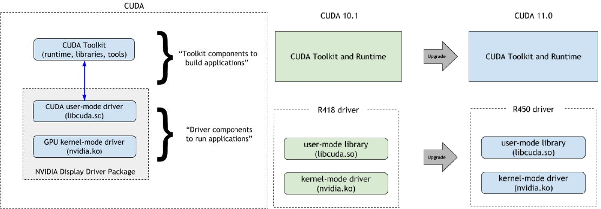

```{r setup, include=FALSE}
# source("tools/chunk-options.R")
knitr::opts_chunk$set(echo = TRUE, warning=FALSE, message=FALSE,
                    comment="", digits = 3, tidy = FALSE, 
                    prompt = FALSE, fig.align = 'center')

library(tidyverse)
```


# 딥러닝 개발 환경

딥러닝 개발환경은 결국 Nvidia GPU 그래픽 카드를 구매하여 마더보드에 장착을 한 후에 이를 구동하기 위한 1) 드라이버 2) C 컴파일러 3) CUDA 4) 딥러닝 프레임워크를 순차적으로 설치하여 딥러닝 응용프로그램 개발에 적용하는 것으로 간략히 정리할 수 있다.

구글 Colab을 사용하는 경우 상기 1~4번 과정이 이미 클라우드 상에 구현되어 있으니 신경을 쓰지 않아도 되지만 극단적으로 연구실/집/회사에 자체 딥러닝 서버 혹은 워크스테이션을 구축한 경우 상기 1~4번 뿐만 아니라 전기세(?)도 신경을 써서 관리해야 한다.


- [Techzizou (Aug 25, 2021), "Install CUDA and CUDNN on Windows & Linux", Published in Geek Culture](https://medium.com/geekculture/install-cuda-and-cudnn-on-windows-linux-52d1501a8805)

# 소프트웨어 스택

## 드라이버 {.tabset}

드라이버는 하드웨어와 운영체제를 연결해주는 소프트웨어다. 예를 들어 GPU 그래픽 카드로 Nvidia Geforce GTX 1050 그래픽 카드 마더보드에 장착했다고 가정하면 운영체제(윈도우 10)에서 인식하여 활용할 수 있도록 드라이버 소프트웨어를 설치해줘야 한다.

오래된 GPU는 GPU 드라이버 지원이 중지될 것이 확실하기 때문에 오래된 GPU를 계속해서 사용하고자 하는 경우 GPU 세대별 지원 드라이버 버전을 확인하고 가능하면 최신 GPU 드라이버 버전을 유지한다.

### 드라이버 다운로드

구입한 Nvidia Geforce 그래픽 카드에 매칭되는 드라이버를 [GEFORCE® 드라이버 다운로드](https://www.nvidia.com/ko-kr/geforce/drivers/)에서 선택하여 설치한다.


### 윈도우즈 10 설치 장착모습


### Nvidia 그래픽카드 확인

```{bash, eval = FALSE}
$ nvidia-smi
Sat Jul  9 19:41:41 2022
+-----------------------------------------------------------------------------+
| NVIDIA-SMI 460.89       Driver Version: 460.89       CUDA Version: 11.2     |
|-------------------------------+----------------------+----------------------+
| GPU  Name            TCC/WDDM | Bus-Id        Disp.A | Volatile Uncorr. ECC |
| Fan  Temp  Perf  Pwr:Usage/Cap|         Memory-Usage | GPU-Util  Compute M. |
|                               |                      |               MIG M. |
|===============================+======================+======================|
|   0  GeForce GTX 1050   WDDM  | 00000000:01:00.0  On |                  N/A |
| 20%   35C    P5    N/A /  75W |   1836MiB /  2048MiB |      2%      Default |
|                               |                      |                  N/A |
+-------------------------------+----------------------+----------------------+

+-----------------------------------------------------------------------------+
| Processes:                                                                  |
|  GPU   GI   CI        PID   Type   Process name                  GPU Memory |
|        ID   ID                                                   Usage      |
|=============================================================================|

```


## Visual Studio 설치

[Visual Studio](https://visualstudio.microsoft.com/ko/downloads/)를 다운로드 받는 이유는 C 컴파일러를 설치하기 위해 필요한 것이다. Visual Studio IDE를 통해 필요한 개발에 필요한 언어 구성요소를 설치할 수 있다. 예를 들어 .NET, Node.js, 파이썬 등... 하지만 딥러닝을 위해 꼭 필요한 것은 C/C++ 개발 구성요소라 필히 설치하고 너무 낮은 버전 Visual Studio 2015 와 같은 너무 오래된 Visual Studio 버전은 업그레이드 하는 것이 필요하다.


## CUDA 설치 {.tabset}

위키백과에 따르면 **CUDA("Compute Unified Device Architecture", 쿠다)**는 그래픽 처리 장치에서 수행하는 알고리즘을 C 프로그래밍 언어를 비롯한 산업 표준 언어를 사용하여 작성할 수 있도록 하는 GPGPU ('GPU의 범용 연산', General-Purpose computing on Graphics Processing Units) 기술이다. CUDA는 엔비디아가 개발해오고 있으며 이 아키텍처를 사용하려면 엔비디아 GPU와 특별한 스트림 처리 드라이버가 필요하다.

CUDA는 응용프로그램을 실행하는 부분과 응용프로그램 개발을 지원하는 툴킷으로 구성된다. GPU 하드웨어에 맞춰 CUDA 버전을 맞춰줘야 하드웨어 성능을 최상으로 유지시킬 수 있다.



### 설치할 CUDA 버전 검색

CUDA 모든 버전이 Nvidia Geforce 그래픽 카드에 맞지 않기 때문에 예를 들어 GTX 1050을 소유하고 있다면 GTX 1050 제품이 속한 아키텍처가 "파스칼(Pascal)"  이기 때문에 CUDA 8 이후 버전을 [CUDA Toolkit Archive](https://developer.nvidia.com/cuda-toolkit-archive) 에서 찾아 GTX 1050을 가장 잘 지원하는 하드웨어 CUDA 버전을 다운로드해서 설치한다.

[Arnon Shimoni (27/10/2020), "Matching CUDA arch and CUDA gencode for various NVIDIA architectures"](https://arnon.dk/matching-sm-architectures-arch-and-gencode-for-various-nvidia-cards/)

GTX 1050에 적합한 CUDA 버전으로 8버전이후 가장 최신 버진이 아닌 11.2를 선택한다. ~~가장 최신 버전을 다운로드 받아 설치하면 안 됩니다~~


### CUDA 버전 확인

```{bash, eval = FALSE}
$ nvcc --version
nvcc: NVIDIA (R) Cuda compiler driver
Copyright (c) 2005-2020 NVIDIA Corporation
Built on Mon_Nov_30_19:15:10_Pacific_Standard_Time_2020
Cuda compilation tools, release 11.2, V11.2.67
Build cuda_11.2.r11.2/compiler.29373293_0
```


## cuDNN 설치 {.tabset}

GTX 1050 그래픽 카드 CUDA 버전을 확정(11.2) 했기 때문에 cuDNN 딥러닝 GPU 가속 라이브러리를 [cuDNN Archive](https://developer.nvidia.com/rdp/cudnn-archive) 에서 다운로드 받아 복사하여 붙여넣기를 한다.

### cuDNN 다운로드

`cudnn-windows-x86_64-8.4.0.27_cuda11.6-archive.zip` 파일명을 갖기 때문에 압축을 풀어 `bin\`, `include\`, `lib\` 폴더에 담긴 모든 파일을 `C:\Program Files\NVIDIA GPU Computing Toolkit\CUDA\v11.2\` 폴더에 다음과 같이 복사하여 붙여넣기한다.


### 복사하여 붙여넣기


이미지 출처: [5. Installing cuDNN](https://medium.com/analytics-vidhya/installing-cuda-and-cudnn-on-windows-d44b8e9876b5)

## 환경변수 등록

`C:\Program Files\NVIDIA GPU Computing Toolkit\CUDA\v11.2\` 폴더에 담긴 CUDA 정보를 윈도우즈 환경으로 등록한다.

- CUDA_PATH &rarr; C:\Program Files\NVIDIA GPU Computing Toolkit\CUDA\v11.2
- CUDA_PATH_V11_2 &rarr; C:\Program Files\NVIDIA GPU Computing Toolkit\CUDA\v11.2


## 딥러닝 프레임워크 설치

현 시점에서 가장 인기있는 딥러닝 프레임워크는 텐서플로우와 파이토치다. 

먼저 CUDA (11.2), cuDNN (8.1)에 해당되는 파이썬 버전과 tensorflow 버전은 `tensorflow_gpu-2.7.0`으로 확인되어 이를 설치한다.

<div class = "row">
  <div class = "col-md-6">
**tensorflow**

```{bash, eval = FALSE}
pip3 uninstall tensorflow
pip3 install 'tensorflow-gpu==2.7.0'
```

  </div>
  <div class = "col-md-6">
**pytorch**

```{bash, eval = FALSE}
conda install pytorch torchvision cudatoolkit=11.2 -c pytorch
```

  </div>
</div>


- [윈도우즈](https://www.tensorflow.org/install/source_windows#tested_build_configurations)
- [맥/리눅스](https://www.tensorflow.org/install/source#tested_build_configurations)


# 헬로우 월드

## 텐서플로우


```{python tensorflow-gpu}
import tensorflow as tf

print(tf.config.list_physical_devices('GPU'))

print(tf.test.is_built_with_cuda)

print(tf.test.gpu_device_name())

print(tf.config.get_visible_devices())
```

## 파이토치

```{python pytorch-gpu, eval = FALSE}
import torch

device = torch.device("cuda") if torch.cuda.is_available() else torch.device("cpu")
print('Using device:', device)
# Using device: cuda

#Additional Info when using cuda
if device.type == 'cuda':
    print(torch.cuda.get_device_name(0))
    print('Memory Usage:')
    print('Allocated:', round(torch.cuda.memory_allocated(0)/1024**3,1), 'GB')
    print('Cached:   ', round(torch.cuda.memory_reserved(0)/1024**3,1), 'GB')
# GeForce GTX 1050
# Memory Usage:
# Allocated: 0.0 GB
# Cached:    0.0 GB

```


