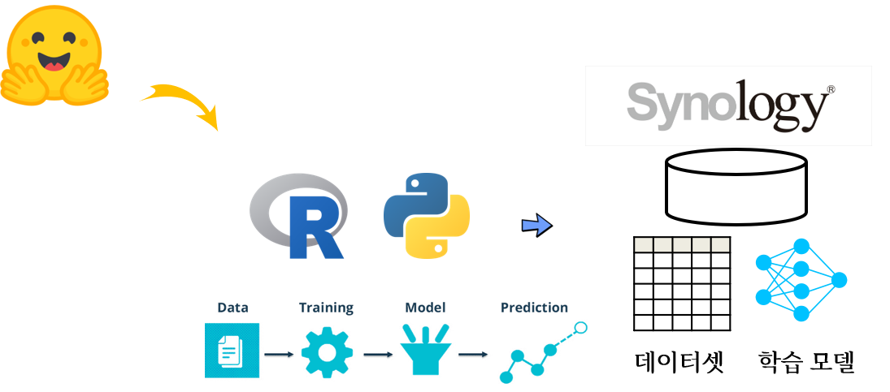

```{r setup, include=FALSE}
# source("tools/chunk-options.R")
knitr::opts_chunk$set(echo = TRUE, warning=FALSE, message=FALSE,
                    comment="", digits = 3, tidy = FALSE, prompt = FALSE, fig.align = 'center')

library(tidyverse)
```



# 데이터셋

[Hugging Face](https://huggingface.co/) 웹사이트에서 데이터와 사전학습모델을
다운로드 받아 딥러닝 모델의 개발 생산성을 높일 수 있다.

[Hugging Face](https://huggingface.co/)에서 다른 설정을 특별히 하지 않게 되면 
윈도우의 경우 다음 디렉토리에 데이터와 사전학습모델이 저장된다.

- `C:\Users\사용자명\.cache\huggingface\datasets\`

`datasets` 에 포함된 데이텟을 파이썬에서 일별한다. 

```{python configure-download, eval = TRUE}
## 다운로드 받은 데이터셋을 삭제하지 않는 기능
from datasets import disable_caching
from datasets import load_dataset
disable_caching()

from datasets import list_datasets
datasets_list = list_datasets()
len(datasets_list)

```

기계학습의 가장 대표적인 데이터셋이 붓꽃(iris) 데이터셋이 유명하기 때문에 
`datasets` 패키지에 포함된 데이터 중 iris 데이터세을 다운로드받아 이를 
기계학습 분석에 활용한다.

`reticulate` 패키지 파이썬 객체를 R에서 가져와서 `iris` 데이터셋을 확인한다.


```{r}
library(reticulate)
library(tidyverse)

py$datasets_list %>% 
  enframe() %>% 
  filter(str_detect(value, "iris"))
```

붓꽃 데이터를 팬다스 데이터프레임으로 변환한 후에 기계학습을 위한 준비 데이터로 되었는지 출력하여 확인한다.

```{python, eval = FALSE}
iris = load_dataset('scikit-learn/iris', 
                       download_mode="reuse_dataset_if_exists",
                       cache_dir='z:\dataset')

print(iris)

iris_pd = iris['train'].to_pandas()

iris_pd
```

```
      Id  SepalLengthCm  ...  PetalWidthCm         Species
0      1            5.1  ...           0.2     Iris-setosa
1      2            4.9  ...           0.2     Iris-setosa
2      3            4.7  ...           0.2     Iris-setosa
3      4            4.6  ...           0.2     Iris-setosa
4      5            5.0  ...           0.2     Iris-setosa
..   ...            ...  ...           ...             ...
145  146            6.7  ...           2.3  Iris-virginica
146  147            6.3  ...           1.9  Iris-virginica
147  148            6.5  ...           2.0  Iris-virginica
148  149            6.2  ...           2.3  Iris-virginica
149  150            5.9  ...           1.8  Iris-virginica

[150 rows x 6 columns]
```


마찬가지 방식으로 질의응답 데이터셋(squad), 영화평점 `imdb` 데이터를 다운로드한다.
저장장소로 `cache_dir='z:\dataset'` 와 같이 (시놀로지) NAS 디렉토리를 지정하여 저장한다.

```{python, eval = FALSE}
squad = load_dataset('squad', 
                       download_mode="reuse_dataset_if_exists",
                       cache_dir='z:\dataset')
                       
imdb = load_dataset('imdb', 
                       download_mode="reuse_dataset_if_exists",
                       cache_dir='z:\dataset')
```


# 이미지 데이터셋

개와 고양이 이미지 분류가 첫 딥러닝 모형이라 이를 잘 구분하는 분류기를 제작하기 위해서 
데이터셋을 다운로드한다. 먼저 고양이(`cats`)가 포함된 데이터셋를 찾아 ... `cats_vs_dogs` 명칭을 갖는 데이터셋을 다운로드 한다.

```{r}
py$datasets_list %>% 
  enframe() %>% 
  filter(str_detect(value, "cats"))
```

대안으로 [Hugging Face - Datasets](https://huggingface.co/datasets) 에서 검색을 넣어 
가장 많은 다운로드를 기록한 데이터셋을 다운로드한다.


```{python, eval = FALSE}
cats_vs_dogs = load_dataset('hf-internal-testing/cats_vs_dogs_sample', 
                       download_mode="reuse_dataset_if_exists",
                       cache_dir='z:\dataset')

cats_vs_dogs['train'].to_pandas()
```

```
                                                image  labels
0   {'bytes': None, 'path': 'z:\dataset\downloads\...       0
1   {'bytes': None, 'path': 'z:\dataset\downloads\...       0
2   {'bytes': None, 'path': 'z:\dataset\downloads\...       0
3   {'bytes': None, 'path': 'z:\dataset\downloads\...       0
4   {'bytes': None, 'path': 'z:\dataset\downloads\...       0
5   {'bytes': None, 'path': 'z:\dataset\downloads\...       0
6   {'bytes': None, 'path': 'z:\dataset\downloads\...       0
7   {'bytes': None, 'path': 'z:\dataset\downloads\...       0
8   {'bytes': None, 'path': 'z:\dataset\downloads\...       0
9   {'bytes': None, 'path': 'z:\dataset\downloads\...       0
10  {'bytes': None, 'path': 'z:\dataset\downloads\...       0
11  {'bytes': None, 'path': 'z:\dataset\downloads\...       0
12  {'bytes': None, 'path': 'z:\dataset\downloads\...       0
13  {'bytes': None, 'path': 'z:\dataset\downloads\...       0
14  {'bytes': None, 'path': 'z:\dataset\downloads\...       0
15  {'bytes': None, 'path': 'z:\dataset\downloads\...       0
16  {'bytes': None, 'path': 'z:\dataset\downloads\...       0
17  {'bytes': None, 'path': 'z:\dataset\downloads\...       0
18  {'bytes': None, 'path': 'z:\dataset\downloads\...       0
19  {'bytes': None, 'path': 'z:\dataset\downloads\...       0
20  {'bytes': None, 'path': 'z:\dataset\downloads\...       0
21  {'bytes': None, 'path': 'z:\dataset\downloads\...       0
22  {'bytes': None, 'path': 'z:\dataset\downloads\...       0
23  {'bytes': None, 'path': 'z:\dataset\downloads\...       0
24  {'bytes': None, 'path': 'z:\dataset\downloads\...       0
25  {'bytes': None, 'path': 'z:\dataset\downloads\...       1
26  {'bytes': None, 'path': 'z:\dataset\downloads\...       1
27  {'bytes': None, 'path': 'z:\dataset\downloads\...       1
28  {'bytes': None, 'path': 'z:\dataset\downloads\...       1
29  {'bytes': None, 'path': 'z:\dataset\downloads\...       1
30  {'bytes': None, 'path': 'z:\dataset\downloads\...       1
31  {'bytes': None, 'path': 'z:\dataset\downloads\...       1
32  {'bytes': None, 'path': 'z:\dataset\downloads\...       1
33  {'bytes': None, 'path': 'z:\dataset\downloads\...       1
34  {'bytes': None, 'path': 'z:\dataset\downloads\...       1
35  {'bytes': None, 'path': 'z:\dataset\downloads\...       1
36  {'bytes': None, 'path': 'z:\dataset\downloads\...       1
37  {'bytes': None, 'path': 'z:\dataset\downloads\...       1
38  {'bytes': None, 'path': 'z:\dataset\downloads\...       1
39  {'bytes': None, 'path': 'z:\dataset\downloads\...       1
40  {'bytes': None, 'path': 'z:\dataset\downloads\...       1
41  {'bytes': None, 'path': 'z:\dataset\downloads\...       1
42  {'bytes': None, 'path': 'z:\dataset\downloads\...       1
43  {'bytes': None, 'path': 'z:\dataset\downloads\...       1
44  {'bytes': None, 'path': 'z:\dataset\downloads\...       1
45  {'bytes': None, 'path': 'z:\dataset\downloads\...       1
46  {'bytes': None, 'path': 'z:\dataset\downloads\...       1
47  {'bytes': None, 'path': 'z:\dataset\downloads\...       1
48  {'bytes': None, 'path': 'z:\dataset\downloads\...       1
49  {'bytes': None, 'path': 'z:\dataset\downloads\...       1
```

딥러닝 가장 인기가 많은 `mnist` 데이터셋도 다운로드 받아 NAS 저장소에 저장한다.
공통적으로 `.arrow` 파일 확장자가를 갖는 파일로 저장된다.

```{python, eval = FALSE}
mnist = load_dataset('mnist', 
                       download_mode="reuse_dataset_if_exists",
                       cache_dir='z:\dataset')

mnist
```

```
DatasetDict({
    train: Dataset({
        features: ['image', 'label'],
        num_rows: 60000
    })
    test: Dataset({
        features: ['image', 'label'],
        num_rows: 10000
    })
})
```

