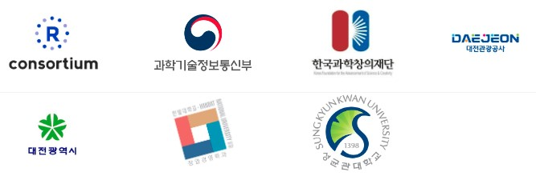

```{r, include=FALSE}
# source("tools/chunk-options.R")
knitr::opts_chunk$set(echo = FALSE, warning=FALSE, message=FALSE,
                    comment="", digits = 3, tidy = FALSE, prompt = FALSE, fig.align = 'center')

library(here)
```


# 학습목차


```{r deep-learing-list}
library(tidyverse)
library(bs4cards)

deep_learning_list <- list(
  tibble(
    title = "딥러닝 개념",
    image = "assets/favicon-logistic.png",
    text = "신경망, 로지스틱 회귀모형",
    link = "00_concept.html",
    footer = "2022-06-22"
  ),
  tibble(
    title = "회귀모형",
    image = "assets/favicon-regression.png",
    text = "선형 회귀모형",
    link = "01_linear_regression.html",
    footer = "2022-06-22"
  ),
  tibble(
    title = "로지스틱 회귀모형",
    image = "assets/favicon-logistic.png",
    text = "신경망, 로지스틱 회귀모형",
    link = "02_logistic_regression.html",
    footer = "2022-06-22"
  ),
  tibble(
    title = "딥러닝 프레임워크",
    image = "assets/favicon-framework.png",
    text = "케라스, 텐서플로우, 파이토치 ...",
    link = "03_framework.html",
    footer = "2022-06-23"
  )
)


deep_learning_tbl <- deep_learning_list %>% 
  enframe() %>% 
  unnest(value)

deep_learning_tbl %>% 
  cards(
    title = title,
    text = text,
    link = link,
    image = image,
    footer = footer,
    layout = "label-left", 
    width = 3
  )
```
 
# 관련 정보

- [편집기 - https://www.latex4technics.com/](https://www.latex4technics.com/)
- [$LaTeX$ - Equation Editor](https://www.codecogs.com/latex/eqneditor.php)
- [Classical ML Equations in LaTeX](https://blmoistawinde.github.io/ml_equations_latex/)
- [How to code a logistic regression in R from scratch](https://anderfernandez.com/en/blog/code-logistic-regression-r-from-scratch/)
- [THE ASIMOV INSTITUTE, THE NEURAL NETWORK ZOO](https://www.asimovinstitute.org/neural-network-zoo/)


# 후원

이 프로그램은 과학기술진흥기금 및 복권기금의 재원으로 운영되고,과학기술정보통신부와 한국과학창의재단의 지원을 받아 수행된 성과물로 우리나라의 과학기술 발전과 사회적 가치 증진에 기여하고 있습니다. 성균관대학교 경제학과, 한밭대학교 창업경영학과에서 장소를 지원해 주셨으며, 대전과학문화거점센터 지원도 받았음을 밝혀둡니다.




