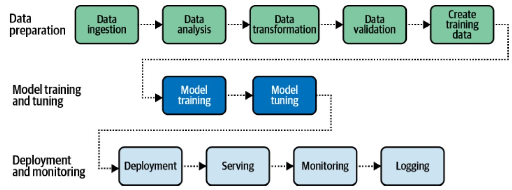
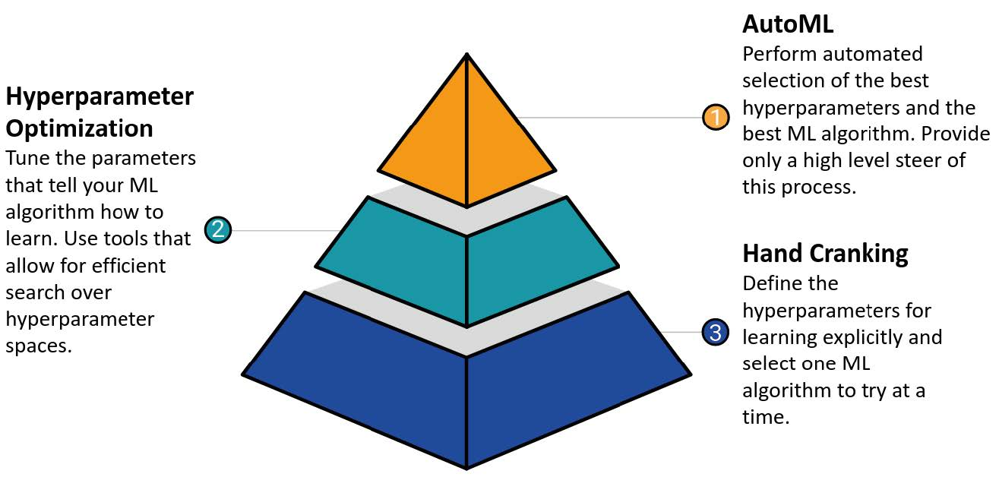
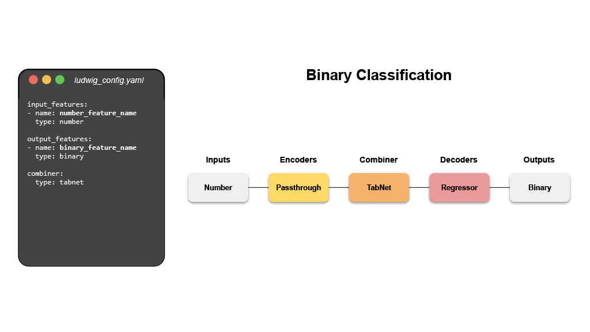

```{r setup, include=FALSE}
# source("tools/chunk-options.R")
knitr::opts_chunk$set(echo = TRUE, warning=FALSE, message=FALSE,
                    comment="", digits = 3, tidy = FALSE, prompt = FALSE, fig.align = 'center')

library(tidyverse)
```




# 기계학습 자동화




# `ludwig` 

[ludwig.ai](https://ludwig-ai.github.io/ludwig-docs/0.5/) 웹사이트에 Ludwig 의 
딥러닝에 대한 자세한 사항을 확인할 수 있다.

- Ludwig is a **declarative** deep learning framework 

즉 선언적인 딥러닝 프레임워크로 그래프 문법(ggplot)에 익숙하면 수월하게 활용할 수 있다.



평론가는 관람한 영화가 맘에 들면 신선한 토마토를, 그렇지 않다면 썩은 토마토(rotten tomato)를 선택하는 데 지수가 높을수록 추천하는 평론가가 많다는 것을 의미하는데...
국내에서는 "썩토지수"라로 많이 알려져 있다.

Ludwig는 (비)정형 데이터를 모두 다룰 수 있지만 썩은 토마토 데이터셋을 가지고 새로 
개발되고 있는 딥러닝 모형을 개발해보자. 다음 코드는 [Ludwig Getting Stated](https://ludwig-ai.github.io/ludwig-docs/0.5/getting_started/)에서 가져왔다.

```{python, eval = FALSE}
# !pip install ludwig --user

import pandas as pd
from ludwig.api import LudwigModel

df = pd.read_csv('ludwig/rotten_tomatoes.csv')

model = LudwigModel(config='ludwig/rotten_tomatoes.yaml')
results = model.train(dataset=df)
# Lock 1420789236640 acquired on C:\swc\.lock_preprocessing
# Lock 1420789236640 released on C:\swc\.lock_preprocessing
```

딥러닝 모형에 다소 시간이 걸렸는데... 예측모형은 저장되면 이를 가져와서
inference 딥러닝 모형으로 예측이 가능하다.


```{python}
import pandas as pd
from ludwig.api import LudwigModel

movie_model = LudwigModel.load('results/api_experiment_run/model')

predictions, _ = movie_model.predict(dataset='ludwig/rotten_tomatoes_test.csv')
predictions.head()
```

예측에 대한 자세한 사항을 살펴보자.

```{r}
library(reticulate)
library(tidyverse)

rt_csv <- read_csv('ludwig/rotten_tomatoes_test.csv')

py$predictions %>% 
  janitor::clean_names() %>% 
  bind_cols(rt_csv) %>% 
  select(movie_title, 
         review_content ,
         recommended_probabilities,
                    recommended_predictions,
                    recommended_probability) %>% 
  knitr::kable()
```


