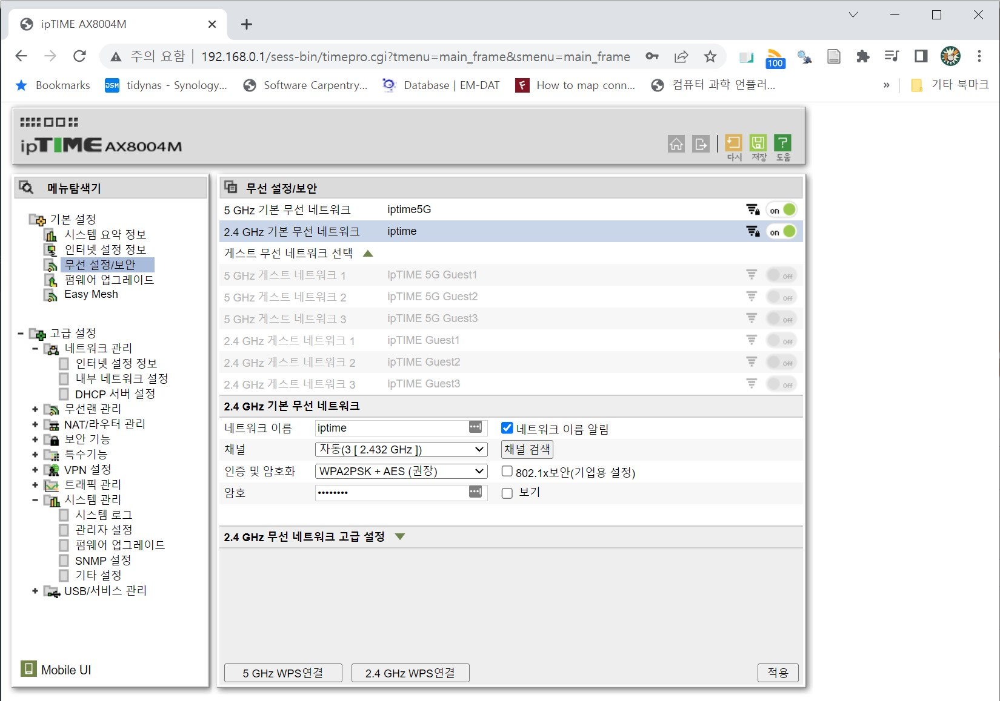

```{r setup, include=FALSE}
# source("tools/chunk-options.R")
knitr::opts_chunk$set(echo = TRUE, warning=FALSE, message=FALSE,
                    comment="", digits = 3, tidy = FALSE, prompt = FALSE, fig.align = 'center')

library(tidyverse)
```

# 사설 클라우드

Private Cloud는 사설 클라우드 어감 때문에 프라이빗 클라우드로 우리나라에서는 
불리고 있다. 사설 클라우드는 개방형 클라우드(Public Cloud)와 대비되는 개념으로
돈을 지불한다고 클라우드 자원을 마음껏 쓸 수 있는 퍼블릿 클라우드와 대비되는 개념이다.


# 하드웨어 구성

사설 클라우드 구축을 위해서 가장 먼저 구성요소와 환경을 구축한다. 사무실이나 
집에서 클라우드 구축을 위해서 KT/SKT 등 외부 네트워크(퍼블릭 클라우드)를 구축할 사설 클라우드와 연결하기 위해서 모뎀이 필요하다.
그리고 사설 클라우드 구축에 필요한 구성요소를 공유기 + 스위치(선택사항)에 연결시켜 
사설 클라우드 구축을 위한 기본 구성을 갖춘다.

- 네트워크: 공유기(라우터) + 스위치(선택사항)
- 저장소: NAS (시놀로지 등)
- 딥러닝 워크스테이션: Nvidia GTX GPU가 구비된 서버
- PC: 인텔 CPU가 장착된 일반 컴퓨터
- 노트북: 맥북 등

네트워크를 공유기(라우터) + 스위치로 구성하는 경우는 연결해야 되는 장비가 
많아서 동일 네트워크에 물리는 기기를 늘리기 위해서 필요한 장비구성이다.
공유기(라우터)에 물리는 장비가 대략 4대로 충분한 경우 스위치는 생략해도 문제가 
없다.


# 네트워크 연결


## 라우터(공유기) 설정 {.tabset}

공유기에 강한 비밀번호를 초기에 설정하여 외부 해커로부터의 위협으로부터
프라이빗 클라우드를 지켜낸다. 

### 초기 비번 설정

`http://192.168.0.1/` 을 웹브라이져 주소창에 입력하게 되면 라우터에 접근하여 
로그인 이름과 암호를 변경할 수 있다. 로그인 이름 `admin`, 로그인 암호 `admin`
동일하게 설정되어 있다.


### 와이파일 비번설정

집에서 와이파이를 가족 구성원만 사용하게 만들기 위해서 "기본설정" &rarr; "무선 설정보안"
으로 들어가서 암호를 설정한다. 네트워크 이름 알림 여부 및 해당 와이파이 
암호도 설정해 둔다.




## 라우터와 NAS

KT/SKT 모뎀을 라우터와 네트워크 연결 작업이 하드웨어 연결과 라우터 비밀번호 
설정을 통해 구축이 완료되면 다음 단계 KT/SKT 외부 네트워크와 관계없이
홈(프라이빗) 네트워크 내부 IP 설정을 확인하여 연결/확인 작업을 수행한다.

통신사마다 홈(프라이빗) 상황에 따라 차이가 나지만 대략 사설 IP 대역은 다음과 
같이 구성되고 이를 NAS, PC, 노트북, 게임기 등에서 공유하고 있다면 정상 동작하는 것을 
쉽게 파악할 수 있다.

- 사설 IP 대역
 - 192.168.X.X
 - 172.16~31.X.X
 - 10.X.X.X


구축에 관련된 자세한 사항은 [유랑인 : 홈 네트워크 구축시 주의사항 | 홈 네트워크 구축이 올바른지 설정 확인하기](https://www.youtube.com/watch?v=30wlGldueCE)을 참조한다.


