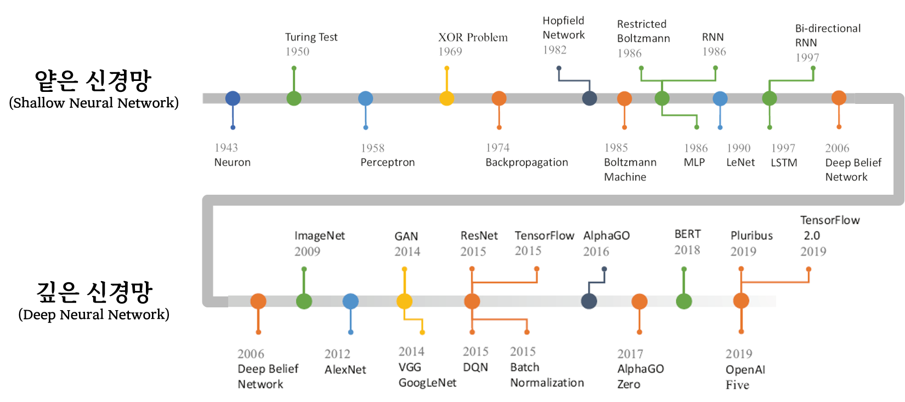
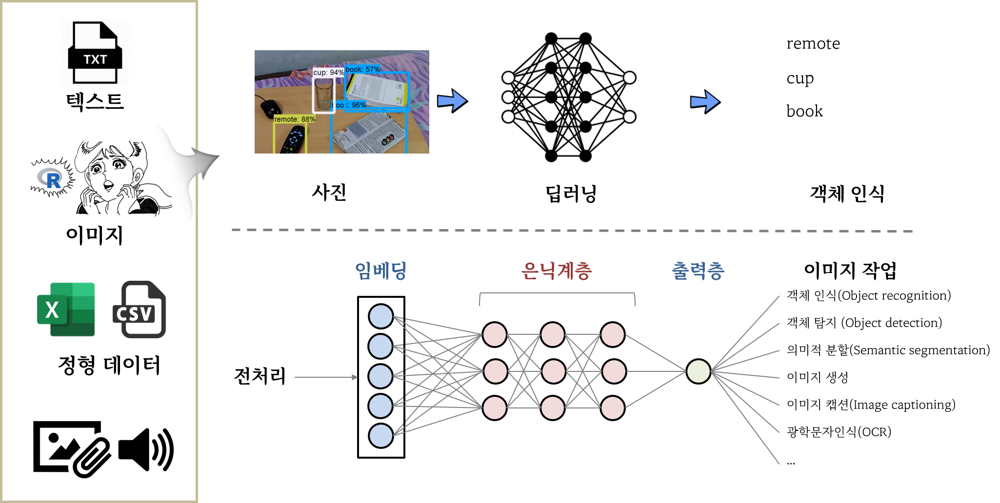
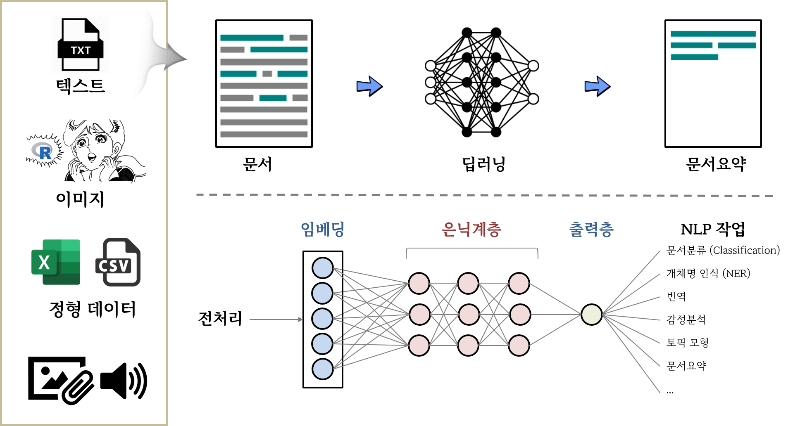
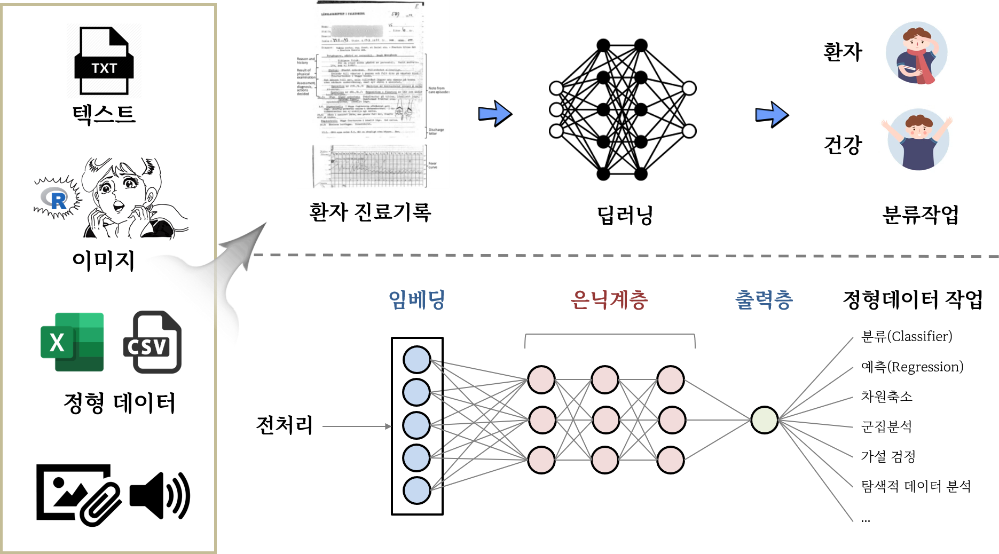

---
class: inverse, middle
name: ai
# 발표 개요 

----

.pull-left[


최근 각광받고 있는 **.warmyellow[딥러닝(Deep Learning)]** 은 
학문적으로 의미가 있을 뿐만 아니라 기술의 급격한 발전과
디지털 전환에 중요한 역할을 하고 있기 때문에
**컴퓨팅 사고력(Computational Thinking)**의 중요한 축인 
**.warmyellow[자동화(automation)]**을 떼고 생각할 수는 없다.

이에, 자동화, 인공지능, 딥러닝을 이해하고 
구현하는데 핵심적인 사항을 다뤄본다. 

]
 
.pull-right[   
.left[

1\. [자동화](#automation)

2\. **[.warmyellow[인공지능]](#ai)**

3\. [딥러닝](#deep-learning)

]
] <!--end of right-column-->  

---
name: automation-paradox
# 모라벡의 역설(Moravec’s paradox)

<br>

.center[


]

.footnote[
미국 카네기 멜론 대학 (CMU) 로봇 공학자 한스 모라벡(Hans Moravec)이 1970년대에 ‘it is comparatively easy to make computers exhibit adult level performance on intelligence tests or playing checkers, and difficult or impossible to give them the skills of a one-year-old when it comes to perception and mobility’라는 표현으로 컴퓨터와 인간의 능력 차이를 역설적으로 표현하였다.
]

---
name: automation-comparison
# 중국어 방 (Chinese room)

<br>
<br>

```{css css-width, eval = FALSE}
.pull-left {
  float: left;
  width: 30%;
}

.pull-right {
  float: right;
 width: 70%;
}

.pull-right ~ p {
clear: both;
}
```


.pull-left[

]

.pull-right[

|  인공지능 |       컴퓨터      |       인간            |
|:---------:|:-----------------:|:---------------------:|
| 중국어 방 |      하드웨어     | 인간의 외형적인 몸체  |
| 영어만 할 줄 아는 사람| 소프트웨어| 인간의 지능 |
| 중국어로 된 질문 | 입력(Input) | 인간이 외부에서 접할 수 있는 자극 |
| 중국어로 된 답변 | 출력(Output) | 인간이 외부에서 접한 자극에 대한 반응 |
| 질문&대답 목록 | 데이터베이스(Database) | 습득된 기억 |

]

.footnote[
[중국어 방 역설 (Chinese room argument) - 대체 누가 중국어를 이해하고 있는가?](http://ko.experiments.wikidok.net/wp-d/592f718da44f1a4153e80611/View)
]


---
name: dl-timeline
# 기계학습 분류

<br>
<br>

.center[

]


---
name: dl-timeline
# 신경망 모형 여정

.center[

]

.footnote[
Liangqu Long, Xiangming Zeng (2022), "Beginning Deep Learning with TensorFlow: Work with Keras, MNIST Data Sets, and Advanced Neural Networks", Apress
]

---
name: dl-applicatin
# 딥러닝 활용사례

.panelset[

.panel[.panel-name[이미지 데이터]
.center[

]
]

.panel[.panel-name[텍스트 데이터]
.center[

]
]

.panel[.panel-name[정형 데이터]
.center[

]
]

]


---
name: human-performance
# 딥러닝 알고리즘 성능 - 이미지

<br>
<br>

```{r}
library(tidyverse)
library(httr)
library(rvest)
library(readxl)

sota_raw <- read_excel(glue::glue("{here::here()}/slideshow/data/imagenet.xlsx"),
                       col_types = rep("text", 12))

sota_tbl <- sota_raw %>% 
  janitor::clean_names() %>% 
  mutate(top_5_accuracy = as.numeric(top_5_accuracy),
         year = as.integer(year)) %>% 
  mutate(top_5_accuracy = ifelse(top_5_accuracy > 1, top_5_accuracy/100, top_5_accuracy)) %>% 
  group_by(year) %>% 
  arrange(desc(top_5_accuracy)) %>% 
  slice(1) %>% 
  select(year, model, top_5_accuracy)


sota_tbl %>% 
  ggplot(aes(x = year, y = top_5_accuracy , group = 1)) +
    geom_point() +
    geom_line() +
    scale_y_continuous(labels = scales::percent) +
    scale_x_continuous(breaks = seq(2011, 2022, by =2)) +
    geom_hline(yintercept = 0.95, linetype = 2, color = "lightblue") +
    labs(x = "", 
         y = "상위 5개 정확도 (%)",
         title = "ImageNet 이미지 분류") +
    theme_election() +
    geom_text(aes(x = 2012, y = 0.95, label = "인간 정확도 (95%)"), 
              size = 12, color = "blue", fontface = "bold") +
    ggrepel::geom_text_repel(aes(label = model), size = 9.5)


```

.footnote[
[Image Classification on ImageNet](https://paperswithcode.com/sota/image-classification-on-imagenet)
]


---
name: human-performance-nlp
# 딥러닝 알고리즘 성능 - 텍스트

<br>
<br>

```{r}
library(tidyverse)
library(httr)
library(rvest)
library(readxl)

squad_url <- "https://rajpurkar.github.io/SQuAD-explorer/"

squad_tables <- read_html(squad_url) %>% 
  html_elements(css = '.col-md-7 > div:nth-child(1) > div:nth-child(1) > table:nth-child(3)') %>%
  html_table(fill =TRUE)

squad_tbl <-  squad_tables[[1]] %>% 
  janitor::clean_names()  %>% 
  # mutate(year = str_extract(rank, "\\d{4}$") %>%  as.integer) %>% 
  mutate(text = str_remove(rank, "^\\d{1,2}")) %>% 
  mutate(text = ifelse(str_detect(model, "Human Performance"), "Jun 16, 2016", text)) %>% 
   mutate(date = parse_date(text, format =  "%b %d, %Y")) 

squad_tbl %>% 
  filter(! str_detect(model, "Human Performance")) %>% 
    ggplot(aes(x = date, y = f1 , group = 1)) +
    geom_point() +
    geom_line() +
    scale_y_continuous() +
    geom_hline(yintercept = 89.452, linetype = 2, color = "darkblue") +
    labs(x = "", 
         y = "F1 점수",
         title = "스탠포드 질의응답 데이터셋 (SQuAD2.0)") +
    theme_election() +
    geom_text(aes(x = as.Date("2018-08-16"), y = 89.452, label = "인간 정확도 (89.452)"),
              size = 12, color = "blue", fontface = "bold")

```

.footnote[
[SQuAD2.0 - The Stanford Question Answering Dataset](https://rajpurkar.github.io/SQuAD-explorer/)
]


