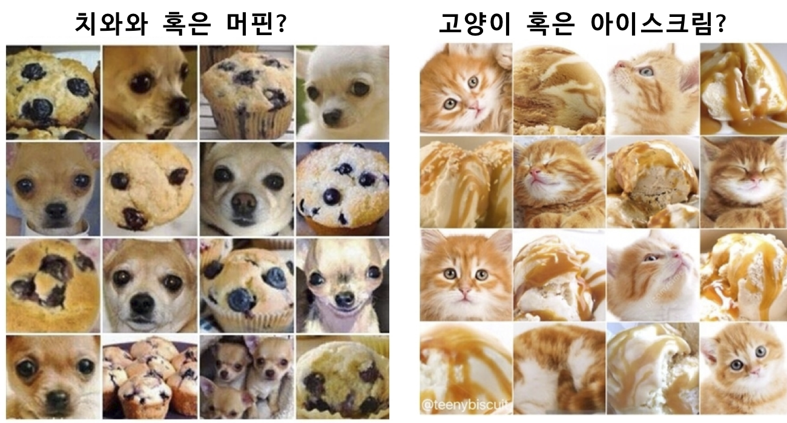
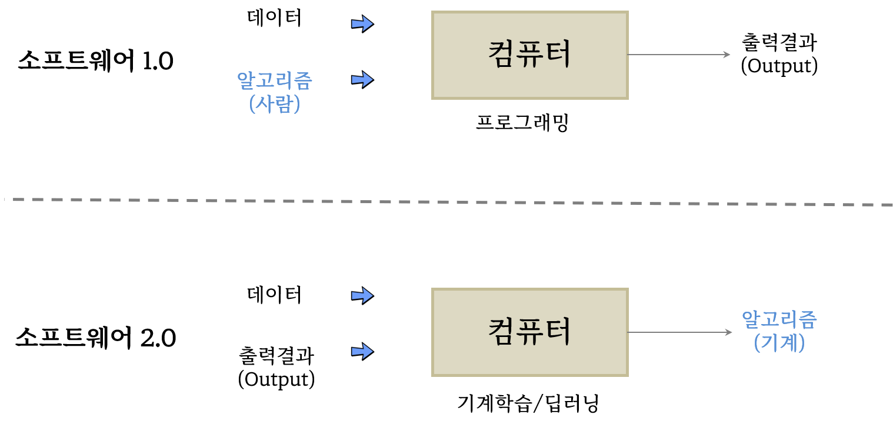

---
name: automation-paradox
# 모라벡의 역설(Moravec’s paradox)

<br>

.center[



]

.footnote[
미국 카네기 멜론 대학 (CMU) 로봇 공학자 한스 모라벡(Hans Moravec)이 1970년대에 ‘it is comparatively easy to make computers exhibit adult level performance on intelligence tests or playing checkers, and difficult or impossible to give them the skills of a one-year-old when it comes to perception and mobility’라는 표현으로 컴퓨터와 인간의 능력 차이를 역설적으로 표현하였다.
]

---
name: automation-comparison
# 중국어 방 (Chinese room)

<br>
<br>

```{css css-width, eval = FALSE}
.pull-left {
  float: left;
  width: 30%;
}

.pull-right {
  float: right;
 width: 70%;
}

.pull-right ~ p {
clear: both;
}
```


.pull-left[

]

.pull-right[

|  인공지능 |       컴퓨터      |       인간            |
|:---------:|:-----------------:|:---------------------:|
| 중국어 방 |      하드웨어     | 인간의 외형적인 몸체  |
| 영어만 할 줄 아는 사람| 소프트웨어| 인간의 지능 |
| 중국어로 된 질문 | 입력(Input) | 인간이 외부에서 접할 수 있는 자극 |
| 중국어로 된 답변 | 출력(Output) | 인간이 외부에서 접한 자극에 대한 반응 |
| 질문&대답 목록 | 데이터베이스(Database) | 습득된 기억 |

]

.footnote[
[중국어 방 역설 (Chinese room argument) - 대체 누가 중국어를 이해하고 있는가?](http://ko.experiments.wikidok.net/wp-d/592f718da44f1a4153e80611/View)
]


---
name: deep-learning-vs-software
# 소프트웨어 2.0 vs. 딥러닝 모형

<br>
<br>

.center[

]

.footnote[
Domingos, Pedro. The master algorithm: How the quest for the ultimate learning machine will remake our world. Basic Books, 2015.
]


---
name: hidden-technical-debt
# 기계학습(딥러닝) 기여분

<br>
<br>

.center[

]

.footnote[
Sculley, David, et al. "Hidden technical debt in machine learning systems." Advances in neural information processing systems 28 (2015).
]


---
name: human-performance
# 딥러닝 알고리즘 성능

<br>
<br>

```{r}
library(tidyverse)
library(httr)
library(rvest)
library(readxl)

sota_raw <- read_excel(glue::glue("{here::here()}/slideshow/data/imagenet.xlsx"),
                       col_types = rep("text", 12))

sota_tbl <- sota_raw %>% 
  janitor::clean_names() %>% 
  mutate(top_5_accuracy = as.numeric(top_5_accuracy),
         year = as.integer(year)) %>% 
  mutate(top_5_accuracy = ifelse(top_5_accuracy > 1, top_5_accuracy/100, top_5_accuracy)) %>% 
  group_by(year) %>% 
  arrange(desc(top_5_accuracy)) %>% 
  slice(1) %>% 
  select(year, model, top_5_accuracy)


sota_tbl %>% 
  ggplot(aes(x = year, y = top_5_accuracy , group = 1)) +
    geom_point() +
    geom_line() +
    scale_y_continuous(labels = scales::percent) +
    scale_x_continuous(breaks = seq(2011, 2022, by =2)) +
    geom_hline(yintercept = 0.95, linetype = 2, color = "lightblue") +
    labs(x = "", 
         y = "상위 5개 정확도 (%)",
         title = "ImageNet 이미지 분류") +
    theme_light() +
    geom_text(aes(x = 2012, y = 0.95, label = "인간 정확도\n(95%)"), 
              size = 4.5, color = "blue", fontface = "bold") +
    ggrepel::geom_text_repel(aes(label = model))

```

.footnote[
[Image Classification on ImageNet](https://paperswithcode.com/sota/image-classification-on-imagenet)
]


