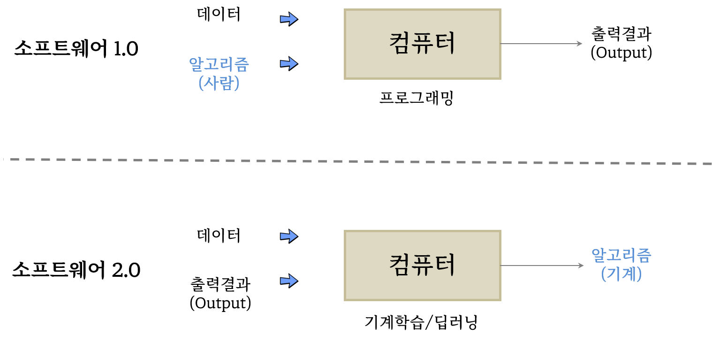
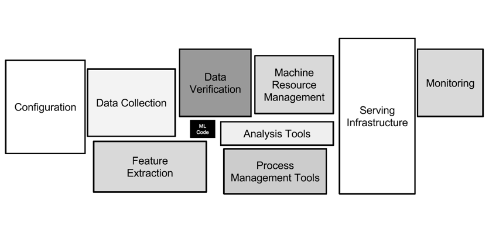
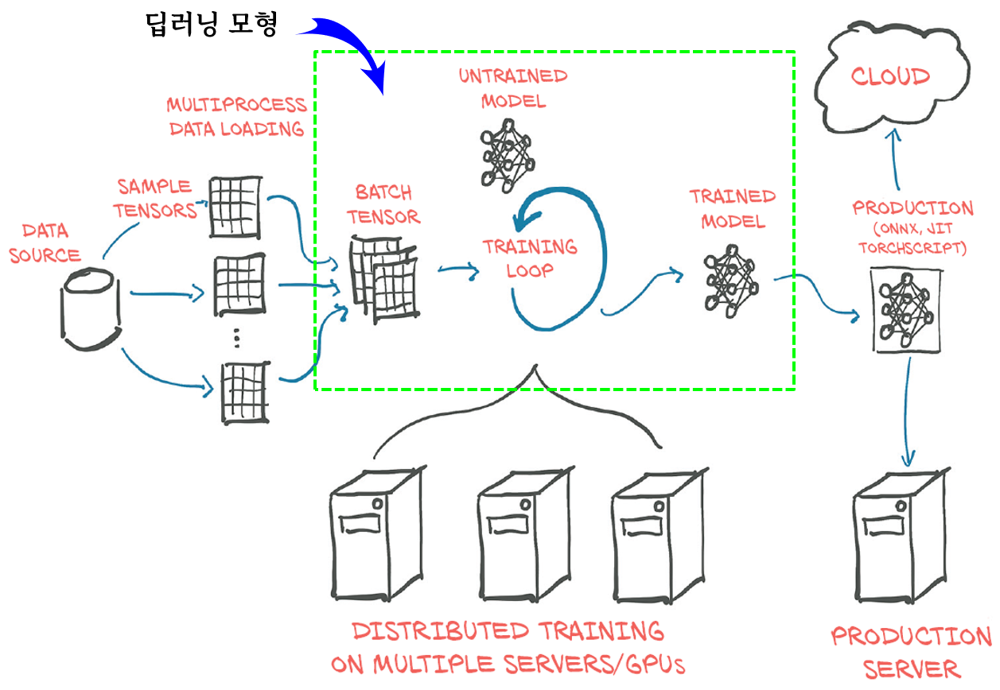
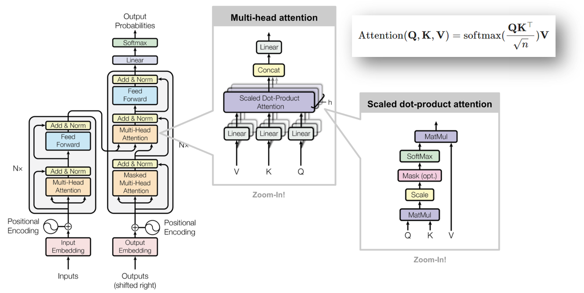

---
class: inverse, middle
name: deep-learning
# 발표 개요 

----

.pull-left[

최근 각광받고 있는 **.warmyellow[딥러닝(Deep Learning)]** 은 
학문적으로 의미가 있을 뿐만 아니라 기술의 급격한 발전과
디지털 전환에 중요한 역할을 하고 있기 때문에
**컴퓨팅 사고력(Computational Thinking)**의 중요한 축인 
**.warmyellow[자동화(automation)]**을 떼고 생각할 수는 없다.

이에, 자동화, 인공지능, 딥러닝을 이해하고 
구현하는데 핵심적인 사항을 다뤄본다. 

]
 
.pull-right[   
.left[

1\. [자동화](#automation)

2\. [인공지능](#ai)

3\. **[.warmyellow[딥러닝]](#deep-learning)**

]
] <!--end of right-column-->  

---
name: deep-learning-vs-software
# 소프트웨어 2.0 vs. 딥러닝 모형

 
 

.center[

]

.footnote[
Domingos, Pedro. The master algorithm: How the quest for the ultimate learning machine will remake our world. Basic Books, 2015.
]

---
name: hidden-technical-debt
# 기계학습(딥러닝) 기여분

 
 

.center[

]

.footnote[
Sculley, David, et al. "Hidden technical debt in machine learning systems." Advances in neural information processing systems 28 (2015).
]

---
name: deep-learning-end2end
# 딥러닝 모형 개발 범위

 

.center[

]

.footnote[
Eli Stevens, Luca Antiga, and Thomas Viehmann (2020), "Deep Learning with PyTorch", Manning.
]

---
name: nlp-transformers
# Attention & Transformers

 
 

.center[

]

.footnote[
[Lilian Weng (June 24, 2018), "Attention? Attention!"](https://lilianweng.github.io/posts/2018-06-24-attention/)
]

---
name: nlp-bert-gpt
# Attention & Transformers &rarr; GPT, BERT

 

.center[

]

.footnote[
[ratsgo's NLPBOOK](https://ratsgo.github.io/nlpbook/docs/language_model/)
]

