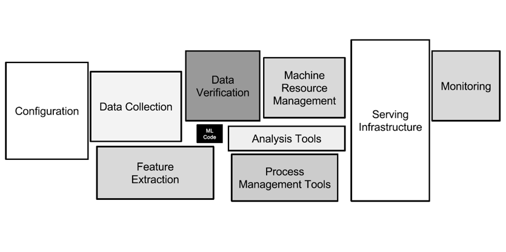

```{r setup, include = FALSE}
library(tidyverse)
xaringanExtra::use_panelset()
# library(nhsrtheme)
# library(NHSRdatasets)
# set default options

options(
  htmltools.dir.version = FALSE, 
  htmltools.preserve.raw = FALSE,
  tibble.width = 60, tibble.print_min = 6,
  crayon.enabled = TRUE
)

knitr::opts_chunk$set(echo = FALSE, message=FALSE, warning=FALSE,
                      comment="", digits = 3, tidy = FALSE, prompt = FALSE, fig.align = 'center',
                      fig.width = 7.252,
                      fig.height = 4,
                      dpi = 300)

# uncomment the following lines if you want to use the NHS-R theme colours by default
# scale_fill_continuous <- partial(scale_fill_nhs, discrete = FALSE)
# scale_fill_discrete <- partial(scale_fill_nhs, discrete = TRUE)
# scale_colour_continuous <- partial(scale_colour_nhs, discrete = FALSE)
# scale_colour_discrete <- partial(scale_colour_nhs, discrete = TRUE)
```


class: title-slide, left, bottom

# `r rmarkdown::metadata$title`
----
## **`r rmarkdown::metadata$subtitle`**
### `r rmarkdown::metadata$author`
### `r rmarkdown::metadata$date`

 
---
class: inverse, middle
name: data-science-case

# 발표 개요 

----

.pull-left[

최근 각광받고 있는 **.warmyellow[딥러닝(Deep Learning)]** 을 이해하고 
구현하는데 핵심적인 사항을 다뤄본다.

]
 
.pull-right[   
.left[

1\. [딥러닝이란](#deep-learning)

]
] <!--end of right-column-->  

```{r child='goodbye.Rmd'}
```


---
name: deep-learning-vs-software
# 소프트웨어 2.0 vs. 딥러닝 모형

<br>
<br>

.center[

]

.footnote[
Domingos, Pedro. The master algorithm: How the quest for the ultimate learning machine will remake our world. Basic Books, 2015.
]


---
name: hidden-technical-debt
# 기계학습(딥러닝) 기여분

<br>
<br>

.center[

]

.footnote[
Sculley, David, et al. "Hidden technical debt in machine learning systems." Advances in neural information processing systems 28 (2015).
]


---
name: human-performance
# 딥러닝 알고리즘 성능

<br>
<br>

```{r}
library(tidyverse)
library(httr)
library(rvest)
library(readxl)

sota_raw <- read_excel(glue::glue("{here::here()}/slideshow/data/imagenet.xlsx"),
                       col_types = rep("text", 12))

sota_tbl <- sota_raw %>% 
  janitor::clean_names() %>% 
  mutate(top_5_accuracy = as.numeric(top_5_accuracy),
         year = as.integer(year)) %>% 
  mutate(top_5_accuracy = ifelse(top_5_accuracy > 1, top_5_accuracy/100, top_5_accuracy)) %>% 
  group_by(year) %>% 
  arrange(desc(top_5_accuracy)) %>% 
  slice(1) %>% 
  select(year, model, top_5_accuracy)


sota_tbl %>% 
  ggplot(aes(x = year, y = top_5_accuracy , group = 1)) +
    geom_point() +
    geom_line() +
    scale_y_continuous(labels = scales::percent) +
    scale_x_continuous(breaks = seq(2011, 2022, by =2)) +
    geom_hline(yintercept = 0.95, linetype = 2, color = "lightblue") +
    labs(x = "", 
         y = "상위 5개 정확도 (%)",
         title = "ImageNet 이미지 분류") +
    theme_light() +
    geom_text(aes(x = 2012, y = 0.95, label = "인간 정확도\n(95%)"), 
              size = 4.5, color = "blue", fontface = "bold") +
    ggrepel::geom_text_repel(aes(label = model))

```

.footnote[
[Image Classification on ImageNet](https://paperswithcode.com/sota/image-classification-on-imagenet)
]

