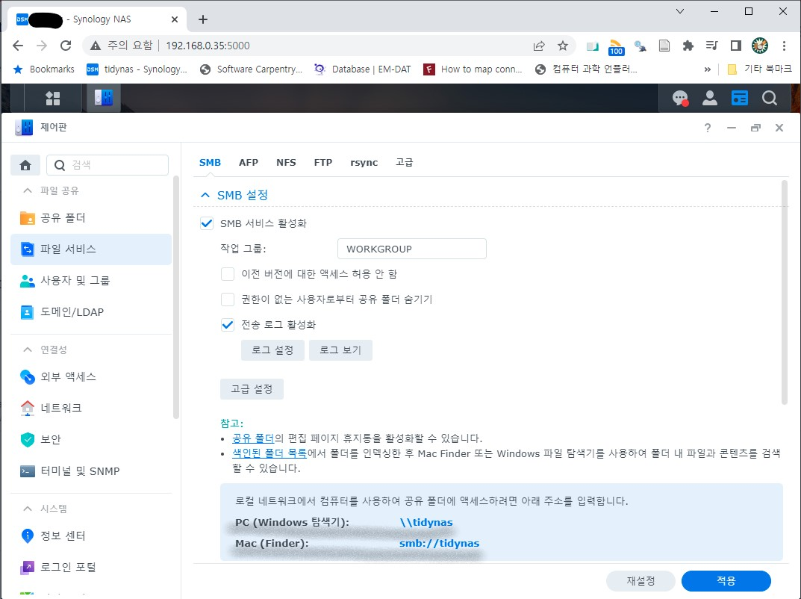

```{r setup, include=FALSE}
# source("tools/chunk-options.R")
knitr::opts_chunk$set(echo = TRUE, warning=FALSE, message=FALSE,
                    comment="", digits = 3, tidy = FALSE, prompt = FALSE, fig.align = 'center')

library(tidyverse)
```

# NAS 관리자 접속

시놀러지를 구입하여 설치하고 나면 NAS 저장소에 접근하여 각종 설정을 할 필요가 있다.
이런 경우 관리자가 (시놀로지) NAS 서버에 접근해할 때 내부에서 네트워크와 
외부 공공 인터넷망을 사용하여 접근하는 두가지 방식이 존재한다.


## 내부접속 

내부접속은 `https` 대신 `http` 방식으로 접근해도 보안이나 관련 이슈가 전혀없다.
이런 경우 (시놀로지) NAS 설치된 IP를 찾아 포트번호 5000 번을 붙여 접속한 후 
등록한 ID와 비밀번호를 지정하여 로그인한 후 필요한 각종 작업을 수행하면 된다.

- http://192.168.0.35:5000/

## 외부접속 

카페나 외부 다른 곳에서 프라이빗 클라우드의 한 축을 이루는 (시놀로지) NAS 저장소에 
로그인 하기 위해서는 보안이 떨어지는 `http` 대신 필히 `https` 방식으로 로그인해야 한다.
이를 위해서 인증서가 필요한데 관련된 인증서는 인증서 제공업체에 제공하는 
인증서를 사용하거나 시놀로지를 사용하는 경우 시놀로지에서 자체 제공하는 
Let's Encrypt 인증서를 사용한다. 

그리고 인증서를 `https`와 도메인명을 연결하는 설정을 취해 외부에서 
(시놀로지) NAS 저장소에 로그인 하도록 한다.


1. 인증서 발급: 발급대상, 유효기간, 인증서 발급자
    * 발급대상 : synology.me
    * 유효기간 : 자동갱신
    * 인증서 발급자: Let's Encrypt
2. 공유기(라우터) 포트포워딩
    * iptime 공유기 포트포워딩 설정: 5001 번
3. 외부 접속 URL 주소
    * `https://*****.synology.me:5001/`
    


- 참고: [유랑인 - 내 나스를 더욱 더 안전하게! HTTPS 설정하기 | 시놀로지 HTTPS 설정](https://www.youtube.com/watch?v=xIJBlZIaQ0c)

## 내외부 접속 사례 {.tabset}

### 내부접속


### 외부접속


# 사용자 NAS 활용

내외부 관리자 권한을 사용하여 프라이빗 클라우드 NAS 저장소에 접속할 수 있었다면 다음 단계로 
NAS 저장소에 데이터를 저장하고 저장된 데이터를 빠르게 읽어와 이를 업무에 활용하는
방식이 남아있다.

## (서버) NAS 저장소 설정

방식은 매우 단순한데... 관리자 권한으로 시놀로지 NAS에 들어가서 **제어판**에서
설정하면 된다.

1. 관리자 권한 시놀로지 NAS 로그인
1. 제어판 이동
1. **파일서비스** 클릭 후 `SMB 서비스 활성화`

상기 과정이 마무리 되면 NAS 저장소에서는 사용자가 데이터를 넣거나 읽어오는 것이 
가능하게 되었다.




## (클라이언트) 윈도우 탐색기

윈도우 탐색기 주소창에서 `\\NAS_명칭` 을 입력하여 접근 가능한 저장소를 파악한다.
혹은 네트워크 드라이브 예를 들어 `Y:\` 드라이브에 NAS 저장소를 바로 연결시킨다.


# NAS 홈페이지

(시놀로지) NAS 저장소 기능을 단순히 파일을 저장하고 불러내는 것을 넘어 웹사이트를 
운영하는데 활용할 수 있다.

앞에서 `https` 인증서 문제는 해결되었기 때문에 웹서비스 8080 포트를 개발한 
웹사이트를 서비스하는 방식으로 운영하는게 가능하다.

이를 위해서 (시놀로지) NAS 저장소에 필요한 소프트웨어를 설치하고 
가상호스트를 생성하여 포트를 준비해둔다.
공유기(라이터)를 통해 외부 인터넷과 통신해야해서 포트포워딩 기능을
적용하여 외부 URL을 통해 웹페이지 접속이 8080 포트를 통해 무리없이 
진행되게 설정한다.

NAS 홈페이지를 단순히 보여주는 용도라 별도 개발은 하지 않고 
무료 부츠트랩 템플릿을 다운로드 받아 NAS 저장소 `web` 폴더 아래 압축을
푼 모든 파일을 윈도우 탐색기에서 복사하여 붙여넣는다.

마지막으로 웹브라우저 주소창에 NAS 웹주소를 통해 웹사이트가 제대로 올라왔는지 확인한다.

1. (시놀로지) NAS 웹서버 설정
    1. (시놀로지) NAS **패키지 센터**에서 **Web Station** 앱 설치
    1. **Web Station** `일반` 탭에서 웹서버, 스크립트 언어, 데이터베이스등 웹사이트 운영에 필요한 소프트웨어 설치. 예를 들어, nginx, PHP 8.0, MySQL 등.
    1. **웹 서비스 포털** 탭을 클릭하여 **생성**을 클릭하여 `가상 호스트`를 생성시킨다.
        - Network와 Backend를 설정한다.
    1. iptime 공유기(라우터)로 들어가 포트포워딩 설정을 한다.
1. 웹사이트 구축
    1. [BootstrapMade](https://bootstrapmade.com/)와 같은 웹사이트에서 무료 부츠트랩 템플릿을 다운로드 받아 압축을 푼다.
    1. 예를 들어, `Medialab` 폴더 아래 파일과 하위 디렉토리 모두를 복사하여 NAS 저장소 `web\` 디렉토리에 붙여넣는다.
1. 확인 테스트
    1. `https` 로 웹서버 설정을 했기 때문에 포트번호를 URL에 붙여 정상 작동하는지 테스트 한다.
        - `https://r2bit.synology.me:8080/`


